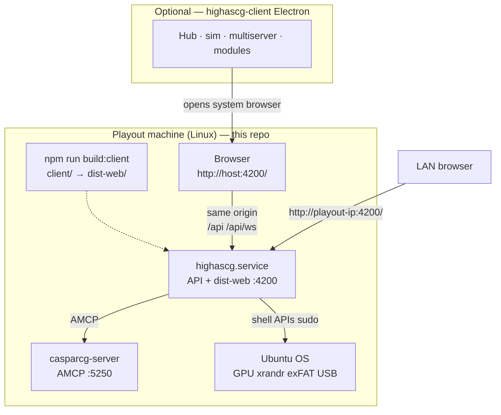

# HighAsCG architecture — unified playout stack

**Status:** Canonical reference (2026)  
**Related:** [`../client/README.md`](../client/README.md), [`../from_client/AGENT_SERVER_CLIENT_MERGE.md`](../from_client/AGENT_SERVER_CLIENT_MERGE.md), [`PLAN_SERVER_CLIENT_SPLIT.md`](PLAN_SERVER_CLIENT_SPLIT.md) (historical WO-51), [`work/BACKEND_AND_CLIENT_SPLIT.md`](../work/BACKEND_AND_CLIENT_SPLIT.md), [`WO47_ISO_VS_EXFAT.md`](WO47_ISO_VS_EXFAT.md)

---

## One-line model

> **One repo, one playout machine:** `client/` → `dist-web/` → Node serves API + UI on `:4200`. Optional Electron launcher (highascg-client) = stick prep / sim / multiserver — not the UI source tree.

---

## Repository model (post-merge)

Everything ships from **this repository** ([highascg](https://github.com/mko1989/highascg)):

| Path | Role |
|------|------|
| **`client/`** | **Canonical operator UI sources** (dashboard, scenes, device view, timeline, settings) |
| **`client/map.html`** | **Interactive Project Map** sources (served at `/map`) |
| **`dist-web/`** | Vite production build — **what playout serves** at `/` |
| **`src/`**, **`index.js`** | Node API bridge (Caspar, OS, WebSocket, config) |
| **`client/tools/electron-launcher/`** | Electron hub sources — packaged separately as [**highascg-client**](https://github.com/mko1989/highascg-client) |

**highascg-client** is **not** a second UI development repo. It is an **optional Electron packaging extract** (simulator, multiserver workflow, modules such as CG Studio) built from `client/tools/electron-launcher/` and related tooling. Operators still control playout via the **browser** at `http://<playout-ip>:4200/`.

**Develop UI here:** edit `client/` → `npm run build:client` → refresh browser.  
**Do not** treat GitHub highascg-client as the canonical UI tree.

---

## What runs where

| Component | Runs on | In production playout deploy? |
|-----------|---------|------------------------------|
| **`index.js` + `src/`** | Playout Linux host | **Yes** |
| **`dist-web/`** | Playout Linux host (served by Node) | **Yes** — required for operator UI |
| **`config/`, `template/`, `scripts/`** | Playout host | **Yes** |
| **`tools/runtime/`** | Playout host | **Yes** (exFAT sync CLI, staged Caspar start) |
| **`client/`** (UI sources) | Dev / build only | **No** as sources — ship **`dist-web/`** |
| **Electron hub** ([highascg-client](https://github.com/mko1989/highascg-client)) | Optional Mac/Windows/Linux | **No** on playout — sim, multiserver, stick prep; opens browser to `:4200` |
| **`work/`** | Developers only | **No** |

---

## Connection diagram



---

## Server responsibilities (bridge)

| Direction | Examples |
|-----------|----------|
| **→ CasparCG** | Scene take, mixer, playlists, multiview, global border AMCP, `casparcg.config` generation, template sync |
| **← CasparCG** | OSC state, INFO/CLS polling, playback tracker |
| **→ OS** | `xrandr` layout, NVIDIA driver apply (incl. **Sync to VBlank off** for screen consumers — see [reference/screen-consumer-vsync-nvidia.md](reference/screen-consumer-vsync-nvidia.md)), exFAT mtime sync, USB mount/ingest, systemd unit writes |
| **↔ UI (browser)** | Settings persistence, device graph, project/scenes JSON, WebSocket state broadcast |
| **→ Browser** | Serve **`dist-web/`** SPA, `/templates/`, optional `/vendor/` |

With **`HIGHASCG_HEADLESS=true`** (debug/API-only only), non-API HTTP returns 404 JSON and **`dist-web/`** is not served. **Production default:** headless **off**.

---

## UI responsibilities (browser SPA)

| Area | Browser UI (`dist-web/` from `client/`) | Server (`src/`) |
|------|----------------------------------------|-----------------|
| Panels, drag-drop, forms | Yes | Validates + executes |
| Live state | WS subscribe, local mirrors | Owns truth, broadcasts |
| Scene edit UX | Local edit, save via API | AMCP take sequences |
| Settings UI | Collect payloads | Merge config, restart services |
| Media browser tree | Thumbnails, tree UI | Disk scan, ffmpeg probe |
| Preview video | WebRTC `<video>` | Caspar/FFmpeg consumers |

No direct AMCP from the browser (except dev tooling). No OSC UDP, no systemd, no GPU driver install in the SPA.

---

## Build & deploy workflow

```bash
# On playout or dev machine (repo root)
npm install
npm run build:client    # client/ → dist-web/
npm start               # :4200 serves API + dist-web/
```

**UI dev with HMR:** `npm run dev:client` (`:4350` → API on `:4200`).

**Deploy:** `npm run deploy:dev` includes **`dist-web/`** when present (see [`scripts/deploy/dev-push.sh`](../scripts/deploy/dev-push.sh)).

When counting lines or auditing “server code”, exclude **`work/`**, **`tools/eggs/`**, and **`cef-cache/`**. UI sources in **`client/`** are part of this program but not deployed as raw sources on playout.

---

## Distribution

| Artifact | Contents |
|----------|----------|
| **Playout ISO squashfs** | Caspar shell, systemd, drivers — often **no** full `src/` until exFAT bootstrap |
| **exFAT `drop-update/`** | `highascg-server_*.tar.gz` — **`index.js`, `src/`, `scripts/`, `tools/runtime/`, `dist-web/`** |
| **UI-only hotfix** | rsync **`dist-web/`** only, or rebuild on playout with `npm run build:client` |

Server + UI updates can land via **`drop-update/`** without reflashing the ISO. Operator entry URL: **`http://<playout-ip>:4200/`**.

---

## Historical note (WO-51 → WO-52)

WO-51 ran the API headless on playout and hosted the UI in Electron on `:4350`. **Current model:** UI is built from in-repo **`client/`** and served on playout **`:4200`**. See [`PLAN_SERVER_CLIENT_SPLIT.md`](PLAN_SERVER_CLIENT_SPLIT.md) for the old plan only.
