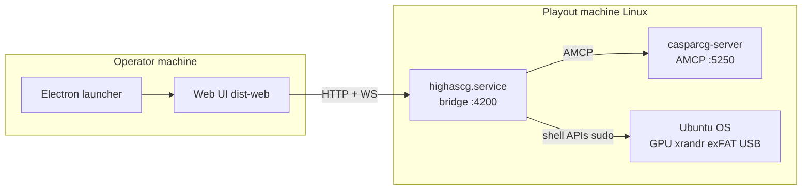

# HighAsCG architecture — server bridge and client

**Status:** Canonical reference (2026-06-03)  
**Related:** [`PLAN_SERVER_CLIENT_SPLIT.md`](PLAN_SERVER_CLIENT_SPLIT.md), [`work/BACKEND_AND_CLIENT_SPLIT.md`](../work/BACKEND_AND_CLIENT_SPLIT.md), [`WO47_ISO_VS_EXFAT.md`](WO47_ISO_VS_EXFAT.md)

---

## One-line model

**HighAsCG Server** (`node index.js` on the playout machine) is a **bridge**:

1. **Client ↔ CasparCG** — REST/WebSocket from the operator UI become AMCP commands, config generation, scene takes, streaming setup, and template sync.
2. **Client ↔ Ubuntu OS** — the same API exposes GPU layout (`xrandr`), DeckLink/NVIDIA inventory, exFAT sync, USB ingest, systemd hooks, and hardware settings the UI cannot run locally.

The **operator UI** runs on a **client machine** inside the **Electron launcher** ([**highascg-client**](https://github.com/mko1989/highascg-client) repo). It talks to the server only over **HTTP `/api/*`** and **WebSocket `/api/ws`**.

---

## What runs where

| Component | Runs on | In production ISO / server tarball? |
|-----------|---------|-------------------------------------|
| **`index.js` + `src/`** | Playout Linux host | **Yes** |
| **`config/`, `template/`, `scripts/`** | Playout host | **Yes** (server bundle) |
| **`tools/runtime/`** | Playout host | **Yes** (exFAT sync CLI, staged Caspar start) |
| **`client/`** (legacy in-tree UI) | Operator laptop only | **No** — not deployed to playout |
| **`client/tools/electron-launcher/`** | Operator laptop only | **No** — lives in **highascg-client** for releases |
| **`dist-web/`** | Operator laptop (Electron bundle) | **No** on playout (`HIGHASCG_HEADLESS=true`) |
| **`work/`** | Developers only | **No** — work orders, references, planning |
| **`work/references/`** | Developers only | **No** — design prototypes, not runtime |
| **`tools/eggs/`, `tools/smoke/`** | Build / dev host | **No** on playout stick |

---

## Connection diagram

---

## Server responsibilities (bridge)

| Direction | Examples |
|-----------|----------|
| **→ CasparCG** | Scene take, mixer, playlists, multiview, global border AMCP, `casparcg.config` generation, template sync |
| **← CasparCG** | OSC state, INFO/CLS polling, playback tracker |
| **→ OS** | `xrandr` layout, NVIDIA driver apply (incl. **Sync to VBlank off** for screen consumers — see [reference/screen-consumer-vsync-nvidia.md](reference/screen-consumer-vsync-nvidia.md)), exFAT mtime sync, USB mount/ingest, systemd unit writes |
| **↔ Client** | Settings persistence, device graph, project/scenes JSON, WebSocket state broadcast |

The server **does not** render the operator dashboard in production. With **`HIGHASCG_HEADLESS=true`**, non-API HTTP returns 404 JSON.

---

## Client responsibilities

| Area | Client | Server |
|------|--------|--------|
| Panels, drag-drop, forms | Yes | Validates + executes |
| Live state | WS subscribe, local mirrors | Owns truth, broadcasts |
| Scene edit UX | Local edit, save via API | AMCP take sequences |
| Settings UI | Collect payloads | Merge config, restart services |
| Media browser tree | Thumbnails, tree UI | Disk scan, ffmpeg probe |
| Preview video | WebRTC `<video>` | Caspar/FFmpeg consumers |

No direct AMCP from the client (except dev tooling). No OSC UDP, no systemd, no GPU driver install on the client.

---

## Repository layout (this repo)

| Path | Role |
|------|------|
| **`src/`** | Server bridge — all runtime Node code on playout |
| **`index.js`** | Boot orchestrator |
| **`client/`** | **Legacy / dev-only** browser tree; **not shipped** on playout. Production UI: **highascg-client** + Electron. |
| **`work/`** | Engineering docs, work orders, **not part of the program** |
| **`docs/`** | Operator and integrator documentation |

When counting lines or auditing “server code”, exclude **`client/`**, **`work/`**, **`tools/eggs/`**, and **`cef-cache/`**. See [`work/sweep2.md`](../work/sweep2.md).

---

## Distribution

| Artifact | Contents |
|----------|----------|
| **Playout ISO squashfs** | Caspar shell, systemd, drivers — often **no** full `src/` until exFAT bootstrap |
| **exFAT `update/server/`** | `highascg-server_*.tar.gz` — **`index.js`, `src/`, `scripts/`, `tools/runtime/`** only |
| **Client release** | **highascg-client** → `dist-web/` + Electron launcher for Mac/Windows/Linux operator stations |

Server updates do **not** require reburning the ISO. UI updates do **not** require touching the playout stick.
