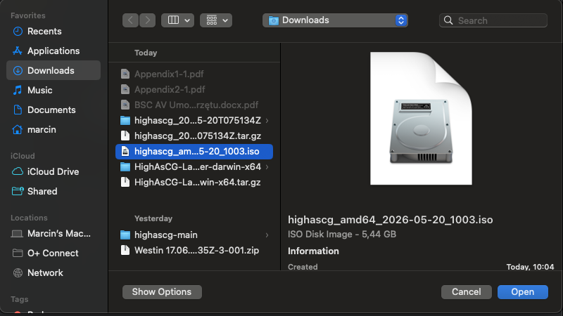
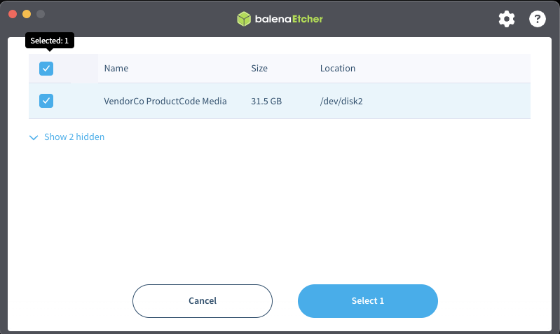
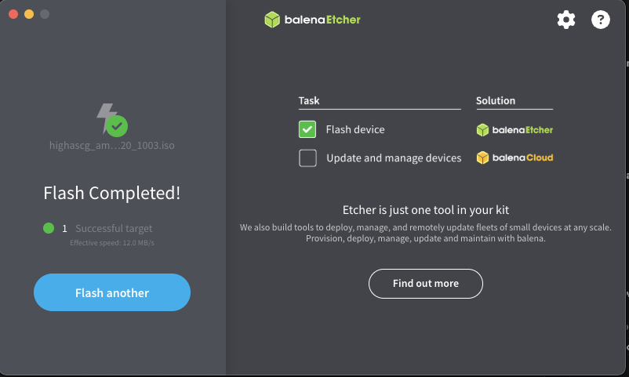

# HighAsCG playout stick — quick start

Prepare a **bootable HighAsCG USB stick** on **Windows** or **macOS**: flash the live ISO, add the operator **exFAT** partition, copy the starter folder layout, then boot the playout machine from the stick.

**Time:** ~20 minutes · **USB size:** 32 GiB recommended (minimum: ISO size + ~2 GiB free for exFAT)

---

## What you end up with

| Layer | Label | Purpose |
|-------|-------|---------|
| **Boot image** (written by Etcher) | `highascg` | Live Linux + CasparCG — **do not delete or reformat** |
| **Operator data** (you create this) | **`HIGHASCGEXF`** | Configs, media, server updates — must be **exactly** this label (11 characters) |

On boot, the playout machine mounts **`HIGHASCGEXF`** at `/home/casparcg/exfat`, applies any server drop in `drop-update/`, syncs `configs/`, and starts the operator UI at **`http://<playout-ip>/`** (nginx proxies port 80 → `:4200`; direct URL **`http://<playout-ip>:4200/`** also works).

---

## 1. Download the latest ISO

Always use the **current** build from the download site — filenames change with each release.

| Method | Link / command |
|--------|----------------|
| **Browser (recommended)** | [https://highascg.dpdns.org/](https://highascg.dpdns.org/) — click **DOWNLOAD BOOTABLE ISO** |
| **Direct URL (auto-latest)** | Read `download_url` from [release.json](https://highascg.dpdns.org/release.json) |

**Resume a large download (Linux / macOS Terminal):**

```bash
ISO_URL=$(python3 -c "import json,urllib.request; print(json.load(urllib.request.urlopen('https://highascg.dpdns.org/release.json'))['download_url'])")
wget -c "$ISO_URL" -O highascg-latest.iso
echo "Saved: highascg-latest.iso"
```

**Windows PowerShell:**

```powershell
$release = Invoke-RestMethod https://highascg.dpdns.org/release.json
Invoke-WebRequest -Uri $release.download_url -OutFile highascg-latest.iso
```

Example filename at time of writing: `highascg-nvidia-595_amd64_2026-06-08_0812.iso`. Current builds are **~5 GiB** (older docs mentioning ~2.7 GiB are stale). Yours may differ — trust **`release.json`**, not a fixed name.

---

## 2. Flash the stick with Balena Etcher

Install [Balena Etcher](https://etcher.balena.io/) if needed.

### Step 1 — Load the ISO

Open Etcher → **Flash from file** → select your `highascg-*.iso`.



### Step 2 — Select the USB drive

Click **Select target** → choose your USB stick. **Check capacity and model** — Etcher will erase the whole device.



### Step 3 — Flash and verify

Click **Flash!** → approve the admin prompt → wait for verification (**Flash Complete!**).



> **Important:** When Windows or macOS asks to format new volumes after flashing, click **Cancel** / **Don't format**. You still need to create the exFAT partition in the next step.

---

## 3. Create the exFAT partition (`HIGHASCGEXF`)

Use **only the unallocated space at the end** of the USB disk. Never delete or reformat the small boot partitions Etcher created.

### Windows — Disk Management

1. `Win + X` → **Disk Management**
2. In the **lower** pane, select your **Removable** USB disk (verify size — **not** internal Disk 0)
3. Right-click the **black unallocated** bar at the **right end** → **New Simple Volume…**
4. Use all available space → file system **exFAT** → volume label **`HIGHASCGEXF`** (exact spelling, no spaces)
5. Finish and note the drive letter (e.g. `E:`)

**Optional — `diskpart` (run as Administrator)** — replace `2` with your USB disk number from Disk Management:

```text
diskpart
list disk
select disk 2
create partition primary
format fs=exfat label=HIGHASCGEXF quick
assign
exit
```

### macOS — Terminal

Replace **`disk2`** with your USB whole-disk id from step 1. **Never use `disk0` or `disk1`** (internal disks).

**1. List external USB disks (read-only):**

```bash
diskutil list external physical
```

**2. Inspect the stick (read-only):**

```bash
diskutil list disk2
```

**3. Unmount before editing the partition table:**

```bash
diskutil unmountDisk disk2
```

**4. Add an exFAT slice with `fdisk` (interactive):**

```bash
sudo fdisk -e /dev/rdisk2
```

In `fdisk`, type one line at a time (do not paste the whole block):

1. `print` — note the last free MBR slot (often slot 4)
2. `edit 4` — use your free slot number
3. `07` — exFAT/NTFS family type
4. Choose **sector offsets** when asked (not CHS)
5. Start sector: **`12582912`** (6 GiB offset — safe for current ~5 GiB ISO builds). **Rule:** the start sector must leave at least **ISO size + 1.5 GiB** before the exFAT partition (512-byte sectors: `(ISO_GiB + 1.5) × 2097152`). If your ISO grows past ~4.5 GiB, increase the offset accordingly.
6. End sector: total sectors from `diskutil info disk2` **minus 1**
7. `print` — confirm the boot ISO slice is unchanged
8. `write` → confirm → `exit`

**5. Format the new slice only** — replace `disk2s4` with your new slice from `diskutil list disk2`:

```bash
sudo newfs_exfat -v HIGHASCGEXF /dev/rdisk2s4
diskutil mount disk2s4
```

If the volume mounts as `HIGHASCGEXF 1`, rename it:

```bash
diskutil rename "HIGHASCGEXF 1" HIGHASCGEXF
```

---

## 4. Copy the starter folder layout

Download **[HIGHASCGEXF-starter-layout.zip](guides/stick/HIGHASCGEXF-starter-layout.zip)** from this repo (or build it with `npm run exfat:starter-zip`).

> **Note:** `npm run exfat:starter-zip` writes a fresh zip to **`dist/HIGHASCGEXF-starter-layout.zip`**; the checked-in copy at `docs/guides/stick/HIGHASCGEXF-starter-layout.zip` is a **snapshot** and can lag behind. To refresh it: `npm run exfat:starter-zip`, then copy `dist/HIGHASCGEXF-starter-layout.zip` over the docs copy.

Unzip **directly onto the exFAT volume root** — not inside an extra folder.

**Expected top-level folders after unzip:**

```
HIGHASCGEXF/
  configs/              ← factory settings + starter show
  drop-config/
  drop-update/          ← put highascg-server_*.tar.gz here later
  drop-update/applied/
  media/
  network/              ← operator IP file network.conf (WO-95; create if your zip predates it)
  projects/
  snapshots/rear-panels/
  templates/
  .private/             ← per-machine pairing data (hidden folder)
  decklink/             ← optional DeckLink vendor debs — NOT in the zip, create manually (see below)
  README.txt
```

**Windows (PowerShell)** — adjust `E:` to your drive letter:

```powershell
Expand-Archive -Path HIGHASCGEXF-starter-layout.zip -DestinationPath E:\ -Force
```

**macOS / Linux:**

```bash
unzip -o HIGHASCGEXF-starter-layout.zip -d /Volumes/HIGHASCGEXF
```

> **Copying from Linux? Never `rsync -a` onto exFAT** — exFAT has no ownership, so `chown` fails with `EPERM` and rsync exits **23** (killing scripts mid-copy). Use `rsync -rLt --modify-window=2` or plain `cp`.

Safely eject the stick when copying finishes.

> **Optional later:** extract a [GitHub server release](https://github.com/mko1989/highascg/releases) (`highascg-server_*.tar.gz`) into `drop-update/` so `drop-update/package.json` exists. The starter zip alone is enough for a first boot test with the embedded ISO server tree.

### DeckLink drivers (optional — operator-supplied)

The public ISO does **not** ship Blackmagic Desktop Video. If the playout machine has a DeckLink card, copy vendor packages into **`decklink/`** on the stick (create the folder if your starter zip predates it):

```
HIGHASCGEXF/decklink/
  desktopvideo_<version>_amd64.deb          ← required for Caspar decklink I/O
  desktopvideo-gui_<version>_amd64.deb      ← optional (Setup / Updater GUI)
```

Download [Desktop Video for Linux](https://www.blackmagicdesign.com/support/family/capture-and-playback), extract the tarball, and copy from `deb/x86_64/`.

| Package | Needed for playout? | Purpose |
|---------|---------------------|---------|
| **`desktopvideo`** | **Yes** (when using DeckLink) | Kernel driver, `libDeckLinkAPI.so`, firmware / CLI update tools |
| **`desktopvideo-gui`** | **No** | Blackmagic Desktop Video **Setup** and **Updater** GUI only |

**`desktopvideo` alone is enough** when the card is already on appropriate firmware and Caspar channel settings in `configs/` are sufficient. Without `desktopvideo-gui`, Settings → **Desktop Video Setup** / **Updater** report *GUI not installed* — playout is unaffected.

On boot, HighAsCG installs from `decklink/` when needed (`highascg-decklink-install.service`). See `decklink/README.txt` on the volume.

---

## 5. Boot from the stick

1. Insert the USB into the **playout machine**
2. Power on and open **UEFI/BIOS setup** (common keys: `F2`, `F12`, `Del`, `Esc` at the manufacturer logo)
3. **Disable Secure Boot** — NVIDIA and DeckLink drivers on the live image are not signed for Secure Boot
4. Set **USB** as the first boot device, **or** use the one-time boot menu (`F12` on many boards) and pick the USB stick
5. Save and exit — the machine should show the **HighAsCG GRUB** menu
6. Choose the default **Live** entry

After boot:

- Operator UI: **`http://127.0.0.1/`** or **`http://<playout-ip>/`** from another machine on the LAN (port 80 → `:4200`); **`http://<playout-ip>:4200/`** works directly too
- Confirm the stick mounted: Settings → exFAT sync, or on the machine run `lsblk -f` and look for **`HIGHASCGEXF`**

---

## Checklist

| Step | Done when |
|------|-----------|
| ISO downloaded | File opens in Etcher; size matches [release.json](https://highascg.dpdns.org/release.json) |
| Etcher flash | **Flash Complete!** banner |
| exFAT created | Explorer/Finder shows **`HIGHASCGEXF`** with **gigabytes** free (not ~15 MiB) |
| Starter zip copied | `configs/`, `drop-update/`, `media/`, … at volume root |
| BIOS | Secure Boot **off**, USB boot **on** |
| Live boot | GRUB menu → desktop or headless playout starts; `:4200` responds |

---

## Troubleshooting

| Problem | Fix |
|---------|-----|
| No unallocated space after Etcher | Use a **larger** USB (32 GiB recommended) |
| Windows only shows a tiny partition | Do not format the ISO slice — partition only the **trailing free space** |
| macOS **Partition** greyed out | Use the Terminal / `fdisk` steps above |
| Stick boots but no exFAT sync | Volume label must be exactly **`HIGHASCGEXF`** |
| Secure Boot error / no NVIDIA | Disable Secure Boot in BIOS |

---

## More detail

| Topic | Document |
|-------|----------|
| exFAT vs ISO contents | [WO47_ISO_VS_EXFAT.md](WO47_ISO_VS_EXFAT.md) |
| Bridge disk + USB roles | [BRIDGE_DISK_AND_USB_EXFAT.md](BRIDGE_DISK_AND_USB_EXFAT.md) |
| Server drops on the stick | [EXFAT_SERVER_UPDATE.md](EXFAT_SERVER_UPDATE.md) |
| GUI prep kit (optional) | [Electron launcher](https://github.com/mko1989/highascg-client) — same flash/partition screenshots |
