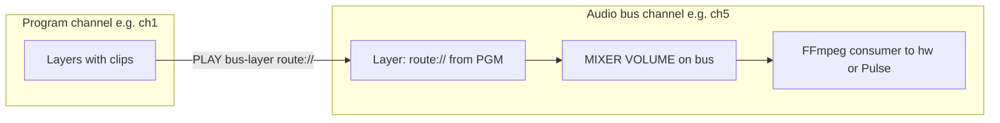

# Audio routing reference (CasparCG + HighAsCG)

Quick reference for **layer/channel audio levels**, **layouts**, **routing between channels**, and **FFmpeg audio filters**. For Linux device setup, see [Audio setup guide](./audio-setup-guide.md).

**Related:** [06 — Audio playout](../../06_WO_AUDIO_PLAYOUT.md) · Phase 5 (T5.2) · [Caspar audio consumers](./caspar-audio-consumers.md)

---

## AMCP: MIXER audio

Audio on a channel is controlled with **MIXER** subcommands. Layer index follows Caspar conventions (`channel-layer`).

| Action | AMCP (typical) | Notes |
|--------|----------------|-------|
| **Layer volume** | `MIXER 1-10 VOLUME 0.5` | `0` = mute, `1` = unity (check your Caspar version for exact semantics). |
| **Layer volume + tween** | `MIXER 1-10 VOLUME 0.5 25 linear` | Duration in frames, tween name. |
| **Channel master** | `MIXER 1 MASTERVOLUME 0.5` | Affects the whole channel mix (no layer index on `MASTERVOLUME`). |
| **Query** | `MIXER 1-10 VOLUME` | No value → query current (if supported). |

**HighAsCG HTTP:** `POST /api/audio/volume` with JSON, e.g. `{ "channel": 1, "layer": 10, "volume": 0.5 }` or `{ "channel": 1, "master": true, "volume": 0.8 }` — see `src/api/routes-audio.js`.

---

## Channel layouts (summary)

Standard and custom layouts are set on the **channel** in `casparcg.config` and may require entries under **`<audio><channel-layouts>`** for custom names (`4ch`, `16ch`, `live-8ch`, …). Full table: [T2.5](./caspar-audio-consumers.md#t25--channel-layouts-and-audiochannel-layouts).

| Channels | Typical layout id | Notes |
|----------|-------------------|--------|
| 1 | `mono` | |
| 2 | `stereo` | Default stereo bus |
| 4 | `4ch` (custom) | Define in `<audio>` if your build requires it |
| 6 | `dts` / 5.1 layouts | |
| 8 | `8ch`, `live-8ch`, `dolby-e` | `live-8ch` often needs explicit channel-order in config |
| 16 | `16ch` (custom) | Stems / multi-bus |

**Runtime layout change (if enabled on server):** `SET 1 CHANNEL_LAYOUT stereo` — verify against your Caspar build; not all deployments expose this.

---

## Multi-bus routing (concept)

Program audio is mixed on **channel 1** (example). **Extra channels** act as **buses**: you **play** a `route://` source into a layer on the bus channel, then send that bus to ALSA/NDI/etc.



1. Configure an **audio-only** (or minimal video-mode) **channel** with the right **channel-layout** and consumers ([T2.4](./caspar-audio-consumers.md#t24--audio-only-channels-extra-channels)).
2. From AMCP: load/play **`route://`** (or equivalent) pointing at the program channel’s audio mix — exact producer string depends on Caspar version; consult your server docs.
3. Use **MIXER VOLUME** on the **routed layer** for sub-mix level.

---

## FFmpeg audio filters (`AF` on PLAY)

Caspar can pass **FFmpeg audio filters** on **PLAY** for per-clip remapping (see WO-06 Context: `PLAY 1-10 clip AF "..."`).

**Stereo → duplicate to two buses (illustrative `pan`):**

```text
pan=stereo|c0=c0|c1=c1
```

**4-output matrix example (adjust channel indices to your layout):**

```text
pan=4c|c0=0.5*c0+0.5*c1|c1=c2|c2=c3|c3=c0
```

Always validate filter graphs against **FFmpeg** docs for your deployed version; start with **unity** routing and add gain **coefficients** in small steps to avoid clipping.

---

## OSC

Real-time meters and transport feedback use **OSC** from Caspar to clients (see [09 — OSC protocol](../../09_WO_OSC_PROTOCOL.md)). This does not replace MIXER for level control unless you add automation that sends AMCP in response.
