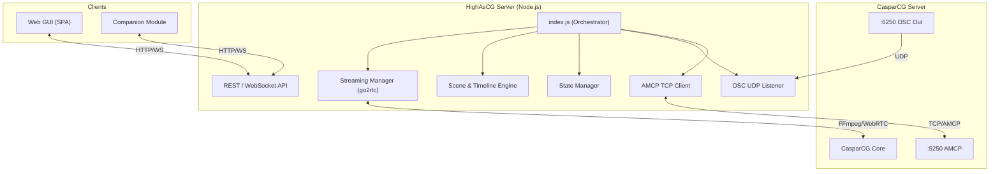

# HighAsCG Project Overview & Architecture Breakdown

HighAsCG is a standalone Node.js application designed to act as a high-performance, modular client for **CasparCG Server**. It replaces the monolithic architecture previously found in the `companion-module-casparcg-server` module with a decoupled, modern system.

## 1. High-Level Architecture

The system consists of three main tiers:

---

## 2. Server-Side Breakdown (`/src`)

The logic is split into domain-specific modules, each with a single responsibility.

### `index.js` (The Orchestrator)
The entry point. It initializes all subsystems, loads configuration, manages the application lifecycle (startup/shutdown), and wires together the different components (connecting the AMCP client to the state manager, etc.).

### `src/server/` (Network Layer)
- **`http-server.js`**: Setup for the Express/Node HTTP server. Serves static files for the Web UI and provides the base for the REST API.
- **`ws-server.js`**: Manages WebSocket connections for real-time state broadcasts and command confirmation.

### `src/api/` (Routing & Handlers)
- **`router.js`**: The central dispatcher for all REST API requests.
- **`routes-*.js`**: Domain-specific API handlers.
    - `routes-amcp.js`: Direct AMCP command execution.
    - `routes-mixer.js`: Video mixer controls (volume, transform, etc.).
    - `routes-scene.js`: Scene-based production logic.
    - `routes-streaming.js`: Controls for the go2rtc preview engine.
    - `routes-ingest.js`: Client-server synchronization and file management.
    - `routes-audio.js`: System-wide ALSA default device and multi-channel routing.

### `src/audio/` (Hardware Integration)
- **`audio-devices.js`**: Enumerates ALSA and PipeWire hardware; manages `/etc/asound.conf` for system-wide default output (Yamaha DM3 integration).
- **`config-generator.js`**: Generates `casparcg.config` XML with mapped audio layouts and `<system-audio>` stereo downmixes.

### `src/caspar/` (AMCP Communication)
- **`connection-manager.js`**: Manages the TCP connection to CasparCG, including reconnection logic and health checks.
- **`protocol.js`**: Implementation of the AMCP protocol (commands, parsers, and constants).
- **`tcp-client.js`**: Low-level TCP socket handling.

### `src/osc/` (Feedback & Status)
- **`osc-listener.js`**: Listens for incoming OSC packets from CasparCG.
- **`osc-state.js`**: Interprets OSC messages to track playback progress, audio levels (VU), and server performance.
- **`osc-variables.js`**: Maps OSC data to "Variables" that can be used by the UI or Companion.

### `src/engine/` (Core Logic)
- **`scene-transition.js`**: Handles complex A/B bank transitions, allowing smooth cuts or fades between "Looks".
- **`timeline-engine.js`**: Manages scheduled playback and sequence execution.

### `src/state/` (Global Memory)
- **`state-manager.js`**: The "Source of Truth" for the application. It holds the current channel states, media lists, and system variables.

### `src/streaming/` (Preview System)
- **`go2rtc-manager.js`**: Orchestrates `go2rtc` and `FFmpeg` to provide low-latency WebRTC previews of CasparCG channels.
- **`caspar-ffmpeg-setup.js`**: Configures CasparCG to output streams (via NDI, SRT, or local capture) into the preview engine.

---

## 3. Web UI Breakdown (`/web`)

The frontend is a lightweight Single Page Application (SPA) built with Vanilla JS components.

### Core Files
- **`index.html`**: The main shell.
- **`app.js`**: The main frontend controller; handles WebSocket connection, state synchronization, and component initialization.
- **`styles.css`**: Global design system (Dark mode, glassmorphism, responsive layout).

### Key Components (`/web/components/`)
- **`header-bar.js`**: Branding, connection status, and global actions.
- **`dashboard.js`**: Grid-based control surface for quick actions.
- **`scenes-editor.js` / `scenes-compose.js`**: Tools for building and triggering complex visual setups.
- **`timeline-editor.js`**: Visual editor for playback sequences.
- **`inspector-panel.js`**: Context-aware properties editor for selected layers/items.
- **`sources-panel.js`**: Media browser (clips, templates, live inputs).
- **`vu-meter.js`**: Real-time audio visualization using OSC data.

---

## 4. How it all Ties Together (Key Workflows)

### Workflow A: Triggering a Clip
1. **User Action**: Clicks a clip in `sources-panel.js`.
2. **API Call**: Frontend sends `POST /api/mixer/play` to the HighAsCG server.
3. **AMCP Command**: `routes-mixer.js` translates this into an AMCP `LOADBG` + `PLAY` sequence and sends it via `amcp.protocol.js`.
4. **Execution**: The AMCP Client sends bytes over TCP to CasparCG.

### Workflow B: Real-Time Status Update
1. **Event**: CasparCG finishes playing a clip and sends an OSC message.
2. **Detection**: `osc-listener.js` receives the UDP packet.
3. **Update**: `osc-state.js` parses the message and updates the `StateManager`.
4. **Broadcast**: `ws-server.js` detects the state change and broadcasts an `osc` message to all connected Web UI clients.
5. **UI Refresh**: `vu-meter.js` and `playback-timer.js` update their displays instantly.

### Workflow C: Client-Server Sync (Offline Mode)
1. **Preparation**: User builds scenes/timelines while HighAsCG is disconnected from the production server (`Offline Mode`).
2. **Storage**: Data is saved to local JSON state (`.highascg-state.json`).
3. **Publishing**: User opens `publish-modal.js` and clicks "Sync".
4. **Sync Engine**: `routes-ingest.js` compares local media/state with the remote server and uploads missing assets/configurations.

---

## 5. Configuration & Persistence

- **Defaults**: Found in `config/default.js`.
- **User Config**: Stored in `highascg.config.json`.
- **Application State**: Stored in `.highascg-state.json` (persists scenes, timelines, and UI layouts).
- **Environment Variables**: Can override any config setting (e.g., `PORT`, `CASPAR_HOST`).

---
*Created: 2026-04-06 | Project: HighAsCG Breakdown*
