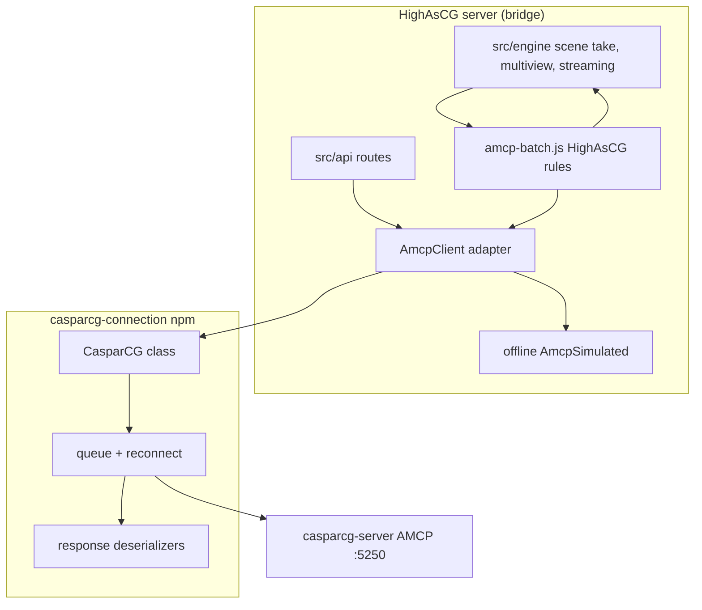

# Adopting `casparcg-connection` for HighAsCG AMCP

**Generated:** 2026-06-03  
**Status:** Assessment — not a commitment to migrate  
**Library:** [casparcg-connection](https://www.npmjs.com/package/casparcg-connection) (SuperFlyTV / Sofie TV automation)  
**Local reference copy:** `work/references/show_creator/casparcg-connection-main/` (v7.0.0-0 pre-release tree)  
**Official docs:** [API reference](https://superflytv.github.io/casparcg-connection/) · [Getting started guide](https://superfly-tv.gitbooks.io/casparcg-connection-getting-started-guide/content/)

CasparCG’s own [developer tools page](https://casparcg.com/docs/downloads/developer-tools) lists this as the standard **Node.js** AMCP library.

---

## Executive summary

| Question | Answer |
|----------|--------|
| **Is it a good idea in principle?** | Yes — it is the de-facto community library, well documented, MIT licensed, and maintained for broadcast automation (Sofie). |
| **Would it replace a lot of code?** | Partially. ~**2,700 lines** in `src/caspar/` today, but much of HighAsCG’s *value* is not generic AMCP — it is batch orchestration, scene-take sequencing, and `raw()` line builders tied to a custom Caspar build. |
| **Effort to fully switch?** | **Large** (multi-week): 50+ call sites across `src/engine/`, `src/api/`, routing, streaming, Art-Net, WS proxy. High regression risk on PGM take, multiview, and streaming. |
| **Recommended shape if we do it** | **Adapter / hybrid**, not a big-bang delete of `src/caspar/`. Keep HighAsCG batch semantics and `raw()` escape hatch; use the library for TCP, queue, parsing, and typed helpers where they fit. |
| **Still worth doing?** | **Yes, incrementally** — even a thin wrapper around `casparcg-connection` improves onboarding (external docs) and reduces long-term maintenance of socket/parser code, as long as HighAsCG-specific batch/take logic stays explicit. |

---

## What we have today

HighAsCG runs its own AMCP stack under **`src/caspar/`**:

| Module | Role | Lines (approx.) |
|--------|------|-----------------|
| `connection-manager.js` | TCP lifecycle, reconnect, VERSION health, WS `status` events | 248 |
| `tcp-client.js` | Low-level socket + backoff | 159 |
| `amcp-protocol.js` | Multiline AMCP response parsing, pending callback map | 275 |
| `amcp-client.js` | Send queue, timeouts, `raw()`, offline routing | 388 |
| `amcp-batch.js` | BEGIN…COMMIT chunking, MIXER COMMIT pre-flush rules | 333 |
| `amcp-basic.js`, `amcp-mixer.js`, `amcp-cg.js`, … | Typed-ish helpers → REST `/api/*` | ~800 |
| `amcp-command-plan.js` | Clip/PLAY/LOADBG string building (HTML, NDI, transitions) | 104 |
| `amcp-simulated.js` | `offline_mode` stub responses | 31 |

**How the rest of the server uses it**

- **`appCtx.amcp`** — single client on the playout bridge (`ConnectionManager`).
- **`amcp.raw(line)`** — used heavily for handcrafted sequences (scene take LBG, multiview overlay `CALL`, DeckLink `PLAY`, streaming `ADD STREAM`, Art-Net CG ADD). Dozens of call sites.
- **`amcp.batchSend` / `amcp.batchSendChunked`** — HighAsCG-specific rules:
  - Optional BEGIN…COMMIT batching (`config.amcp_batch`).
  - Chunk cap (default 64, max 512).
  - **`skipMixerPreCommit`** so DEFER + single COMMIT takes are not split incorrectly.
  - **No pre-flush MIXER COMMIT** before batches that contain `CG` lines (PIP / global border ordering).
- **REST surface** — `docs/reference/amcp-mapping.md` maps `amcp.basic.*`, `amcp.mixer.*`, etc. to HTTP routes (`routes-amcp.js`, `routes-mixer.js`, …).
- **WebSocket** — client can send raw AMCP via WS; server forwards through `amcp.raw()`.
- **Operational extras** — connect settle delay after TCP up, long timeouts for CLS/INFO/THUMBNAIL, protocol reset after timeout, AMCP history, quiet command logging.

This stack is **not** a thin TCP wrapper. It encodes **years of Caspar 2.5 + custom build behaviour** (see WO-07, scene-take docs, `global-border.js`, `scene-take-lbg-amcp-pipeline.js`).

---

## What `casparcg-connection` provides

From the [npm package](https://www.npmjs.com/package/casparcg-connection) and in-repo reference:

| Feature | Library support |
|---------|-----------------|
| AMCP 2.1 / 2.3 command set | Implemented |
| Typed methods (`play`, `loadbg`, `mixerOpacity`, `cgAdd`, …) | Yes — [`CasparCG` class](https://superflytv.github.io/casparcg-connection/) |
| Promise / async command API | Yes (`{ error, request }` pattern in v6+) |
| Command queue + connection events | Yes |
| Reconnect | Yes |
| `BEGIN` / `COMMIT` | Yes — `begin()`, `commit()` |
| `MIXER … COMMIT` | Yes — `mixerCommit({ channel })` |
| `THUMBNAIL`, `CINF`, `FLS`, `CLS`, `INFO`, … | Yes |
| Structured response deserializers | Yes (e.g. CINF clip info, INFO CONFIG XML) |
| Raw / low-level send | `sendCommand()` / `executeCommand()` on internal connection |
| Documentation | Strong — API site + GitBook guide |
| License | MIT |

**Version note:** The copy under `work/references/…` is **7.0.0-0** with `"type": "module"` (ESM-only exports). Published **6.3.x** on npm is what most projects use today; verify CommonJS `require()` compatibility before pinning. HighAsCG is **CommonJS** (`require` throughout `index.js` / `src/`).

---

## What a migration would mean (by layer)

### 1. Transport and connection (easiest win)

**Replace:** `tcp-client.js`, parts of `amcp-protocol.js`, socket queue in `amcp-client.js`.

**Keep in HighAsCG:** `ConnectionManager` façade that:

- Emits `status` for WebSocket (`connected`, `versionLine`, `healthError`).
- Applies **`HIGHASCG_AMCP_CONNECT_SETTLE_MS`** before first VERSION.
- Wires `appCtx` the same way (`appCtx.amcp`, `appCtx.connectionManager`).

**Meaning:** Less custom socket code; reconnect and queue behaviour come from a maintained library. **Low risk** if wrapped behind the existing `ConnectionManager` API.

### 2. Typed command helpers (medium effort)

**Replace:** `amcp-basic.js`, `amcp-mixer.js`, `amcp-cg.js`, `amcp-query.js`, `amcp-thumbnail.js` with thin wrappers around `CasparCG` methods.

**Impact:**

- **`routes-amcp.js` / `routes-mixer.js`** — map HTTP bodies to library parameter objects instead of internal helpers.
- **Response shape** — library deserializers return structured objects; REST handlers today often pass through `{ ok, data: string|string[] }`. Adapters needed at the HTTP boundary.
- **Docs alignment** — `docs/reference/amcp-mapping.md` could point to [casparcg-connection API](https://superflytv.github.io/casparcg-connection/) for field names instead of duplicating parameter rules.

**Meaning:** Cleaner REST layer and fewer string-formatting bugs; **moderate refactor** (~15 route files).

### 3. Batch orchestration (hard — do not blindly delegate)

HighAsCG’s **`amcp-batch.js`** is **application logic**, not generic AMCP:

```text
Scene take → many MIXER … DEFER lines → one MIXER ch COMMIT
           → must NOT pre-COMMIT between chunks
           → batches with CG must NOT pre-flush mixer before BEGIN
```

`casparcg-connection` exposes `begin()` / `commit()` but **does not** encode:

- Chunk size policy tied to `amcp_max_batch_commands`
- CG-aware pre-commit suppression
- `skipMixerPreCommit` for LBG crossfade pipeline
- Validation that DISCARD/BEGIN/COMMIT never appear inside client-supplied batch arrays (`routes-amcp.js`)

**Meaning:** Even with the library, **`batchSendChunked` should remain HighAsCG code** (calling library `sendCommand` or typed methods inside batches). Expect **no line-count win** here unless we simplify take semantics (unlikely).

### 4. `raw()` call sites (largest spread, highest risk)

Grep-scale usage across:

- `src/engine/scene-take-lbg*.js` — PGM look take pipeline
- `src/engine/scene-exit-layers.js`, `global-border.js`
- `src/config/routing-setup.js` — DeckLink / live audio routes
- `src/api/routes-multiview.js`, `multiview-layout-helper.js`
- `src/api/routes-streaming-channel.js`
- `src/artnet/artnet-output.js`
- `src/server/ws-server.js` — operator raw AMCP proxy

These build **exact AMCP strings** (transitions, `[html]`, `route://`, `ADD STREAM`, etc.) via `amcp-command-plan.js` and inline templates.

**Options:**

| Approach | Pros | Cons |
|----------|------|------|
| Keep `raw()` on adapter | Minimal engine churn | Still maintain string builders |
| Convert each to typed library calls | Type safety | Many calls have no 1:1 helper (custom `parameters` tails, multiline sequences) |
| Hybrid: typed where easy, `sendCommand` string where not | Pragmatic | Two styles in codebase during transition |

**Meaning:** A “pure library” migration **does not eliminate** most engine code — it only changes *who sends the bytes*.

### 5. Offline / simulation mode

Today: `config.offline_mode` → `AmcpSimulated` returns fake VERSION/CLS/TLS.

Library: no built-in offline stub.

**Meaning:** Keep **`AmcpSimulated`** (or equivalent) in front of the real connection regardless of library choice.

### 6. Custom CasparCG build (PRs #1718–#1720)

HighAsCG targets **`caspar_build_profile: custom_live`** (PortAudio consumers, extended screen tags, etc.). New AMCP verbs or parameter forms on the custom server may **lag** `casparcg-connection` until SuperFlyTV or us upstreams them.

**Meaning:** **`raw()` remains required** for bleeding-edge or fork-only commands. Library adoption does not remove the need for escape hatches.

### 7. Dependencies and deployment

- Add **`casparcg-connection`** to root `package.json` `dependencies` → ships in **`highascg-server_*.tar.gz`** and playout `node_modules`.
- Pin **6.x** until ESM migration is deliberate (Node ≥20 supports `import()` dynamic load of ESM from CJS if needed).
- Bundle size: small relative to existing deps (`ws`, `xml2js`, …).

---

## Architectural picture after adoption



The **bridge** role ([`docs/ARCHITECTURE.md`](../docs/ARCHITECTURE.md)) stays the same: client never speaks AMCP directly; only the server does, via whichever stack sits behind `appCtx.amcp`.

---

## Migration strategies (realistic options)

### Option A — Full replacement (not recommended first)

Delete `src/caspar/*` except batch/plan helpers; rewire all callers to `casparcg-connection`.

| | |
|--|--|
| **Effort** | 3–6+ weeks + heavy QA on air-critical paths |
| **Risk** | High — subtle take/fade/border ordering regressions |
| **Benefit** | Maximum deduplication *if* batch logic is reimplemented correctly on top of library |

### Option B — Adapter behind existing `AmcpClient` (recommended)

1. Add `casparcg-connection` dependency.
2. Implement **`src/caspar/amcp-connection-adapter.js`** that exposes today’s surface:
   - `raw(cmd)` → library `sendCommand` / low-level API
   - `basic`, `mixer`, `cg`, … → delegate to `CasparCG` methods
   - `batchSendChunked` → **unchanged HighAsCG logic**, calling adapter send
3. Swap `ConnectionManager` internals to use the adapter.
4. Migrate call sites to typed methods **opportunistically** (new features first).

| | |
|--|--|
| **Effort** | 1–2 weeks for adapter + smoke/live AMCP tests; ongoing incremental cleanup |
| **Risk** | Medium, contained — external API stable |
| **Benefit** | External docs apply immediately; socket/parser maintenance outsourced |

### Option C — Library for new code only

Keep current stack; use `casparcg-connection` only in new modules (e.g. a greenfield service).

| | |
|--|--|
| **Effort** | Low short-term |
| **Risk** | Two AMCP stacks in one process — confusing |
| **Benefit** | Limited; usually worse than Option B |

---

## Testing requirements if we proceed

Existing checks to extend:

| Test | Purpose |
|------|---------|
| `tools/smoke/highascg-health-api-amcp.test.js` | HTTP AMCP proxy without live Caspar |
| `tools/smoke/highascg-live-amcp.test.js` | Live Caspar VERSION, raw, batch |
| Scene take manual QA | PGM crossfade, global border + CG order, PIP |
| Multiview | `PLAY` + `CALL update()` overlay |
| Streaming | `ADD STREAM` / `REMOVE STREAM` |
| Offline mode | Settings/audio without Caspar |

Add: **parity tests** that send the same command via old stack vs adapter and compare normalized responses (where Caspar is available).

---

## Documentation wins

If we adopt the library (even via adapter):

| Today | After |
|-------|-------|
| `docs/reference/amcp-mapping.md` — internal method names | Link to [casparcg-connection API](https://superflytv.github.io/casparcg-connection/) for parameter shapes |
| New contributors read `src/caspar/amcp-*.js` | Read SuperFlyTV docs + thin HighAsCG batch/take docs |
| CasparCG official site | Already points integrators to this library |

HighAsCG-specific docs **still required** for:

- Scene take LBG pipeline ([`docs/reference/amcp-pgm-look-take-pipeline.md`](../docs/reference/amcp-pgm-look-take-pipeline.md))
- Batch / COMMIT ordering rules
- Custom build AMCP extensions

---

## Recommendation

1. **Do not** delete `src/caspar/` in one pass.
2. **Do** add `casparcg-connection` as the **supported transport + typed command layer** behind an adapter (Option B).
3. **Keep** `amcp-batch.js`, `amcp-command-plan.js`, and engine `raw()` sequences as **HighAsCG orchestration** — document them as “automation on top of casparcg-connection”.
4. **Pin** npm **6.3.x** until we explicitly move the server bundle to ESM or use dynamic `import()`.
5. **Spike first:** one vertical slice — e.g. replace `amcp.query` + `VERSION`/`CLS` path only, run live smoke on playout hardware.

---

## Suggested spike checklist (1–2 days)

- [ ] `npm install casparcg-connection@6` in repo; confirm `require()` works from `index.js`.
- [ ] Prototype `ConnectionManager` using `CasparCG` with `host`/`port` from config.
- [ ] Implement `raw()` via library low-level send; compare VERSION/CLS output to current client.
- [ ] Run `npm run test:highascg:live` against playout Caspar.
- [ ] Document gaps (timeout behaviour, multiline INFO, any parse differences).
- [ ] Decision gate: proceed with adapter vs stay on custom stack.

---

## References

| Resource | URL |
|----------|-----|
| npm | https://www.npmjs.com/package/casparcg-connection |
| API docs | https://superflytv.github.io/casparcg-connection/ |
| GitHub | https://github.com/SuperFlyTV/casparcg-connection |
| CasparCG developer tools | https://casparcg.com/docs/downloads/developer-tools |
| HighAsCG AMCP mapping | [`docs/reference/amcp-mapping.md`](../docs/reference/amcp-mapping.md) |
| In-repo reference tree | `work/references/show_creator/casparcg-connection-main/` |
| Current server stack | `src/caspar/` |
