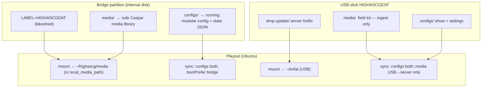

# Work Order 52: Bridge disk partition (media + configs) vs USB stick (ingest + configs)

> **AGENT COLLABORATION PROTOCOL**  
> Every agent that works on this document MUST:
> 1. Add a dated entry to the **Work Log** section at the bottom documenting what was done  
> 2. Update task checkboxes to reflect current status  
> 3. Leave clear **Instructions for Next Agent** at the end of their log entry  
> 4. Do NOT delete previous agents' log entries  

**Status:** In progress (core implementation landed 2026-06-03)  
**Depends on:** WO-47 (exFAT mount + mtime sync), WO_remove-persistence-partition-workflow_exfat-only  
**Related:** [`47_WO_EXFAT_DATA_MOUNT_AND_MTIME_BOOT_SYNC.md`](./47_WO_EXFAT_DATA_MOUNT_AND_MTIME_BOOT_SYNC.md), [`WO_remove-persistence-partition-workflow_exfat-only.md`](./WO_remove-persistence-partition-workflow_exfat-only.md), [`../../docs/WO47_ISO_VS_EXFAT.md`](../../docs/WO47_ISO_VS_EXFAT.md), [`../../config/exfat-sync.json`](../../config/exfat-sync.json), [`../../dist/HIGHASCGEXF-starter-layout.zip`](../../dist/HIGHASCGEXF-starter-layout.zip)

---

## Goal

Split today’s **single `HIGHASCGEXF` volume** into two operator roles:

| Role | Device | Primary use |
|------|--------|-------------|
| **Bridge partition** | Fixed **NVMe / SSD / HDD** slice formatted for **Windows + Linux** | **Only** Caspar/HighAsCG **media library** + **running config** sync (day-to-day production) |
| **USB stick** | Removable **live / field** USB (`HIGHASCGEXF` tail after ISO) | **One-way media ingest** (USB → server) + **config sync** (prep on laptop, apply on playout) |

The playout machine should treat the **internal bridge partition** as the canonical media root—not a bind mount under `media/exfat` alongside other trees.

---

## Problem statement (current)

WO-47 assumes **one** exFAT label (`HIGHASCGEXF`) on the **USB stick** that holds:

- `configs/` ↔ `~/highascg/config/` (boot-prefer exFAT)  
- `drop-update/` server drops  
- `media/` bound to `~/highascg/media/exfat` (not the sole library)

Operators who add a **large internal exFAT/NTFS** disk for Windows prep still share the same mental model as the boot stick. Media can live in **three** places (`media/`, `media/exfat`, stick root), and sync is **bidirectional** everywhere—unsafe for “drop kit on USB, merge into library” workflows.

---

## Target architecture



### Bridge partition (main)

- Operator creates a **dedicated partition** on the playout disk (GPT, after OS install or as empty space).
- Format **exFAT** (preferred cross-platform bridge) unless we document NTFS + `ntfs-3g` as optional.
- **Volume label:** fixed, ≤11 chars (exFAT limit)—proposal **`HIGHASCGDAT`** (bikeshed in §Open decisions).
- **Mount:** production path is the **media library root**:
  - **Preferred:** mount bridge `media/` (or volume root if layout uses root-as-library) at **`/home/casparcg/highascg/media`** via `local_media_path` + Caspar `<media-path>`—**no** parallel `media/exfat` bind for production.
  - **Configs:** `bridge/configs/` ↔ `~/highascg/config/` + state files (`.highascg-state.json`, `.module-state.json`) with **`bootPrefer: bridge`** and **bidirectional** mtime sync (same semantics as today’s `configs/` on stick).
- **Windows / macOS:** partition visible as a drive letter; operators drop files into `media/` and edit `configs/` offline.

### USB stick (`HIGHASCGEXF`)

- Keep existing **live USB** layout: ISO + ESP + **`HIGHASCGEXF`** tail (`finish-operator-stick.sh`, MBR slot 3).
- **`drop-update/`** unchanged (server tarball apply).
- **`media/`:** **one-way sync only** — copy newer/missing files from **`/home/casparcg/exfat/media`** → **bridge media root** (`direction: to_project` or dedicated `usb_media_ingest` pair). **Never** delete or overwrite server files because USB is empty or older (same v1 rule as WO-47: no delete propagation).
- **`configs/`:** sync **config files** (modular JSON, optional `drop-config/`, state JSON) — default **bidirectional** with **`bootPrefer: exfat`** on boot when USB present (field laptop wins for that boot), or explicit **to_project on arrive** via existing `highascg-exfat-arrive` pipeline.

---

## Success criteria

### A. Bridge partition mount (production media)

- [x] **A1.** Systemd mount unit for **`LABEL=HIGHASCGDAT`** at `/home/casparcg/bridge`; **`nofail`** when absent.
- [x] **A2.** Bind `bridge/media/` → `~/highascg/media` (`home-casparcg-highascg-media.mount`). Default `local_media_path` remains `~/highascg/media`.
- [x] **A3.** USB `media/exfat` bind **disabled** by default (`HIGHASCG_LEGACY_USB_MEDIA_BIND=1` to restore).
- [x] **A4.** Bridge boot exits 0 when volume absent (no block).

### B. Bridge config sync

- [x] **B1.** `config/exfat-sync.json` **v2** with `volumes.bridge` / `volumes.usb`.
- [x] **B2.** Bridge config + state pairs with `bootPrefer: exfat`, `pushOnSave: true`.
- [x] **B3.** `pushProjectConfigToExfat` targets bridge pairs when bridge mounted.

### C. USB media ingest (one-way)

- [x] **C1.** Pair `usb-media-ingest`: `direction: to_project`.
- [x] **C2.** Uses existing mtime walker (`to_project` skips project→USB copies).
- [x] **C3.** Runs in `highascg-exfat-sync.service --boot` after bridge/USB config pairs.
- [ ] **C4.** Settings UI “Import USB media” button (optional).

### D. USB config sync

- [x] **D1.** USB config pairs with `bootPrefer: exfat` (runs after bridge on boot).
- [x] **D2.** `drop-update/` unchanged (`highascg-exfat-server-update.service`).

### E. Operator docs & tooling

- [ ] **E1.** Doc: create **internal bridge partition** on Windows (Disk Management) and Linux (`parted` + `mkfs.exfat -L HIGHASCGDAT`).
- [ ] **E2.** Update **`HIGHASCGEXF-starter-layout.zip`** → two zips or one zip with `bridge/` and `usb/` trees (`npm run exfat:starter-zip` successor).
- [ ] **E3.** Settings → System/Media: show **bridge mount status**, **USB mount status**, last sync times, **Dry-run** buttons per volume.
- [ ] **E4.** Migrate [`EXFAT_DATA_ZERO_TOUCH.md`](../../tools/eggs/live-usb/EXFAT_DATA_ZERO_TOUCH.md) — stick = USB profile; bridge = install doc.

### F. Tests

- [ ] **F1.** Unit tests for one-way USB→server walker (mtime, missing file, no server delete).
- [ ] **F2.** Smoke: mock map with temp dirs — bridge config round-trip + USB media ingest only copies expected direction.

---

## Sync map sketch (v2 — bikeshed)

```json
{
  "version": 2,
  "volumes": {
    "bridge": { "label": "HIGHASCGDAT", "mount": "/home/casparcg/bridge", "mediaRoot": "/home/casparcg/highascg/media" },
    "usb": { "label": "HIGHASCGEXF", "mount": "/home/casparcg/exfat" }
  },
  "pairs": [
    { "id": "bridge-configs", "volume": "bridge", "exfat": "configs", "project": "/home/casparcg/highascg/config", "direction": "both", "bootPrefer": "bridge" },
    { "id": "bridge-state", "volume": "bridge", "exfat": "configs/.highascg-state.json", "project": "/home/casparcg/highascg/.highascg-state.json", "direction": "both", "bootPrefer": "bridge" },
    { "id": "usb-configs", "volume": "usb", "exfat": "configs", "project": "/home/casparcg/highascg/config", "direction": "both", "bootPrefer": "exfat" },
    { "id": "usb-media-ingest", "volume": "usb", "exfat": "media", "project": "/home/casparcg/highascg/media", "direction": "to_project" }
  ]
}
```

**Boot order (proposed):**

1. Mount **bridge** (if present) → set `local_media_path` / bind media root  
2. Mount **USB** (if present)  
3. **`highascg-exfat-sync --boot`:** bridge config prefer bridge; then USB config prefer USB; then USB media ingest  
4. **`highascg-exfat-server-update`** (USB `drop-update/`)  
5. **`highascg.service`**

---

## Implementation phases (suggested)

| Phase | Deliverable |
|-------|-------------|
| **0 — Design sign-off** | Final labels, mount paths, migration from single-volume sticks |
| **1 — Schema + sync engine** | `exfat-sync-map.js` multi-volume; `direction: to_project` for media ingest |
| **2 — systemd** | `home-casparcg-bridge.mount`, update USB units, drop `media/exfat` bind on production |
| **3 — App config** | Defaults, Settings UI, `local_media_path` auto from bridge mount |
| **4 — USB ingest UX** | Hotplug + optional manual trigger; progress in logs / Settings |
| **5 — Docs + starter layouts** | Install guide, split zip, update WO-47 / ISO_CONTENTS |
| **6 — Migration** | Existing sticks: `HIGHASCGEXF` = USB profile only; move durable media to internal bridge |

---

## Open decisions (need operator/product input)

| # | Question | Proposal |
|---|----------|----------|
| 1 | Bridge volume label | `HIGHASCGDAT` (10 chars, exFAT ≤11) |
| 2 | Mount media at volume root vs `media/` subfolder | Subfolder `media/` on bridge (matches USB layout) |
| 3 | Stick still uses `HIGHASCGEXF`? | **Yes** — backward compatible with live USB tooling |
| 4 | USB config sync on boot when bridge also has configs | Run **bridge first**, then **USB overwrites** config if `bootPrefer: exfat` (field prep wins for that session) |
| 5 | NTFS bridge for Windows-only shops | Out of scope v1; exFAT only |
| 6 | `media/drive` (WO-38) | Remains removed; bridge replaces both WO-38 and `media/exfat` |

---

## Out of scope (v1)

- Bidirectional **media** sync between USB and server  
- Delete propagation from USB to server  
- Cloud / NAS sync  
- Automatic partition creation on internal disk (operators create partition manually)  
- Replacing **`drop-update/`** mechanism  

---

## Files likely touched

| Area | Paths |
|------|--------|
| Sync map + engine | `config/exfat-sync.json`, `src/system/exfat-sync-map.js`, `exfat-sync-fs.js`, `exfat-sync.js` |
| systemd | `scripts/install-exfat-systemd-units.sh`, `scripts/highascg-exfat-boot.sh`, `config/udev/99-highascg-exfat-arrive.rules` |
| Media paths | `src/media/local-media-paths.js`, `src/config/defaults-core.js`, Caspar generator |
| API / UI | `src/api/routes-exfat-sync.js`, Settings media tab |
| Tooling | `tools/eggs/live-usb/seed-exfat-operator-layout.sh`, `pack-exfat-starter-zip.sh`, `write-exfat-starter-bundle.js` |
| Docs | `docs/WO47_ISO_VS_EXFAT.md`, `docs/ISO_CONTENTS.md`, `tools/eggs/live-usb/EXFAT_DATA_ZERO_TOUCH.md` |

---

## Work Log

### 2026-06-03 — Draft WO (planning)

- Created WO-52 from operator request: **internal bridge partition** = sole media + config sync; **USB** = one-way media ingest + config sync.  
- Documented gap vs current WO-47 single-`HIGHASCGEXF` model and `media/exfat` bind.

### 2026-06-03 — Core implementation

- **`config/exfat-sync.json` v2** — bridge + USB volumes and pairs (`usb-media-ingest` one-way).  
- **`src/system/exfat-sync-map.js`** — multi-volume validate, `resolvePairExfatRoot`, boot sort order.  
- **`src/system/exfat-sync.js`** — per-volume mount checks; push/save to bridge only.  
- **`scripts/install-exfat-systemd-units.sh`** — `HIGHASCGDAT` mount, media bind, bridge-boot; legacy USB media bind off by default.  
- **`scripts/highascg-bridge-boot.sh`**, **`tools/eggs/live-usb/seed-bridge-operator-layout.sh`**.  
- **`docs/BRIDGE_DISK_AND_USB_EXFAT.md`**.

**Instructions for Next Agent:**  
1. Hardware QA: internal exFAT `HIGHASCGDAT` + USB stick boot; confirm sole library under `~/highascg/media`.  
2. Optional: Settings UI for USB ingest + dashboard volume cards.  
3. Optional: separate `HIGHASCGDAT-starter-layout.zip` release asset.  
4. Update `EXFAT_DATA_ZERO_TOUCH.md` / ISO docs to reference bridge doc.
