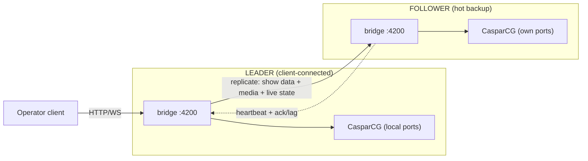

# Work Order 54: Hot backup — leader/follower playout replication

> **⚠️ AGENT COLLABORATION PROTOCOL**
> Every agent that works on this document MUST:
> 1. Add a dated entry to the **Work Log** section at the bottom documenting what was done.
> 2. Update task checkboxes to reflect current status.
> 3. Leave clear **Instructions for Next Agent** at the end of their log entry.
> 4. Do **NOT** delete previous agents' log entries.

**Status:** Draft (planning)
**Parent / context:** [00_PROJECT_GOAL.md](./00_PROJECT_GOAL.md)
**Builds on:**
- [15_WO_CLIENT_SERVER_SYNC.md](./15_WO_CLIENT_SERVER_SYNC.md) — manifest diff + sequential media ingest (`/api/project/diff`, `/api/ingest/upload`, `/api/project/apply-bundle`)
- [49_WO_DEVICE_WIDE_SNAPSHOT_AND_MACHINE_PROFILE.md](./49_WO_DEVICE_WIDE_SNAPSHOT_AND_MACHINE_PROFILE.md) — `hardwareConfig` v2 envelope, device-local vs show-data split
- [52_WO_BRIDGE_DISK_PARTITION_AND_USB_SYNC.md](./52_WO_BRIDGE_DISK_PARTITION_AND_USB_SYNC.md) / [47_WO_EXFAT_DATA_MOUNT_AND_MTIME_BOOT_SYNC.md](./47_WO_EXFAT_DATA_MOUNT_AND_MTIME_BOOT_SYNC.md) — volume-based config/project/media sync
- Full apply flow — `src/utils/full-config-apply.js` (`applyFullServerConfig`)

---

## 1. Goal

Run **two playout machines** as a **hot backup pair**:

- The server the **operator client is currently connected to** is the **leader**.
- The **other** machine is the **follower (hot backup)** — kept continuously in sync and ready to take over.
- **Show data is fully replicated**: media files, looks/scenes, timelines, and **live playout state** (what is on PGM/PRV right now, timeline position, mixer).
- **Device-local settings are NOT replicated**: GPU/xrandr layout, `screen_N_system_id`, physical port wiring, DeckLink device numbers, Caspar AMCP host/port, audio device names. **Ports can differ between the two boxes** and each box keeps its own.

End state: if the leader dies, the operator points the client at the follower (manually or assisted), and the follower is already showing — or can instantly re-take — the same content on its own physical outputs.

### Non-goals (v1)

- No automatic DNS/VIP failover or kernel-level clustering.
- No frame-accurate genlock between the two Caspar outputs (replication is **state-level**: same scene/clip/position within a tolerance, not SDI-sync).
- No more than **2 nodes** in a pair (design data model to allow N later, but ship pair-only).
- No cloud component; replication is **LAN peer-to-peer** over the existing HTTP/WS bridge.

---

## 2. Core concept: three data tiers

The single most important design decision. Every config key and data file falls into exactly one tier:

| Tier | Examples | Replicated leader→follower? | Owner |
|------|----------|------------------------------|-------|
| **Show data (shared)** | `projects/*.json` (scenes, looks, routing intent), timelines, media files, `screenDestinations` *logical* bindings, audio routing intent | **Yes — continuously** | Leader is source of truth |
| **Device-local (per box)** | `osDisplay` (`screen_N_system_id`, `screen_N_os_*`, `multiview_os_*`), `gpuPhysicalTopology`, DeckLink device numbers, `casparServer` host/port/configPath, ALSA/PortAudio device names, `general.json` ports | **Never** | Each box owns its own |
| **Live playout state (hot)** | Active sceneId per channel, timeline playback id + position + play/pause, mixer/transition state | **Yes — streamed** | Leader streams; follower mirrors/armed |

The existing `hardwareConfig` split (WO-49, `src/engine/project-hardware-config.js`) already separates `deviceGraph` / `screenDestinations` (mostly show) from `osDisplay` / `casparServer` (mostly device). **This WO formalizes the boundary** into a single `classifyConfigKey()` module so replication and failover never copy device-local fields.

---

## 3. Phased tasks (small chunks)

### Phase 0 — Role model & peer identity (foundation, no replication yet)

- [ ] **T0.1** Add `replication` config block (new `config/replication.json`, normalized in `src/config/`): `{ enabled, role: "auto"|"leader"|"follower", peer: { host, port, token }, selfId, pairId }`. Default `enabled:false`, `role:"auto"`.
- [ ] **T0.2** `src/replication/role-state.js` — in-memory role machine: `leader` | `follower` | `standalone`. In `auto`, a node becomes **leader when it has ≥1 connected operator WS client**, else `follower`. Expose `getRole()`, `onRoleChange()`.
- [ ] **T0.3** Heartbeat: `GET /api/replication/ping` (cheap: returns `{ selfId, role, appVersion, configHash, liveStateSeq }`). `src/replication/peer-client.js` polls the peer every `HIGHASCG_REPL_PING_MS` (default 2000).
- [ ] **T0.4** `GET /api/replication/status` — aggregated view for UI/Companion: self role, peer reachable, last ack age, lag (state seq delta), media diff pending count. Pure read; no Caspar gate.
- [ ] **T0.5** Smoke test `tools/smoke/smoke-replication-role.js` — role flips leader↔follower as WS client count crosses 0 (mock WS client set).

### Phase 1 — Config classification (device-local guard)

- [ ] **T1.1** `src/config/config-classify.js` — `classifyConfigKey(key)` → `"show"|"device"|"live"`; `splitConfigForReplication(config)` → `{ shared, deviceLocal }`. Reuse WO-49 key lists; add `casparServer` host/port/configPath, `general.json` ports, audio device names, `gpuPhysicalTopology`, all `*_os_*` / `*_system_id` to **device**.
- [ ] **T1.2** Unit test `tools/smoke/smoke-config-classify.js` — assert known keys land in correct tier; assert **no** device-local key is classified `show` (guards regressions). Include the four `screen_N_system_id`, `screen_N_os_x`, `multiview_os_*`, `casparServer.host/port`.
- [ ] **T1.3** Document the boundary in `docs/reference/` (new `hot-backup-replication.md`) with the tier table and the rule: "ports/wiring never travel; looks/media/timelines always travel."

### Phase 2 — Show-data replication (leader → follower, file/manifest level)

- [ ] **T2.1** `src/replication/replicate-projects.js` — on leader project save (`project_sync` WS event already fires, see `routes-data.js`), push the **shared slice only** of the active project to the follower via `POST /api/replication/project` (strips `hardwareConfig.osDisplay` / device tiers via T1.1). Follower writes to its own `projects/` without overwriting its device-local config.
- [ ] **T2.2** `src/replication/replicate-timelines.js` — mirror timeline CRUD (`routes-timeline.js`) to follower `POST /api/replication/timelines`. Debounce like `project_sync`.
- [ ] **T2.3** Server-to-server **media sync**: reuse WO-15 primitives. Leader periodically calls follower `POST /api/project/diff` with its media manifest, then streams missing files to follower `/api/ingest/upload`. New thin wrapper `src/replication/replicate-media.js` (sequential queue, resumable, bandwidth cap `HIGHASCG_REPL_MEDIA_MAX_MBPS`). **Do not** re-implement diff/ingest — call existing routes.
- [ ] **T2.4** Endpoints on follower: `POST /api/replication/project`, `/timelines` (auth via `peer.token`; reject if self is leader to avoid split-brain writes). All gated behind `replication.enabled`.
- [ ] **T2.5** Backfill on (re)connect: when peer link is (re)established, leader runs a **full reconcile** (projects + timelines + media diff) before resuming incremental. Status surfaces "initial sync N% / caught up".
- [ ] **T2.6** Smoke test `tools/smoke/smoke-replication-showdata.js` — two in-process app contexts; save project + timeline on leader; assert follower receives shared slice and **keeps** its own `screen_N_system_id` / ports.

### Phase 3 — Live playout state replication (hot arming)

- [ ] **T3.1** `src/replication/live-state-feed.js` — leader serializes a compact **playout intent** snapshot on each change: `{ seq, channels: { [ch]: { sceneId, source } }, timeline: { id, positionMs, playing }, mixer: {…} }`. Source from existing `state/live-scene-state.js` + `timeline-playback.js` getters. Monotonic `seq`.
- [ ] **T3.2** Stream over a **dedicated WS** leader→follower (`/api/replication/ws`) — send deltas; full snapshot on connect/gap. Reuse `ws-server.js` patterns; separate client set.
- [ ] **T3.3** Follower **apply policy** (configurable `replication.followerMode`):
  - `mirror` (**default**): continuously re-take scenes on its own Caspar so its outputs already match (true hot-on-air backup). Uses **device-local** channel map — never the leader's port numbers.
  - `armed` (opt-in): store latest intent, **do not** drive its Caspar (no double-output, no SDI conflict). On promotion, take it instantly.
- [ ] **T3.4** Translation layer: leader intent references **logical** screen/destination indices; follower resolves them to **its own** channel/output map (`src/config/routing.js` `getChannelMap` on follower's config). Assert no leader port leaks into follower AMCP.
- [ ] **T3.5** Lag metric: follower reports last-applied `seq`; leader computes `lag = leaderSeq - followerSeq` → surfaced in `/api/replication/status`.
- [ ] **T3.6** Smoke test `tools/smoke/smoke-replication-livestate.js` — scene take + timeline play on leader; follower in `mirror` resolves to its own channel map; assert correct local AMCP intent and bounded lag.

### Phase 4 — Promotion & failover

- [ ] **T4.1** `src/replication/promote.js` — `promoteToLeader(ctx)`: stop following, mark role leader, apply latest armed live-state to local Caspar via existing scene-take engine, run `applyFullServerConfig` only if heads/modes changed (usually not — device-local already correct).
- [ ] **T4.2** Trigger paths (both supported):
  - **Auto on leader loss (default):** when the follower loses leader heartbeat for `HIGHASCG_REPL_FAILOVER_MS` (default ~5000ms, configurable), it **auto-promotes** to leader. Gated by `replication.autoPromote` (default `true`). Because the follower default is `mirror`, its outputs are already live — auto-promote primarily flips role + ownership so it accepts client/Companion control and stops expecting a leader feed.
  - **Manual:** `POST /api/replication/promote` (operator/Companion button) at any time, even while the leader is healthy (planned switchover) — triggers graceful demotion of the current leader via fencing (T4.3).
- [ ] **T4.3** Split-brain guard (critical, since auto-promote is enabled): use `pairId` + monotonic `leaderEpoch` fencing. On auto-promote the follower **increments `leaderEpoch`**. If the old leader reappears, the node with the **lower epoch yields** and demotes itself. While a node can still see a healthy peer with a **higher-or-equal** epoch, it refuses to act as leader / refuses replication-push. Network-partition note: if both ends briefly believe they are leader, the epoch reconciliation on rejoin deterministically demotes one; document the small window and that `mirror` mode means both may output during it (acceptable for backup, never genlocked).
- [ ] **T4.4** Demotion: old leader rejoining as follower performs full reconcile **from new leader** before any mirror; never pushes its stale state up.
- [ ] **T4.5** Smoke test `tools/smoke/smoke-replication-failover.js` — kill leader link; promote follower; rejoin old leader → it demotes and reconciles, no split-brain.

### Phase 5 — Client / Companion UX (client repo: highascg-client)

> Server exposes the API; UI lives in **highascg-client**. This phase is the **client-side** chunk.

- [ ] **T5.1** Connection profiles: launcher stores **A/B host** for the pair; one-click "Connect to other node".
- [ ] **T5.2** Replication status banner: leader/follower badge, peer reachable, media sync %, live-state lag, "initial sync" progress. Polls `/api/replication/status`.
- [ ] **T5.3** Manual **Failover / Promote** button with confirm; calls `POST /api/replication/promote`; then reconnect client to the promoted node.
- [ ] **T5.4** Mismatch UI: if follower's device profile is missing/incomplete (no `screen_N_system_id`), warn before relying on it as hot backup.

### Phase 6 — Ops, docs, hardening

- [ ] **T6.1** systemd / boot: optional `replication.enabled` honored at boot; peer link starts after `highascg.service`. Document firewall ports.
- [ ] **T6.2** Backpressure & resilience: media sync resumable across restarts; WS reconnect with snapshot resync; bandwidth cap respected.
- [ ] **T6.3** Security: peer `token` required on all `/api/replication/*`; bind replication endpoints to LAN; reject cross-`pairId` peers.
- [ ] **T6.4** Runbook in `docs/` — pairing two boxes, expected lag, manual failover steps, "what does NOT sync" (ports/wiring), recovery after old leader returns.
- [ ] **T6.5** End-to-end on two real boxes with **different GPU port wiring**: same show plays on both; failover verified; confirm follower used its own `screen_N_system_id`.

---

## 4. Architecture notes & reuse

- **Do not fork** existing sync/apply logic. Replication wrappers **call** existing routes/engines:
  - Media: `/api/project/diff` + `/api/ingest/upload` (WO-15).
  - Config/project persistence: `configManager.save`, project store, `project-hardware-config.js`.
  - Apply on promotion: `src/utils/full-config-apply.js` `applyFullServerConfig`.
  - Live state read: `state/live-scene-state.js`, `engine/timeline-playback.js`.
  - WS: `src/server/ws-server.js` patterns (separate client set for peer link).
- **Leader identity = "has operator WS client"** keeps it simple and matches the user's framing ("the connected-to-client server acts as leader"). `role: "leader"|"follower"` overrides for fixed deployments.
- **Device-local never travels** — enforced centrally in `config-classify.js`; every replication push goes through `splitConfigForReplication`. This is what lets ports differ.
- New code keeps the **≤500 lines/file** principle (00_PROJECT_GOAL). Split per concern: `role-state`, `peer-client`, `replicate-projects`, `replicate-timelines`, `replicate-media`, `live-state-feed`, `promote`.

---

## 5. Success criteria

1. Two boxes with **different DP/HDMI wiring** run the **same show**; saving looks/timelines and ingesting media on the leader appears on the follower within seconds, **without** changing the follower's `screen_N_system_id` / ports.
2. `replication.followerMode: mirror` keeps the follower's **own** outputs showing the same scene/clip/position (within tolerance) as the leader.
3. Operator can **promote** the follower (manual or assisted) and continue the show on the follower's physical outputs with one client reconnect.
4. Old leader rejoining **demotes** cleanly and reconciles from the new leader — **no split-brain**, no stale push.
5. `classifyConfigKey` test proves **no** device-local key is ever marked shared.

---

## 6. Decisions & open questions

**Decided (2026-06-19, user):**

1. **Follower default mode = `mirror`** (follower Caspar actively outputs the same content live on its own ports); `armed` is opt-in.
2. **Promotion = auto on leader disconnect (default) AND manual.** Auto-promote fires after `HIGHASCG_REPL_FAILOVER_MS` of lost heartbeat; manual promote available any time. Split-brain handled by `leaderEpoch` fencing (T4.3).

**Still open:**

3. **Media direction** — leader→follower only, or bidirectional so prep on either box converges? v1: leader→follower only.
4. **Transport for live state** — dedicated WS (proposed) vs piggyback existing `/api/ws` channel with a peer auth flag.
5. **`HIGHASCG_REPL_FAILOVER_MS` value** — needs tuning on real hardware to balance fast failover vs false positives on transient network blips (start ~5000ms).

---

## 7. Expected touch points (server repo)

- `config/replication.json` (new) + `src/config/` normalizer
- `src/config/config-classify.js` (new, with tests)
- `src/replication/` (new dir): `role-state.js`, `peer-client.js`, `replicate-projects.js`, `replicate-timelines.js`, `replicate-media.js`, `live-state-feed.js`, `promote.js`
- `src/api/routes-replication.js` (new) + wire in `src/api/router.js` (pre–Caspar gate for status/ping)
- `src/server/ws-server.js` — peer WS upgrade path
- Reuse: `src/api/routes-data.js`, `routes-project.js`, `routes-ingest.js`, `routes-timeline.js`, `src/engine/project-hardware-config.js`, `src/utils/full-config-apply.js`, `src/state/live-scene-state.js`, `src/engine/timeline-playback.js`
- `tools/smoke/smoke-replication-*.js` (new)
- `docs/reference/hot-backup-replication.md` (new)

---

## 8. Work Log

### 2026-06-19 — WO drafted (planning)

- Captured product ask: **hot backup pair**, **client-connected node = leader**, **per-device settings with differing ports**, **full media/looks/timelines/playout sync**.
- Defined the **three-tier data model** (show / device-local / live) as the central design rule; device-local (ports/wiring) **never replicates**, which is what allows the two boxes to differ.
- Phased into small chunks: role model → config classification → show-data replication → live-state hot arming → promotion/failover → client UX → ops/docs. Each phase has its own smoke test.
- Anchored on existing primitives to avoid duplication: WO-15 diff/ingest for media, WO-49 `hardwareConfig` split, exFAT/bridge sync, `applyFullServerConfig`, `ws-server.js`, scene-take + timeline engines.
- **Instructions for next agent:**
  1. Start with **Phase 0 + Phase 1** — they are low-risk, no live traffic, and unblock everything. Ship `config-classify.js` with its test first; that boundary is the safety guarantee.
  2. Keep replication wrappers as **callers** of existing routes/engines — do not fork sync or apply logic.
  3. Confirm transport choice for live state (dedicated peer WS vs flagged `/api/ws`).

### 2026-06-19 — Policy decisions from user

- **Follower default mode = `mirror`** (was proposed `armed`). Follower actively outputs the same show live on its own physical ports; `armed` becomes the opt-in mode. Updated **T3.3**.
- **Promotion = auto-on-leader-disconnect (default) + manual.** Updated **T4.2** to support both: auto-promote after `HIGHASCG_REPL_FAILOVER_MS` lost heartbeat (gated by `replication.autoPromote`, default true), plus manual `POST /api/replication/promote` for planned switchover.
- Because both `mirror` + auto-promote are now defaults, **split-brain fencing is mandatory** — hardened **T4.3** to use `pairId` + monotonic `leaderEpoch` (lower epoch yields on rejoin) and documented the brief dual-output window during a partition (acceptable for a non-genlocked backup).
- Updated §6: decisions 1 & 2 resolved; remaining open items are media direction, live-state transport, and tuning `HIGHASCG_REPL_FAILOVER_MS`.
- **Instructions for next agent:** unchanged — build Phase 0 + Phase 1 first; Phase 3 should default `followerMode:"mirror"` and Phase 4 should default `autoPromote:true` per these decisions.
