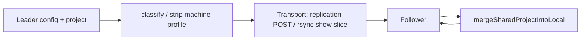

# Work Order 61: Rsync peer sync + Tailscale / Syncthing settings

> **⚠️ AGENT COLLABORATION PROTOCOL**
> Every agent that works on this document MUST:
> 1. Add a dated entry to the **Work Log** section at the bottom documenting what was done.
> 2. Update task checkboxes to reflect current status.
> 3. Leave clear **Instructions for Next Agent** at the end of their log entry.
> 4. Do **NOT** delete previous agents' log entries.

**Status:** In progress (T0 smart config complete 2026-06-27; rsync/Tailscale/Syncthing settings not started)  
**Parent / context:** [00_PROJECT_GOAL.md](./00_PROJECT_GOAL.md)  
**Builds on:**
- [54_WO_HOT_BACKUP_LEADER_FOLLOWER_REPLICATION.md](./54_WO_HOT_BACKUP_LEADER_FOLLOWER_REPLICATION.md) — live playout replication (leader/follower); **essential** path for on-air mirror
- [15_WO_CLIENT_SERVER_SYNC.md](./15_WO_CLIENT_SERVER_SYNC.md) — manifest diff + ingest (HTTP media push)
- [52_WO_BRIDGE_DISK_PARTITION_AND_USB_SYNC.md](./52_WO_BRIDGE_DISK_PARTITION_AND_USB_SYNC.md) / [47_WO_EXFAT_DATA_MOUNT_AND_MTIME_BOOT_SYNC.md](./47_WO_EXFAT_DATA_MOUNT_AND_MTIME_BOOT_SYNC.md) — volume sync patterns
- [39_WO_SETTINGS_SYSTEM_HARDWARE.md](./39_WO_SETTINGS_SYSTEM_HARDWARE.md) — Settings modal tabs, privileged server actions
- Existing deploy: `scripts/deploy/push-backup-box.sh` (`DEPLOY_MODE=code|mirror`)
- Existing read-only API: `GET /api/system/setup` (`routes-system-setup.js`) — Tailscale/Syncthing URLs today

---

## 1. Goal

Give operators **two complementary ways** to keep two playout boxes aligned on **files** (media, templates, projects, selected config), while **WO-54** handles **live playout state**:

| Concern | Primary mechanism (this WO) | Secondary / optional |
|--------|-----------------------------|----------------------|
| Bulk clone / refresh media + show files between boxes | **Rsync over SSH/LAN** (operator-triggered or scheduled) | WO-15 HTTP ingest (already used by replication reconcile) |
| Ongoing media folder sync with GUI | **Syncthing** (optional, enable in settings) | — |
| Reach boxes across sites / NAT | **Tailscale** (optional, enable in settings) | Plain LAN |
| Live PGM/PRV mirror, timelines, takes | **WO-54 replication** (not replaced) | — |

**Operator UX:** new **Settings** tab **“Network sync”** (or split **Tailscale** + **Syncthing** sub-panels) where users can:

- See status of Tailscale and Syncthing (installed, running, connected).
- **Enable / disable** Tailscale and/or Syncthing independently (systemd + persisted config).
- **Tailscale:** start login flow from the UI (invoke `tailscale up`, show auth URL / QR instructions; poll until connected). Link to admin console.
- **Syncthing:** open GUI link, set **GUI authentication** (user + password), optional API key display for HighAsCG replication integration; enable/disable service.

**Design principle:** Rsync is the **simple, predictable** tool for “make backup box look like leader” (full or partial tree). Syncthing remains valuable for **continuous media sync** and its **web GUI** for folder/device management — but must never be the only way to seed a backup box.

**Config principle:** Leader may **push** settings, but the follower **merges only the show slice** — never the backup box’s Device View wiring (see §2).

---

## 2. Smart config sync (leader → follower)

The backup machine often has **different hardware**: fewer screens, different GPU ports, DeckLink layout, or **no cabling at all**. Operators must be able to configure the follower’s rear panel, cables, and screen destinations independently while still receiving **show content** from the leader.

### 2.1 Three tiers (normative)

| Tier | What | Leader pushes? | Follower on receive |
|------|------|----------------|---------------------|
| **Show content** | Looks/scenes (project JSON), timelines, media files, templates, logical routing intent (`audioRouting`, stream/record **definitions**, DMX, Companion maps) | **Yes** | Merge/replace shared slices |
| **Machine profile** | Device View **device graph** (rear panel, **all cables/edges**), **screen destinations** wiring, `osDisplay` / `screen_N_system_id`, GPU xrandr layout, `gpuPhysicalTopology`, `casparServer` host/port/path, DeckLink device numbers, PortAudio device names, `replication`, `general` ports | **No** | **Keep local — never overwrite** |
| **Live playout** | Active scene, timeline position, mixer (WO-54) | Streamed | Applied via channel map **on follower hardware** |

**Rule:** If it describes **which physical connector on this box** or **how cables are drawn**, it is **machine profile**, not show data.

> **Supersedes WO-54 §2 table (2026-06-27):** `deviceGraph` and `screenDestinations` were initially classified as shared show data. User requirement: they are **per-server**; backup may leave destinations unwired or rewire entirely.

### 2.2 Single module — `config-classify.js`

All paths must use the same classifier (no ad-hoc rsync or replication filters):

- `classifyConfigKey(key)` → `'show' | 'device' | null`
- `splitConfigForReplication(config)` → `{ shared, deviceLocal }`
- `stripDeviceLocalFromProject(project)` — leader export: remove **all** machine slices from `hardwareConfig`
- `mergeSharedProjectIntoLocal(existing, incoming)` — follower import: overlay show slices; **preserve** every machine slice from `existing`

**Machine slices in project `hardwareConfig` (never travel):**

`osDisplay`, `casparServer`, `gpuPhysicalTopology`, `fingerprint`, **`deviceGraph`**, **`screenDestinations`**

**Config JSON rsync preset:** copy only keys where `classifyConfigKey === 'show'`. Never rsync `device_graph.json`, `screen_destinations.json`, or `casparcg.config` wholesale to follower.

### 2.3 Apply flow

1. Leader prepares payload with **machine profile stripped**.
2. Follower receives payload.
3. Follower merges into local config/project; **local device graph, cables, screen destinations, and OS display IDs win**.
4. Live replication (WO-54) maps **logical** screen/channel indices to **follower’s** `getChannelMap()` — never leader port numbers.

### 2.4 Operator expectations

- Backup box Device View may show **empty rear panel / no edges** — valid; operator wires only what exists on that machine.
- Saving device graph on follower **must not** be overwritten by the next leader project push.
- Optional future: “Import wiring from leader snapshot” as **explicit** operator action (not default sync).

### 2.5 Tasks — Smart config (WO-54 + this WO)

- [x] **T0.1** Move `deviceGraph`, `screenDestinations` to **device** tier in `config-classify.js` (2026-06-27).
- [x] **T0.2** Extend `stripDeviceLocalFromProject` + `mergeSharedProjectIntoLocal` to preserve/strip graph + destinations (2026-06-27).
- [x] **T0.3** Audit all replication push paths (`replicate-projects`, `receiveProjectFromPeer`, rsync config preset) — assert none write machine profile keys on follower (2026-06-27; see `docs/reference/hot-backup-replication.md` audit table; mirror excludes `device_graph.json` / `screen_destinations.json`).
- [x] **T0.4** Smoke: follower keeps local `deviceGraph` after leader project push; leader push payload omits graph/destinations (`tools/smoke/smoke-replication-showdata.js`).
- [x] **T0.5** Docs: update `docs/reference/hot-backup-replication.md` tier table + WO-54 §2 footnote (2026-06-27).
- [x] **T0.6** UI: Device View banner when paired — “Wiring and screen destinations are local to this server.” (`device-view-inspector-replication.js`).

---

## 3. Non-goals (v1)

- Replacing WO-54 live-state replication or project JSON push over HTTP.
- Automatic Syncthing pairing without operator consent (device trust remains explicit).
- Tailscale ACL / policy editor in HighAsCG (link to Tailscale admin only).
- Bi-directional conflict resolution for rsync (v1: **one direction per job** — leader → follower or explicit “mirror this host”).
- Cloud storage backends (S3, etc.).

---

## 4. Rsync peer sync (server + UI)

### 4.1 Scope — what rsync jobs may include

Configurable **presets** (checkboxes in UI):

| Preset | Paths | Notes |
|--------|-------|-------|
| **Show media** | `media/` (exclude `media/.replication-active/`) | Large; progress % required |
| **Templates** | `template/` | HTML/CG assets |
| **Projects** | `projects/` | Show JSON |
| **App config (show slice only)** | Filtered `config/*.json` via `splitConfigForReplication` — **never** `device_graph.json`, `screen_destinations.json`, `casparcg.config` | Show routing intent only; see §2 |
| **Full playout tree** | Entire `~/highascg` with documented excludes | Same as `DEPLOY_MODE=mirror` in `push-backup-box.sh` |

**Always exclude:** `.git/`, `cef-cache/`, `log/`, `node_modules/.cache`, `media/.replication-active/`, runtime state (`.highascg-state.json`, `.module-state.json`, `.env`).

**Never delete on target by default** for code-only updates; **mirror preset** may use `rsync --delete` only inside selected subtrees (e.g. `media/`, `projects/`) with confirm dialog.

### 4.2 Transport

- **LAN:** SSH to peer `casparcg@<host>` (reuse SSH keys or password prompt via documented setup).
- **Tailscale:** same rsync/SSH when Tailscale enabled and peer reachable on tailnet IP (100.x).
- Reuse / extend `scripts/deploy/push-backup-box.sh` logic in a server module — avoid duplicating exclude lists (`scripts/lib/archive-common.sh` + shared `config/rsync-peer-excludes.txt`).

### 4.3 API (new)

- `GET /api/sync/peer/status` — last job, running?, bytes, peer host, preset, errors.
- `POST /api/sync/peer/rsync` — body `{ peerHost, peerUser?, preset, dryRun?, deleteExtraneous? }` — starts job async; returns `jobId`.
- `GET /api/sync/peer/rsync/:jobId` — progress stream or poll (percent, current file, ETA).
- `POST /api/sync/peer/rsync/cancel` — optional v1.1.

Jobs run as **`casparcg`** via `rsync -e ssh` (not arbitrary shell). Sudo only if future hook requires it (prefer not).

### 4.4 UI surfaces

1. **Settings → Network sync → Rsync** — peer host picker (saved peers from replication pair / manual entry), preset checkboxes, **Dry run**, **Start sync**, progress log.
2. **Device View → Server → Hot backup** — shortcut: “Sync files to follower” / “Pull files from leader” when replication paired (calls same API with peer from `replication.peer`).

### 4.5 Tasks — Rsync

- [ ] **T1.1** Shared exclude manifest: `config/rsync-peer-excludes.txt` + `src/sync/rsync-excludes.js` (single source; used by deploy script + server).
- [ ] **T1.2** `src/sync/peer-rsync.js` — job runner (spawn `rsync`, parse `--info=progress2`, persist job state under `data/sync-jobs/` or in-memory + file log).
- [ ] **T1.3** API routes `src/api/routes-sync-peer.js` — wire GET/POST above; auth: same as other settings mutations (nuclear password if enabled).
- [ ] **T1.4** Refactor `scripts/deploy/push-backup-box.sh` to call shared exclude helper (no drift).
- [ ] **T1.5** Client: `client/components/settings-network-sync-panel.js` + templates tab **Network sync**.
- [ ] **T1.6** Device View hot backup: rsync action buttons + toast progress.
- [ ] **T1.7** Smoke test `tools/smoke/smoke-sync-peer-rsync.js` — mock rsync, exclude `.replication-active`, assert config classify filter for config preset.
- [ ] **T1.8** Docs: `docs/reference/peer-rsync-sync.md` — when to use rsync vs Syncthing vs WO-54 live replication.

---

## 5. Tailscale (settings + server control)

### 5.1 Requirements

- Persist `{ enabled: boolean }` in new `config/network-sync.json` (or extend `config/general.json` — prefer dedicated file).
- **Enable:** ensure `tailscaled` running; `systemctl enable --now tailscaled`.
- **Disable:** `systemctl stop tailscaled` (optional disable on boot — document).
- **Login:** `POST /api/network/tailscale/login` — runs `sudo tailscale up` (or `tailscale up` if already permitted), returns `{ authUrl?, needsLogin, ipv4?, statusLine? }`. UI displays URL + copy button; poll `GET /api/network/tailscale/status` every 3s until connected.
- **Logout (optional v1.1):** `tailscale logout` with confirm.

Extend existing `GET /api/system/setup` tailscale block or add dedicated routes under `/api/network/tailscale/*` to avoid bloating setup payload.

### 5.2 Tasks — Tailscale

- [ ] **T2.1** `config/network-sync.json` schema + `src/config/network-sync-config.js`.
- [ ] **T2.2** `src/network/tailscale-service.js` — status, enable/disable, login (sudo helpers with fixed commands only).
- [ ] **T2.3** Sudoers fragment for `tailscale up`, `tailscale status` (narrow); document in `docs/HIGHASCG_PASSWORDLESS_SUDO.md`.
- [ ] **T2.4** Settings UI: Tailscale section — toggle, status, **Log in**, admin link, tailnet IPv4 display.
- [ ] **T2.5** Installer hook: ensure `tailscale` package on ISO / `scripts/setup/` (optional package).

---

## 6. Syncthing (settings + authentication)

### 6.1 Requirements

- Persist `{ enabled: boolean, guiUser?: string, guiPassword?: string (encrypted or restricted write), apiKey?: read-only display }`.
- **Enable:** `systemctl enable --now syncthing@casparcg` (existing `scripts/setup/12-syncthing-highascg.sh` patterns).
- **Disable:** stop service; replication hot-backup should detect disabled Syncthing and skip media staging (graceful degrade — WO-54 already logs warnings).
- **GUI auth:** UI fields to set Syncthing GUI user/password → server writes `config.xml` `<gui><user>` / `<password>` via `syncthing cli` or controlled XML patch + restart syncthing.
- **Link:** show `http://<primary-ip>:8384` and tailnet URL when Tailscale up.
- **Relation to WO-54:** when Syncthing enabled, hot backup **may** use REST API (`syncthing-client.js`) for referenced media; when disabled, rely on rsync + WO-15 ingest only.

**Important:** exclude `media/.replication-active/` from any **manual/full Syncthing folder share** of `media/` — staging is internal to hot backup (lesson from 2026-06-27 deploy).

### 6.2 Tasks — Syncthing

- [ ] **T3.1** `src/network/syncthing-service.js` — status (device ID, folder list, sync percent), enable/disable systemd, read/write GUI credentials (never return password hash to client; allow set-only).
- [ ] **T3.2** API `GET/POST /api/network/syncthing/*` — status, enable, disable, `set-gui-auth`.
- [ ] **T3.3** Settings UI: Syncthing section — toggle, open GUI, set username/password, show device ID, link to docs.
- [ ] **T3.4** Align `highascg.service.d` `Environment=HOME=...` drop-in with settings save (WO-54 replication API key read).
- [ ] **T3.5** Update WO-54 doc §9: Syncthing = **optional** continuous media; rsync = **operator bulk sync**.

---

## 7. Settings modal integration

### 7.1 Tab layout

Add tab **`network-sync`** (label: **Network sync** or **Tailscale / Syncthing**) in:

- `client/components/settings-modal-templates.js`
- `client/components/settings-modal.js` — activate tab, mount panel
- `client/components/settings-modal-logic.js` — include `networkSync` in save payload if stored server-side

Panel sections (vertical):

1. **Overview** — which services installed; links to peer rsync status.
2. **Tailscale** — enable toggle, login, status, admin link.
3. **Syncthing** — enable toggle, GUI auth, open GUI, device ID.
4. **Rsync to peer** — host, preset, dry-run, run (see §4.4).

### 7.2 Tasks — Settings UI

- [ ] **T4.1** Templates + tab button + pane container.
- [ ] **T4.2** `settings-network-sync-panel.js` — fetch/mutate APIs; reuse nuclear password gate for enable/disable/login/set-auth (same as system-hardware reboot).
- [ ] **T4.3** Persist `network-sync.json` via existing settings save path or dedicated POST (document choice in Work Log).

---

## 8. Security & ops

- All privileged actions: **allow-listed commands only** (pattern from `routes-system-setup.js`, WO-39).
- Syncthing GUI bound to LAN + tailnet; default **require** GUI password when exposed on `0.0.0.0:8384`.
- Rsync over SSH: recommend key-based auth between pair; document `ssh-copy-id` in runbook.
- Audit log line per rsync job: `{ who, peer, preset, bytes, duration, ok }` in server log.

---

## 9. Success criteria

1. Operator can **clone show media + projects** from leader to follower with one Settings action (rsync), without Syncthing installed.
2. Operator can **enable Tailscale**, complete login from Settings, and rsync to peer over tailnet IP.
3. Operator can **enable Syncthing**, set GUI login, open Syncthing UI — without manual SSH editing of `config.xml`.
4. `media/.replication-active/` is **never** copied by rsync mirror or full Syncthing share of `media/`.
5. WO-54 live replication continues to work when Syncthing disabled (degraded media path only).
6. `push-backup-box.sh` code overlay **never deletes** `bin/`, `lib/`, or `media/` on target (regression guard).
7. After leader project/config push, follower **retains its own** Device View graph, cables, and screen destinations (§2).

---

## 10. Relationship to WO-54 (normative)

| Layer | Tool | Purpose |
|-------|------|---------|
| **Live playout** | WO-54 replication WS + scheduled apply | Same scene/clip/position on air |
| **Show files (bulk)** | **Rsync (this WO)** | Seed or refresh backup box |
| **Media (continuous)** | **Syncthing (optional)** | Background clip sync with GUI |
| **Reachability** | **Tailscale (optional)** | Rsync/HTTP across NAT |

Decided **2026-06-27 (user):** Rsync is easier than Syncthing for transferring media and configs between servers; Syncthing remains an **additional** option because of its GUI.

Decided **2026-06-27 (user):** Config sync must be **smart** — leader pushes show data; follower keeps machine-specific wiring (Device View graph, cables, screen destinations, GPU/DeckLink mapping). See §2.

---

## 11. Work Log

### 2026-06-27 — T0.3–T0.6 complete (agent)

- Audited replication paths; documented in `docs/reference/hot-backup-replication.md` (audit table).
- Mirror deploy excludes `config/device_graph.json` and `config/screen_destinations.json`.
- Smoke: `smoke-replication-showdata.js` — strip + merge preserves follower graph/destinations.
- UI: paired-server note in Device View hot backup inspector; fixed `refreshStatus` mode reset.
- Fixed `push-backup-box.sh` `TMP: unbound variable` on code push exit (trap cleared in function).

**Instructions for Next Agent:** Start **T1.1–T1.4** (shared rsync excludes + server job runner).

### 2026-06-27 — Smart config tiers (agent)

- Added §2: three-tier model; `deviceGraph` + `screenDestinations` are **machine profile**, not replicated show data.
- Implemented in `config-classify.js`: moved keys to device tier; extended project strip/merge.
- Supersedes WO-54 §2 table row for deviceGraph/screenDestinations.

**Instructions for Next Agent:** Complete **T0.3–T0.6** (audit push paths, smoke test, docs, UI hint) before rsync config preset ships.

### 2026-06-27 — Work order created (agent)

- Captured user decision: rsync primary for file/config transfer; Syncthing optional; Settings modal for Tailscale login + enable/disable + Syncthing auth.
- Documented lessons from `push-backup-box.sh`: destructive pre-extract deleted `bin/`/`lib/`; fixed to overlay; exclude `media/.replication-active/`.
- Split tasks into rsync, Tailscale, Syncthing, Settings UI phases.

**Instructions for Next Agent:**

1. Start with **T1.1–T1.4** (shared excludes + server rsync job) — unblocks both Settings UI and deploy script parity.
2. Add Settings tab skeleton (**T4.1**) early so UX can be tested with stub API.
3. Coordinate with WO-54: update `docs/reference/hot-backup-replication.md` when T3.5 lands.
4. Do not block WO-54 E2E on Syncthing — rsync mirror is sufficient for two-box file parity testing.
