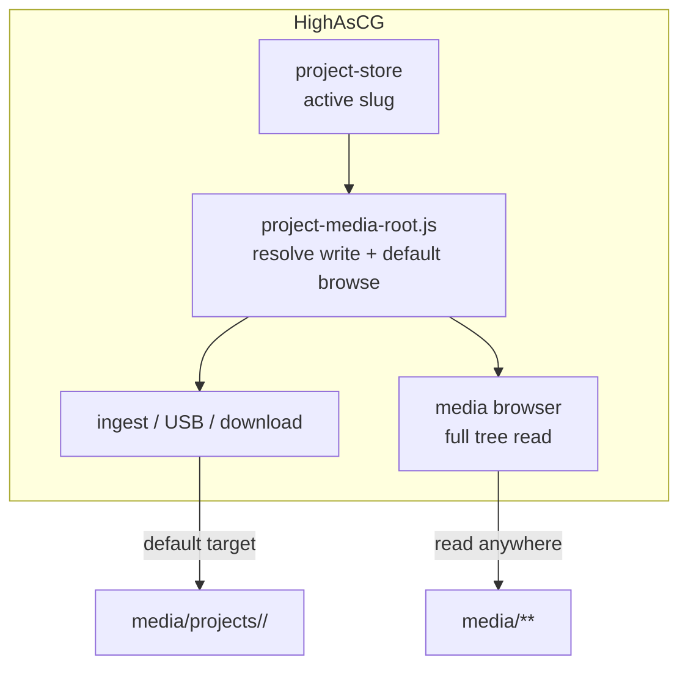

# Work Order 62: Project-scoped media root (portable show folders)

> **⚠️ AGENT COLLABORATION PROTOCOL**
> Every agent that works on this document MUST:
> 1. Add a dated entry to the **Work Log** section at the bottom documenting what was done.
> 2. Update task checkboxes to reflect current status.
> 3. Leave clear **Instructions for Next Agent** at the end of their log entry.
> 4. Do **NOT** delete previous agents' log entries.

**Status:** In progress (Phase 1–3 complete 2026-06-27; manual field QA pending)  
**Parent / context:** [00_PROJECT_GOAL.md](./00_PROJECT_GOAL.md)  
**Builds on:**
- [14_WO_OFFLINE_PREPARATION_MODE.md](./14_WO_OFFLINE_PREPARATION_MODE.md) — offline drafts, path mapping on sync
- [15_WO_CLIENT_SERVER_SYNC.md](./15_WO_CLIENT_SERVER_SYNC.md) — manifest diff + publish ingest
- [29_WO_USB_MEDIA_INGEST.md](./29_WO_USB_MEDIA_INGEST.md) — USB copy into media folder
- [52_WO_BRIDGE_DISK_PARTITION_AND_USB_SYNC.md](./52_WO_BRIDGE_DISK_PARTITION_AND_USB_SYNC.md) — canonical media root on bridge partition
- [54_WO_HOT_BACKUP_LEADER_FOLLOWER_REPLICATION.md](./54_WO_HOT_BACKUP_LEADER_FOLLOWER_REPLICATION.md) — project-referenced media staging (`.replication-active`)
- [61_WO_RSYNC_PEER_SYNC_AND_NETWORK_SETTINGS.md](./61_WO_RSYNC_PEER_SYNC_AND_NETWORK_SETTINGS.md) — bulk media sync between boxes

---

## 1. Goal

Make each **active project** behave like a **portable show kit** on disk:

1. When a project is **opened / activated**, the system ensures a dedicated folder under the main media tree:
   ```
   <media_root>/projects/<project_slug>/
   ```
   This folder is the project's **write root** — the default destination for all media created or ingested **while that project is active**.

2. Operators still have **full read/browse access** to the entire media library (`<media_root>/**`). The project folder is **not** a sandbox jail — it is the **default ingest target** and the **natural bundle boundary** when copying a show to another machine or USB stick.

3. A portable show becomes: `projects/<slug>.json` (show data) + `media/projects/<slug>/` (project-owned clips). Copy both trees to another box and open the project — clips resolve without hunting across a flat media root.

**Primary UX target:** prep at home → copy one folder pair → play on site without reorganizing media.

---

## 2. Problem statement (current)

| Area | Today | Pain |
|------|-------|------|
| **Project JSON** | `~/highascg/projects/<slug>.json` via `project-store.js` | Show data is already per-project, but media is not scoped |
| **Media ingest** | Everything lands at `getMediaIngestBasePath()` root (or optional `path` subdir on upload) | Clips from many shows mix in one flat library |
| **Media references** | Layer `source.value` stores CLS-relative paths like `clip.mov` or `folder/clip.mov` | No stable link between project slug and on-disk layout |
| **Publish / sync** | WO-15 manifest scans **entire** media tree (`routes-project.js` `handleBundle`) | Slow diff; unrelated files included |
| **Replication** | `sync-project-media.js` hardlinks **referenced** clips into `.replication-active/` | Works for hot backup but does not give operators a visible, copy-friendly folder |
| **USB ingest** | Default subfolder template `usb/{label}/{date}` (WO-29) | Not tied to active project |

Operators who want a **compact, movable show** must manually curate folders or rely on replication staging — neither matches "project owns its media root."

---

## 3. Target architecture

### 3.1 On-disk layout

```
<media_root>/                          ← getMediaIngestBasePath() / local_media_path
├── projects/
│   ├── evening_news/                  ← active project write root
│   │   ├── gfx/
│   │   │   └── lower_third.mov
│   │   └── open.mxf
│   └── sunday_service/
│       └── ...
├── stock/                             ← shared library (unchanged access)
├── usb/                               ← legacy / generic ingest (still allowed)
├── .highascg-thumbnails/              ← system (WO-42)
└── .replication-active/               ← replication staging (WO-54, unchanged)
```

**Slug rule:** reuse `projectSlugFromName()` from `src/engine/project-store.js` — same slug as `projects/<slug>.json`. Optional explicit `project.slug` on JSON overrides name-derived slug (already supported by `withProjectSlug`).

**Reserved names:** `projects/` is a first-class namespace. Do not treat `projects` as a user-deletable media clip id without guardrails.

### 3.2 Runtime model



| Concept | Definition |
|---------|------------|
| **Media root** | `getMediaIngestBasePath(config)` — unchanged |
| **Project media root** | `path.join(mediaRoot, 'projects', activeSlug)` |
| **Default ingest base** | Project media root when `activeSlug` is set; else media root (backward compatible) |
| **Browse scope** | **Full** media tree always visible in Sources browser and folder picker |
| **Default browse folder** | Project media root when opening Media tab / file picker (operator can navigate up) |

Persist active slug already exists: `web_project_active_slug` in persistence (`project-store.js`).

### 3.3 Path references in project JSON

**v1 rule (recommended):** store media ids **relative to project media root** when the file lives under `projects/<slug>/`:

| On disk | Stored in layer `source.value` |
|---------|--------------------------------|
| `media/projects/evening_news/open.mxf` | `open.mxf` |
| `media/projects/evening_news/gfx/lower.mov` | `gfx/lower.mov` |
| `media/stock/loop.mp4` (shared library) | `../stock/loop.mp4` **or** absolute-from-media-root `stock/loop.mp4` |

**Resolution order** (`resolveMediaFileOnDisk` extension):

1. If active project: try `projects/<slug>/<value>`
2. Try `<media_root>/<value>` (existing behaviour)
3. Stem search under media root (existing fallback)

**Migration:** on project load / save, optional normalizer rewrites known paths that point at `projects/<slug>/...` to project-relative form (idempotent).

### 3.4 Portability workflows

| Workflow | Expected behaviour |
|----------|-------------------|
| **Copy show to USB** | Copy `projects/<slug>.json` + `media/projects/<slug>/` — sufficient for playout |
| **Open on another box** | Load project JSON; media resolves under local `media/projects/<slug>/` |
| **Publish from laptop (WO-15)** | Manifest includes project folder + shared refs only (`collectProjectAssetRefs` + folder scan), not whole library |
| **USB ingest (WO-29)** | Default `targetSubdir` → `projects/<slug>` when project active |
| **Replication (WO-54)** | May continue using `.replication-active`; optionally also sync `media/projects/<slug>/` as Syncthing/rsync unit (future tie-in to WO-61) |

---

## 4. Success criteria

### A. Project folder lifecycle

- [ ] **A1.** On **project activate** (load/switch/open), ensure `media/projects/<slug>/` exists (`mkdir -p`).
- [ ] **A2.** On **new project** create, allocate slug + empty project media folder atomically.
- [ ] **A3.** Project list API exposes `mediaFolder: "projects/<slug>"` for UI badges and copy-to-USB hints.
- [ ] **A4.** Renaming a project updates **display name** only; slug stays stable (document: slug rename = advanced/manual v2).

### B. Ingest defaults to project root

- [ ] **B1.** `POST /api/ingest/upload` — when no explicit `path` field, write to project media root (not flat media root).
- [ ] **B2.** `POST /api/ingest/download` — same default subdir.
- [ ] **B3.** USB import (`routes-usb-ingest.js`) — default `targetSubdir` = `projects/<slug>` when active.
- [ ] **B4.** Client drag-drop / file picker upload passes no `path` — server applies project default.
- [ ] **B5.** Explicit `path` in ingest API still works (power users can target `stock/` etc.).

### C. Browse remains library-wide

- [ ] **C1.** Sources **Media** tab lists **entire** `<media_root>` tree (existing `scanMediaRecursiveForBrowser`).
- [ ] **C2.** Optional UI: **"This project"** quick filter / default expanded node = `projects/<slug>` — not a hard filter.
- [ ] **C3.** Folder create via UI: default parent = project media root; user can pick another folder.

### D. Resolution & references

- [ ] **D1.** `resolveMediaFileOnDisk` checks project-scoped paths before global search.
- [ ] **D2.** `collectProjectAssetRefs` unchanged input; resolution uses new rules.
- [ ] **D3.** New clips added while project active get project-relative ids in layer sources where possible.
- [ ] **D4.** Clips referenced from `stock/` or other shared folders keep media-root-relative ids.

### E. Sync / bundle / replication

- [ ] **E1.** `GET /api/project/bundle` manifest scoped to **project asset refs** + files under `projects/<slug>/`, not full media scan.
- [ ] **E2.** WO-15 publish diff/upload preserves subpaths under `projects/<slug>/`.
- [ ] **E3.** Replication staging (`rebuildProjectMediaStaging`) prefers linking from `projects/<slug>/` when refs resolve there.
- [ ] **E4.** Document portable copy checklist in `docs/wiki/api/project-state-media.md`.

### F. Settings & config

- [ ] **F1.** Config flag `project_scoped_media_enabled` (default **`true`** on new installs; **`false`** optional for legacy flat behaviour during transition).
- [ ] **F2.** When disabled, ingest behaves as today (flat media root).
- [ ] **F3.** Settings → **Media** section: toggle + read-only display of active project media path.

### G. Safety

- [ ] **G1.** All paths sandboxed via existing `resolveSafe` — no escape from `<media_root>`.
- [ ] **G2.** Deleting a project does **not** auto-delete `media/projects/<slug>/` (confirm modal v2); v1 = orphan folder OK.
- [ ] **G3.** `projects/` and `.replication-active/` hidden from default browser listing (align WO-42 hidden-folder policy).

---

## 5. Code map

| Concern | File / area |
|---------|-------------|
| Project slug / activate | `src/engine/project-store.js`, `src/api/routes-data.js` |
| **Project media root resolver** | `src/media/project-media-root.js` [NEW] |
| Path resolution | `src/media/local-media-paths.js` (`resolveMediaFileOnDisk`) |
| Ingest upload/download | `src/api/routes-ingest.js` |
| USB ingest | `src/api/routes-usb-ingest.js`, `src/media/usb-drives.js` |
| Bundle / manifest | `src/api/routes-project.js` |
| Asset ref collection | `src/replication/project-media-refs.js`, `client/lib/project-media-refs.js` (if present) |
| Media browser API | `src/api/media-catalog.js`, `src/media/local-media-api.js` |
| Client upload UX | `client/components/sources-panel.js`, ingest helpers |
| Client project switch | project load handlers in `client/` (grep `project/save`, `activeSlug`) |
| Config defaults | `config/default.js`, `src/api/settings-get.js` / `settings-post.js` |
| Smoke tests | `tools/smoke/smoke-project-media-root.test.js` [NEW] |

### 5.1 Proposed `project-media-root.js` API

```js
/** @returns {string | null} active slug or null */
function getActiveProjectSlug(persistence)

/** @returns {string} absolute path media/projects/<slug> or media root if no slug */
function getProjectMediaRoot(config, persistence)

/** @returns {string} relative id e.g. "projects/evening_news" */
function getProjectMediaRelId(slug)

/** @returns {string} default ingest subdir relative to media root e.g. "projects/evening_news" */
function getDefaultIngestSubdir(config, persistence)

/** Normalize stored media id for save (project-relative when under project root) */
function normalizeMediaIdForProject(storedId, slug, mediaRoot)
```

---

## 6. Tasks

### Phase 1 — Server foundation
- [x] **T62.1** Add `src/media/project-media-root.js` with helpers above; unit-test slug → path mapping.
- [x] **T62.2** Hook **project activate** in `routes-data.js` (load/switch) to `ensureProjectMediaDir(slug)`.
- [x] **T62.3** Extend `resolveMediaFileOnDisk` to probe `projects/<activeSlug>/` first (read active slug from ctx or pass config bag).
- [x] **T62.4** Wire default ingest subdir in `routes-ingest.js` (upload + download) via `getDefaultIngestSubdir`.
- [x] **T62.5** Wire USB import default subdir in `routes-usb-ingest.js`.
- [x] **T62.6** Add `project_scoped_media_enabled` to config + settings GET/POST.

### Phase 2 — References & bundle scope
- [x] **T62.7** Path normalizer on project save (server): rewrite absolute `projects/<slug>/...` → relative.
- [x] **T62.8** Narrow `handleBundle` / manifest in `routes-project.js` to project refs + `projects/<slug>/` tree.
- [x] **T62.9** Update `rebuildProjectMediaStaging` to resolve from project folder first.
- [x] **T62.10** Mirror path normalization in client project save if client constructs media ids locally.

### Phase 3 — Web UI
- [x] **T62.11** Media tab: show breadcrumb or badge **"Project: &lt;name&gt;"** with path `projects/<slug>`.
- [x] **T62.12** Optional filter toggle **"This project only"** (client-side filter on tree).
- [x] **T62.13** New folder / upload default parent = project media root; navigating to `stock/` still allowed.
- [x] **T62.14** Project manager / header: on switch, toast "Media uploads go to projects/&lt;slug&gt;/".
- [x] **T62.15** Settings → Media: show active project media path + feature toggle.

### Phase 4 — Migration & docs
- [x] **T62.16** Legacy mode: when `project_scoped_media_enabled=false`, zero behaviour change (regression gate).
- [x] **T62.17** Document portable copy workflow (`projects/*.json` + `media/projects/<slug>/`) in wiki.
- [ ] **T62.18** Optional one-shot script `tools/migrate-project-media-into-folders.js` — moves clips **referenced by project** into `projects/<slug>/` (dry-run default); **not** required for v1 launch.

### Phase 5 — Verification
- [x] **T62.19** Smoke: activate project → upload → file lands under `media/projects/<slug>/`.
- [x] **T62.20** Smoke: reference `stock/loop.mp4` from project → still plays.
- [x] **T62.21** Smoke: bundle manifest excludes unrelated media at media root.
- [ ] **T62.22** Manual: copy `projects/foo.json` + `media/projects/foo/` to second machine → open → playout works.
- [ ] **T62.23** Manual: USB ingest with active project lands in project folder.

---

## 7. Technical considerations

- **Caspar CLS paths:** Caspar sees files relative to `<media-path>`. Storing `projects/<slug>/clip.mov` as CLS id **or** project-relative `clip.mov` both work if resolution normalizes before AMCP `LOAD`. Prefer **project-relative** in JSON; expand to full media-relative id when sending AMCP if Caspar requires it.
- **No slug rename v1:** Renaming display title must not break folder mapping. Slug change = copy folder + manual fix (document).
- **Concurrent projects:** Only **active** project gets default ingest. Background autosave for inactive projects does not redirect ingest.
- **Disk space:** Pre-flight ingest checks use project folder + media root statfs as today.
- **Hidden folders:** `projects/` is **not** hidden — it is operator-visible. Only dot-folders (`.replication-active`, `.highascg-thumbnails`) stay hidden per WO-42.
- **Performance:** Scoped manifest shrinks WO-15 diff for large libraries (primary win on 1 TB+ bridge disks).

---

## 8. Open decisions (bikeshed)

| # | Question | Proposal |
|---|----------|----------|
| 1 | Folder name: `projects/` vs `project/` | **`projects/`** (plural, matches `~/highascg/projects/`) |
| 2 | Shared clip path form | Media-root-relative `stock/loop.mp4` (no `..` segments) |
| 3 | Default enabled? | **`true`** for new installs; **`false`** default in code until migration tested — flip in installer |
| 4 | Auto-move legacy clips? | Opt-in script only (T62.18), not on by default |
| 5 | Delete project deletes media folder? | **No** in v1 (data loss risk) |

---

## 9. Out of scope (v1)

- Per-project **template** root under `template/projects/<slug>/` (templates stay global; future WO).
- Encrypting or compressing project media bundles.
- Cloud sync provider integration (WO-61 covers rsync/Syncthing at library level).
- Automatic slug rename with folder move.
- Quota per project.

---

## 10. Work Log

### 2026-06-27 — Agent (Phase 1–2 implementation)

**Work Done:**
- Added `src/media/project-media-root.js` (slug paths, ingest base, path normalize/expand, scoped manifest).
- Wired project activate/save (`routes-data.js`, `project-scenes.js`), ingest upload/download, USB import defaults.
- Extended `resolveMediaFileOnDisk` with project-scoped candidates.
- Scoped `GET /api/project/bundle` manifest; replication staging resolves project-relative refs.
- Config `projectScopedMedia.enabled` + Settings Media (USB) tab checkbox.
- Smoke: `npm run smoke:project-media-root` (6 tests pass).

**Status:** Server core complete. Phase 3 UI polish + manual field QA pending.

**Instructions for Next Agent:**
1. Manual T62.22–T62.23 on production Ubuntu.
2. Optional T62.18 migration script for legacy flat media layouts.

### 2026-06-27 — Agent (Phase 3 UI)

**Work Done:**
- `client/lib/project-media-context.js` — list/settings cache, upload subdir, filter, client-side path normalize.
- Sources panel: project media bar, “This project only” filter, upload/mkdir/URL download use project folder.
- Project load toast via `project-import-flow.js`; save/autosave normalize refs in header + app.js.
- Wiki: portable media section in `docs/wiki/api/project.md`.

---

**Work Done:**
- Surveyed current project storage (`project-store.js`), media paths (`local-media-paths.js`), ingest (`routes-ingest.js`), USB ingest (WO-29), bundle/manifest (`routes-project.js`), and replication staging (`sync-project-media.js`).
- Defined target layout `media/projects/<slug>/`, default ingest behaviour, library-wide browse, path resolution rules, and phased tasks aligned with WO-14/15/29/54/61.

**Status:** Work order created. Implementation pending.

**Instructions for Next Agent:**
1. Start Phase 1 (T62.1–T62.6): implement `project-media-root.js` and ingest defaults behind `project_scoped_media_enabled`.
2. Add smoke test T62.19 before UI work — server-only path proves the core contract.
3. Confirm with operator whether **`projects/`** plural is acceptable vs literal `project/` in user request (§8).

---
*Work Order created: 2026-06-27 | Series: HighAsCG media & projects | Parent: 00_PROJECT_GOAL.md*
