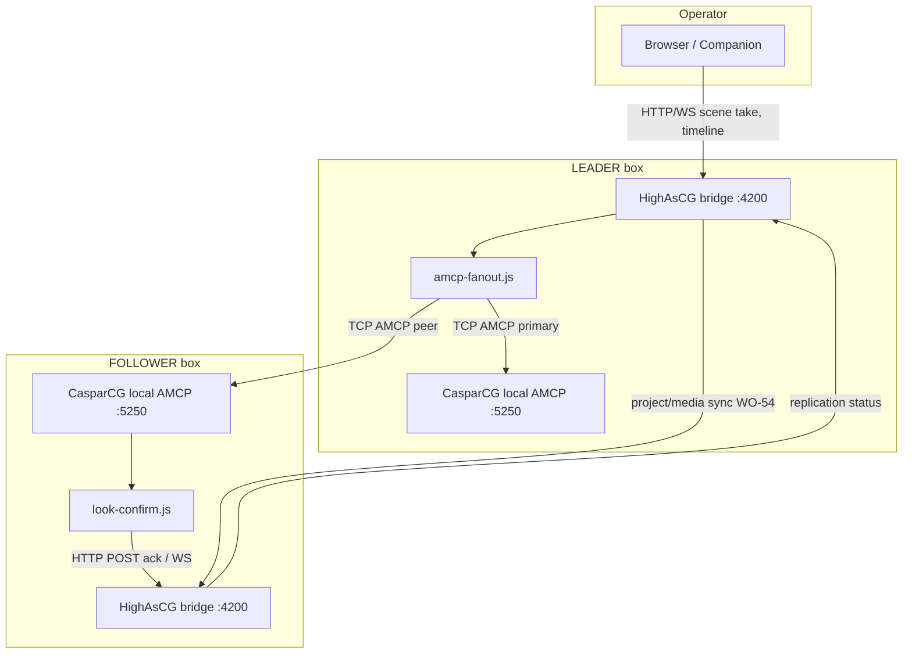

# Work Order 64: Hot backup extended — AMCP fan-out mirror (WO-54 Phase 3 replacement)

> **⚠️ AGENT COLLABORATION PROTOCOL**
> Every agent that works on this document MUST:
> 1. Add a dated entry to the **Work Log** section at the bottom documenting what was done.
> 2. Update task checkboxes to reflect current status.
> 3. Leave clear **Instructions for Next Agent** at the end of their log entry.
> 4. Do **NOT** delete previous agents' log entries.

**Status:** Phase A–C **shipped** (2026-06-27); Phase D–G outstanding — see [65_WO_HOT_BACKUP_ROBUSTNESS_FAILOVER_PLAYHEAD_SYNC.md](./65_WO_HOT_BACKUP_ROBUSTNESS_FAILOVER_PLAYHEAD_SYNC.md)  
**Parent / context:** [00_PROJECT_GOAL.md](./00_PROJECT_GOAL.md)  
**Extends / supersedes (in part):**
- [54_WO_HOT_BACKUP_LEADER_FOLLOWER_REPLICATION.md](./54_WO_HOT_BACKUP_LEADER_FOLLOWER_REPLICATION.md) — pairing, show-data sync, Device View UX, Syncthing staging (**keep**)
- [61_WO_RSYNC_PEER_SYNC_AND_NETWORK_SETTINGS.md](./61_WO_RSYNC_PEER_SYNC_AND_NETWORK_SETTINGS.md) — bulk media / network (**keep**)

**Builds on (existing code — do not rewrite):**
- `src/caspar/connection-manager.js` — local Caspar TCP / `casparcg-connection` adapter
- `src/caspar/amcp-client.js` — send queue, `raw()`, timeouts, offline routing
- `src/caspar/amcp-batch.js` — BEGIN…COMMIT chunking, MIXER COMMIT ordering (scene take)
- `work/casparcg-node-connection.md` — adapter strategy for `casparcg-connection`
- `src/replication/` — peer identity, pairing, project/timeline push, status UI (**reuse**; demote live re-take mirror)
- `src/engine/scene-take-lbg.js` / `scene-take-pgm-only.js` — **leader-only** orchestration; follower must not re-run take engine in mirror mode

**Operator doc (update when shipped):** `docs/reference/hot-backup-replication.md`

---

## 1. Problem statement (field, 2026-06-27)

WO-54 **Phase 3** implemented **semantic mirror**: leader broadcasts `{ sceneId, updatedAt }` per screen; follower **re-executes** `runSceneTakeLbg()` locally. This is **not** frame-accurate Caspar sync.

| Symptom | Root cause |
|---------|------------|
| Not every look transition reaches follower | WS / HTTP catch-up gaps; dedup by `updatedAt`; duplicate reconcile on connect; re-take no-ops when layer equality skips |
| ~3 s initial lag | Intent broadcast after take completes (fade window); scheduled apply + ping interval stacking |
| Drift grows to **8–9 s over a 60 s clip** | Follower **re-PLAYs from in-point** on each mirror event; no continuous playback-position sync; leader and follower Caspar clocks diverge |
| Transitions “act weird” even with matched `defaultTransition` | Re-take path ≠ leader’s actual AMCP sequence (LOADBG/MIXER DEFER/COMMIT/PLAY order, template CG, PIP, exit teardown timing) |

**Conclusion:** Acceptable hot backup requires **the same AMCP bytes on both Caspar servers**, not a second scene-take interpreter on the follower.

---

## 2. Goal (normative)

When paired in **`replication.followerMode: mirror`** (extended):

1. **Primary sync — AMCP fan-out:** On the **leader** bridge, every AMCP command sent to **local** Caspar is also sent to **follower Caspar** over a dedicated peer AMCP TCP connection (same command strings, same ordering, same batch atomicity rules).
2. **Secondary sync — show state:** HighAsCG **project / look / media** replication (WO-54 Phases 1–2) remains, but is triggered **after** a successful look play/recall confirmation — not as the primary air path.
3. **Follower confirmation:** Follower reports that the **intended look** (logical scene / take token) is on air on **its** Caspar, verified from **direct AMCP** responses (`INFO`, `CINF`, optional `TICKER`), not from HighAsCG live JSON alone.
4. **Caspar config rule:** Leader and follower `casparcg.config` must agree on **channel topology** (channel count, resolution, framerate, producer types per channel). **Consumers differ** (DeckLink vs screen vs file on each box) — already enforced by WO-54 machine profile split.

End state: follower SDI/GPU output is a **time-aligned duplicate** of leader Caspar playout (within network + decode tolerance), not a re-interpreted take.

### Non-goals (v1)

- Genlock / frame lock between SDI outputs
- Fan-out of **read-only** AMCP (`INFO`, `CLS`, `TLS`, `THUMBNAIL`) unless needed for confirmation
- Fan-out of **multiview** / **compose-preview** / **streaming ADD STREAM** unless explicitly allowlisted
- More than one follower Caspar target (pair-only; design for N later)
- Replacing WO-54 pairing UX — Device View connect/disconnect stays

---

## 3. Architecture

### 3.1 Control vs air paths



### 3.2 Workflow (operator)

1. **Pair** boxes via Device View (unchanged WO-54).
2. Leader **opens peer AMCP** to follower Caspar (`replication.peer.casparHost`, `casparPort`, optional token/VLAN).
3. Operator takes a look on leader → bridge runs scene-take → **one send path** duplicates each AMCP line/batch to local + peer Caspar.
4. Follower HighAsCG **confirms** look on follower Caspar (INFO/CINF/hash) → updates `/api/replication/status` (`lastConfirmedLook`, `amcpFanoutLagMs`, `unconfirmedTakes`).
5. **Project sync** (looks JSON, referenced media) runs on connect and on **confirmed** look change (debounced), not on every MIXER tick.

### 3.3 Why TCP AMCP (not raw UDP to Caspar)

CasparCG speaks **AMCP over TCP**. A UDP “emit every AMCP line” channel is useful only as an **optional audit/replay bus** between bridges; execution on follower Caspar still requires TCP AMCP (or a follower-side relay that writes to local `:5250`).

| Transport | Role |
|-----------|------|
| **TCP AMCP leader → follower Caspar** | **Primary (v1)** — duplicate execution |
| **TCP AMCP follower bridge → local Caspar** | Confirmation queries only on follower |
| **UDP command envelope (optional v1.1)** | Leader bridge → follower bridge fire-and-forget log + sequence numbers for lag metrics; follower bridge applies via local TCP |
| **WO-54 HTTP/WS live_state** | **Demoted** — UI hint / armed promotion only; not air driver in `mirror` mode |

---

## 4. Caspar configuration contract

Both boxes **before** enabling fan-out:

| Must match (leader ↔ follower) | May differ |
|--------------------------------|------------|
| `<channels>` count | `<consumers>` (DeckLink device index, screen consumer, preview file) |
| Per-channel `<video-mode>` / `<width>` / `<height>` / `<fps>` | Output routing tags (`screen`, `sdi-stream`, custom tags) |
| `<producers>` available on both (HTML, ffmpeg, etc.) | `<paths>` / media roots (same **clip ids** via WO-54 media sync) |
| Layer numbering convention (PGM stack) | GPU vs SDI physical outputs |

**Validation (new):** `POST /api/replication/validate-caspar-parity` compares leader `INFO CONFIG` vs follower `INFO CONFIG` channel slice; block fan-out with actionable errors in Device View.

Reuse: `src/replication/follower-caspar-output.js` warnings → extend for **channel parity**, not only consumer presence.

---

## 5. Implementation plan (phased)

### Phase A — Config & peer Caspar endpoint

- [ ] **T64.A1** Extend `config/replication.json`:
  ```json
  {
    "mirrorTransport": "amcp-fanout",
    "peerCaspar": { "host": "", "port": 5250, "connectTimeoutMs": 5000 },
    "amcpFanout": {
      "enabled": true,
      "confirmLooks": true,
      "allowlist": ["PLAY", "LOADBG", "LOAD", "STOP", "CLEAR", "MIXER", "CG", "PAUSE", "RESUME", "SWAP", "CALL"],
      "denylist": ["INFO", "CLS", "TLS", "THUMBNAIL", "VERSION", "DIAG", "ADD", "REMOVE"],
      "maxUnconfirmed": 3
    }
  }
  ```
  Default `mirrorTransport: "live-state"` until fan-out proven; `amcp-fanout` opt-in per pair.
- [ ] **T64.A2** `replication.peerCaspar` populated on **Connect** from follower ping payload (`casparHost`, `casparPort` from follower `casparServer` config — **not** leader’s localhost). On a typical LAN where Companion already reaches both boxes’ AMCP and `:4200`, **no extra firewall work** — only config (leader must dial follower Caspar, same as any remote AMCP client).
- [ ] **T64.A3** Smoke: paired config normalizes; follower exposes Caspar endpoint on `/api/replication/ping`.

### Phase B — Peer Caspar connection (leader side)

- [ ] **T64.B1** `src/replication/peer-caspar-connection.js` — second `ConnectionManager` (or thin `casparcg-connection` instance) on leader; lifecycle tied to replication pair (`connect` / `disconnect` / peer lost).
- [ ] **T64.B2** Independent reconnect/backoff; fan-out **paused** when peer Caspar down (leader local playout continues).
- [ ] **T64.B3** Do **not** share send queue with local Caspar (avoid head-of-line blocking); **preserve order** per channel via serial queue in fan-out layer.
- [ ] **T64.B4** Smoke: mock dual sockets; assert same command sequence on both.

### Phase C — AMCP fan-out hook (core)

- [ ] **T64.C1** `src/replication/amcp-fanout.js` — register on leader when `mirrorTransport === "amcp-fanout"`:
  - Intercept **`AmcpClient` send path** (`raw`, `batchSend`, `batchSendChunked`) — single choke point (see `src/caspar/amcp-client.js`, `amcp-batch.js`).
  - After successful local send (or parallel — see T64.C3), replicate to peer Caspar.
- [ ] **T64.C2** **Allowlist/denylist** — never fan-out read/query traffic; never fan-out `ADD CONSUMER` / `REMOVE CONSUMER` / device-specific routes.
- [ ] **T64.C3** **Ordering policy:**
  - **Default:** local send completes → peer send (simplest; leader air unchanged).
  - **Optional `parallelFanout`:** dispatch both; follower may lead by RTT — measure before enabling.
  - **Batches:** fan-out entire BEGIN…COMMIT chunk as one peer write (match `amcp-batch.js` atomicity).
- [ ] **T64.C4** Attach **take token** metadata on scene-take entry (`ctx._replAmcpTakeToken = { sceneId, screenIdx, seq, at }`) for confirmation correlation.
- [ ] **T64.C5** Disable `mirror-apply.js` / `scheduleLiveIntentApply` when `mirrorTransport === "amcp-fanout"` (keep module for `armed` promotion + legacy mode).

### Phase D — Look confirmation (follower side)

- [ ] **T64.D1** `src/replication/look-confirm.js` on follower — after detecting fan-out batch for a take (HTTP notify from leader or local WS internal):
  - Query follower Caspar `CINF` / `INFO <ch>` for expected clip/template ids from take token.
  - Compare against leader-declared intent (scene layer sources hash).
- [ ] **T64.D2** `POST /api/replication/confirm-look` (follower → leader) or piggyback on ping: `{ takeToken, ok, casparEvidence, at }`.
- [ ] **T64.D3** Status fields: `lastConfirmedLook`, `unconfirmedTakeCount`, `amcpFanoutLastError`, `peerCasparConnected`.
- [ ] **T64.D4** On **failed** confirm after N attempts: log + banner; optional `replication.onConfirmFailure: "warn"|"resync"` — resync = one-shot `INFO`-driven reconcile (not full re-take).

### Phase E — Project sync as follower function of look play

- [ ] **T64.E1** Trigger `pushProjectToPeer` / media staging **debounced** on **confirmed look** (sceneId change), not on every AMCP line.
- [ ] **T64.E2** On connect: full WO-54 reconcile **once**; then incremental on confirmed looks only.
- [ ] **T64.E3** Remove duplicate reconcile storms (multiple `received project` lines on connect) — idempotent slug+hash guard.

### Phase F — Operator UX & metrics

- [ ] **T64.F1** Device View hot backup: show **AMCP fan-out** mode badge, peer Caspar link, last confirm age, unconfirmed count.
- [ ] **T64.F2** Toggle `mirrorTransport` (`live-state` legacy vs `amcp-fanout`) with warning text.
- [ ] **T64.F3** “Validate Caspar parity” button → runs T64.A validation.

### Phase G — Tests & hardware sign-off

- [ ] **T64.G1** `tools/smoke/smoke-replication-amcp-fanout.js` — mock dual AMCP; scene take issues identical batch on both.
- [ ] **T64.G2** `tools/smoke/smoke-replication-look-confirm.js` — confirm pass/fail paths.
- [ ] **T64.G3** **Hardware E2E:** 1 min clip with timer — drift **< 500 ms** end-to-end vs leader (measure with burn-in timecode or scope); dissolve take identical on both outputs.
- [ ] **T64.G4** Failover: disconnect leader Caspar only — follower continues; disconnect leader bridge — follower continues from last confirmed state.

---

## 6. Command filtering reference

| Fan-out | Commands | Notes |
|---------|----------|-------|
| **Yes** | `PLAY`, `LOADBG`, `LOAD`, `STOP`, `CLEAR`, `PAUSE`, `RESUME`, `SWAP`, `MIXER`, `CG`, `CALL` | Core air + transitions |
| **Conditional** | `BEGIN`/`COMMIT`/`DISCARD` | Only as part of batch chunk from `batchSendChunked` |
| **No** | `INFO`, `CLS`, `TLS`, `CINF`, `THUMBNAIL`, `VERSION` | Follower runs locally for confirm |
| **No** | `ADD`, `REMOVE` (consumers/streams) | Machine-local |
| **No** | Multiview / preview / meter `ADD STREAM` | Separate outputs |

Channel numbers in commands are **logical Caspar channels** — identical on both configs by contract (§4). No translation layer in v1.

---

## 7. Relationship to WO-54 phases

| WO-54 phase | Disposition |
|-------------|-------------|
| 0 Role & pairing | **Keep** |
| 1 Config classification | **Keep** |
| 2 Show-data replication | **Keep** — trigger policy changes (§5 Phase E) |
| 3 Live-state re-take mirror | **Legacy** — `mirrorTransport: live-state`; superseded by WO-64 for air |
| 4 Promotion / disconnect | **Keep** — promotion applies last **confirmed** state |
| 5–9 Device View, Syncthing, CT-SS | **Keep** — CT-SS optional for armed mode only |
| `mirror-apply.js` | **Deprecated** for mirror air when fan-out enabled |

Update WO-54 §6 open items: add pointer to WO-64 as Phase 3 v2.

---

## 8. Success criteria

1. **Completeness:** Every operator look take on leader produces **identical AMCP batch** on follower Caspar (byte-normalized compare in smoke test).
2. **Timing:** 60 s clip drift **≤ 500 ms** vs leader on follower output (lab measurement); no growing 8–9 s skew.
3. **Confirmation:** `/api/replication/status` shows confirmed scene within **1 s** of leader take under LAN.
4. **Safety:** Fan-out disabled automatically when channel parity check fails; leader local air never blocked by peer failure.
5. **Show sync:** Project JSON + referenced media still converge after confirmed look; Device View wiring/consumers remain local.

---

## 9. Risks & mitigations

| Risk | Mitigation |
|------|------------|
| Peer Caspar slower → local blocks if sequential fan-out | Default local-first; bounded peer queue; drop fan-out with alarm, not local |
| Media missing on follower → PLAY fails on peer only | Pre-flight `CINF` on follower before fan-out enable; WO-54 media staging gate |
| Split batch / COMMIT ordering | Reuse `amcp-batch.js` chunk as atomic unit; never split fan-out |
| Double scene-take if legacy + fan-out both on | Hard mutual exclusion on `mirrorTransport` |
| Security | Peer Caspar TCP only on replication VLAN; optional AMCP password if Caspar supports |

---

## 10. Expected touch points

| Path | Change |
|------|--------|
| `src/replication/amcp-fanout.js` | **New** — intercept + replicate |
| `src/replication/peer-caspar-connection.js` | **New** — leader → follower Caspar TCP |
| `src/replication/look-confirm.js` | **New** — follower verification |
| `src/caspar/amcp-client.js` | Hook fan-out delegate (leader only) |
| `src/caspar/amcp-batch.js` | Optional post-chunk callback |
| `src/replication/mirror-apply.js` | Guard off when fan-out active |
| `src/replication/replication-service.js` | Mode switch, status fields |
| `src/api/routes-replication.js` | validate-caspar-parity, confirm-look |
| `client/components/device-view-inspector-replication.js` | Fan-out status UI |
| `config/replication.json` schema | `mirrorTransport`, `peerCaspar`, `amcpFanout` |
| `docs/reference/hot-backup-replication.md` | Document fan-out as recommended mirror mode |

---

## 11. Work Log

### 2026-06-27 — WO drafted from field failure analysis

**Observed on paired leader (.16) / follower (.10):**
- WO-54 semantic mirror (`mirror-apply` re-take) misses some transitions; ~3 s lag; **8–9 s drift** at end of 60 s clip.
- Logs show follower `animate=false fadeDur=0` while leader dissolves — re-take ≠ AMCP air path.

**Decision (user):**
- **Primary workflow:** leader bridge maintains **second AMCP connection to follower Caspar**; **every** local AMCP command (allowlisted) duplicated to follower Caspar.
- **Secondary:** HighAsCG project/state sync follows **confirmed look play/recall**, not live-state re-take.
- **Requirement:** matching Caspar **channels** (not consumers) on both boxes.
- **Follower:** confirm intended look via **direct AMCP** on follower Caspar.

**Reuse (do not reinvent):**
- WO-54 pairing, project push, Syncthing staging, Device View UX.
- `casparcg-connection` / `ConnectionManager` for peer TCP (`work/casparcg-node-connection.md`).
- `amcp-client.js` + `amcp-batch.js` as single send choke point.

**Instructions for next agent:**
1. Implement **Phase A + B** first (config + peer connection without fan-out) — on connect, leader opens TCP to follower `casparServer.host:port` (usually `:5250`). If Companion from another LAN device already reaches follower AMCP, this path is already open; verify once with `nc` or a one-shot VERSION from the leader box.
2. Spike **Phase C** on one vertical: PGM `PLAY`/`LOADBG`/`MIXER`/`COMMIT` batch from `scene-take-pgm-only.js` only.
3. Measure drift on 60 s clip **before** building confirm UX (Phase D).
4. Keep `mirrorTransport: live-state` as default until E2E passes; switch default after T64.G3.

### 2026-06-27 — Phase A–C shipped; field success + drift noted

- Implemented `amcp-fanout.js`, `peer-caspar-connection.js`, hooks in `amcp-client.js` / `amcp-batch.js`, connect pairing with `mirrorTransport: amcp-fanout`.
- **User validation:** takes/transitions **in sync** — major success.
- **Remaining gap:** continuous clip playhead drifts (~10 s / min); fan-out duplicates commands not clocks → **[WO-65](./65_WO_HOT_BACKUP_ROBUSTNESS_FAILOVER_PLAYHEAD_SYNC.md)**.

#### 2026-07-07 — status reconciliation (WO-147)

Phases A–C shipped (2026-06-27, confirmed). Phase D (fan-out confirmation UX): status payload now
carries fan-out active/role/last-fanout-timestamp (WO-147 T147.5); Device View badge is a small
follow-up. Phases E–G (smoke + hardware E2E: 60 s drift < 500 ms, failover) are scripted in
`HOT_BACKUP_TWO_BOX_QA_RUNBOOK.md` §4/§6 — unticked until run on real hardware.
