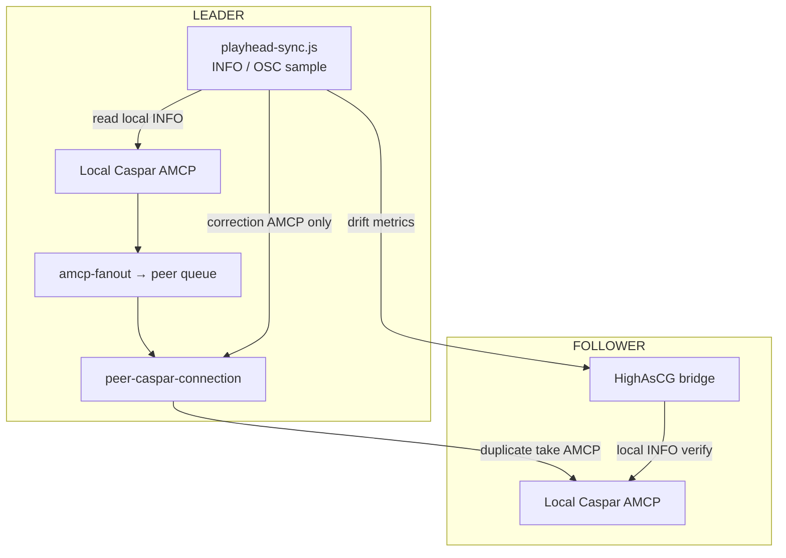
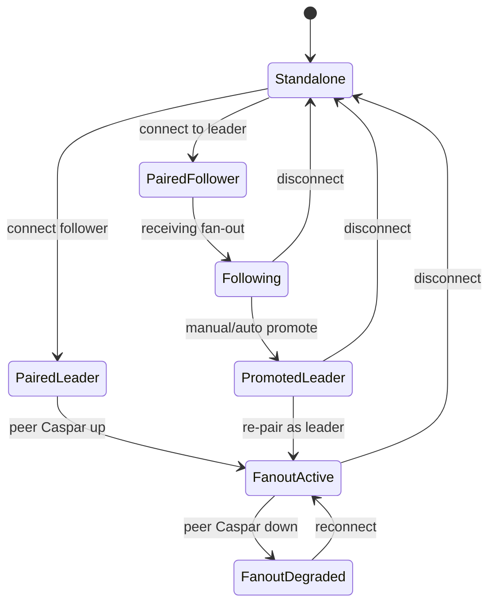

# Work Order 65: Hot backup expanded² — playhead sync, robustness & failover (WO-64 follow-on)

> **⚠️ AGENT COLLABORATION PROTOCOL**
> Every agent that works on this document MUST:
> 1. Add a dated entry to the **Work Log** section at the bottom documenting what was done.
> 2. Update task checkboxes to reflect current status.
> 3. Leave clear **Instructions for Next Agent** at the end of their log entry.
> 4. Do **NOT** delete previous agents' log entries.

**Status:** In progress — Phase B + D core shipped (2026-06-27); field sign-off pending  
**Parent / context:** [00_PROJECT_GOAL.md](./00_PROJECT_GOAL.md)  
**Builds on (required reading):**
- [64_WO_HOT_BACKUP_AMCP_FANOUT.md](./64_WO_HOT_BACKUP_AMCP_FANOUT.md) — **shipped Phase A–C** (`amcp-fanout.js`, `peer-caspar-connection.js`, connect pairing)
- [54_WO_HOT_BACKUP_LEADER_FOLLOWER_REPLICATION.md](./54_WO_HOT_BACKUP_LEADER_FOLLOWER_REPLICATION.md) — pairing, show-data, Device View, disconnect policy
- [61_WO_RSYNC_PEER_SYNC_AND_NETWORK_SETTINGS.md](./61_WO_RSYNC_PEER_SYNC_AND_NETWORK_SETTINGS.md)

**Reuse (do not rewrite):**
- `src/replication/amcp-fanout.js`, `peer-caspar-connection.js`, `replication-reload.js`
- `src/state/info-channel-parse.js`, `playback-tracker.js`, `playback-tracker-osc.js` — leader playhead truth
- `src/replication/promote.js`, `peer-client.js`, `connect-pair.js`
- `src/osc/osc-state.js` — optional low-latency frame telemetry

**Operator doc (update when shipped):** `docs/reference/hot-backup-replication.md`

---

## 1. Field result — WO-64 success + new gap

**Validated (user, 2026-06-27):** AMCP fan-out mirror is **“beautiful”** — takes start in sync, transitions match leader, follower air path is correct.

**New gap:** Long clips **drift apart**. Clips **start aligned**; over ~1 minute the **leader finishes ~10 s ahead** of follower (follower video plays **slower**, not merely late).

### 1.1 Why this happens (not a fan-out bug)

WO-64 duplicates **discrete AMCP events** (`PLAY`, `LOADBG`, `MIXER`, …). It does **not** synchronize **continuous playhead clocks** between two independent CasparCG processes.

After the initial `PLAY`:

| Mechanism | Leader | Follower |
|-----------|--------|----------|
| Frame clock | Own producer + channel scheduler | Own producer + channel scheduler |
| Consumer load | Local GPU / DeckLink | May differ (different device, buffer, drops) |
| Decode / I/O | Local disk / bridge latency | Syncthing-staged media, different read path |
| Channel `<video-mode>` | Must match (contract) | **Any fps mismatch → cumulative drift** |

AMCP fan-out guarantees **same commands at take time**; it does **not** guarantee **same frames per wall-clock second** thereafter. Growing lag on a single continuous clip is **expected** without a **playhead correction loop**.

Likely contributors on this hardware pair (investigate in Phase A):

1. **Channel fps / video-mode mismatch** between leader and follower `casparcg.config` (e.g. 5000 vs 6000, or custom canvas fps).
2. **Follower consumer backpressure** (DeckLink / screen drops frames → ffmpeg producer falls behind).
3. **Heavy follower box load** (HighAsCG + Caspar + preview consumers) vs leaner leader.
4. **Fan-out serial queue** (`peer-caspar-connection.js`) — adds **command latency** at takes but should **not** slow ongoing playback; still measure queue depth at take bursts.

**Non-goal:** Genlock / black burst / SDI frame lock. Target: **≤ 200 ms playhead delta** on 60 s clip via software correction.

---

## 2. Goals (normative)

### G1 — Playhead sync (drift correction)

While paired in `mirrorTransport: amcp-fanout`:

1. Leader samples **program-layer playhead** (frame or seconds) from **local** Caspar (`INFO <ch>` XML and/or OSC `/channel/<n>/stage/layer/<L>/foreground/file/time`).
2. Follower compares **its** playhead for the same channel/layer (local AMCP only — never fan-out `INFO`).
3. When delta exceeds threshold, leader sends **correction AMCP to follower only** (not local): e.g. `PLAY <ch>-<layer> SEEK <frames>` or `RESUME` + seek — **without** re-fan-out from local take path (dedicated correction channel).
4. Corrections are **rate-limited** and **hidden from operator** (no visible jump on air unless delta > hard limit).

### G2 — Fan-out robustness

1. **Peer Caspar link** auto-reconnect with exponential backoff; status surfaces `peerCasparConnected`, `lastError`, `queueDepth`.
2. **Fan-out never blocks local air** — local send always first; peer queue bounded; drop peer with alarm if queue > N.
3. **Optional parallel fan-out** (`amcpFanout.parallel: true`) — measure on hardware before default-on.
4. **Command journal** (ring buffer) for last K fan-out payloads — debug + optional replay after reconnect (v1.1).
5. **Caspar parity gate** before fan-out enable (WO-64 §4) — block with Device View errors.

### G3 — Failover & promotion (amcp-fanout aware)

Current `promote.js` still calls **`mirror-apply` re-take** — wrong when fan-out is active. Failover must:

1. **Stop fan-out** on promoted box (`syncPeerCasparConnection` off; follower no longer accepts peer AMCP from old leader).
2. **No re-take on promote** when follower Caspar already has correct air from fan-out — promotion is **role + control plane** only.
3. **Manual promote** (`POST /api/replication/promote`) — operator button; optional graceful leader demotion message.
4. **Auto promote** (opt-in, default **off** — user policy today is `disconnectPolicy: standalone`): when enabled, follower promotes after `FAILOVER_MS` **and** peer Caspar + bridge both lost.
5. **`leaderEpoch` fencing** — promoted node bumps epoch; stale leader yields (existing WO-54 T4.3; finish wiring for fan-out mode).
6. **Planned switchover** — “Make backup leader” stops fan-out on old leader first, promotes follower, operator reconnects client to new leader IP.

### G4 — Health & confirmation

1. **Look confirm** (WO-64 Phase D) — follower verifies `CINF` / `INFO` after each take token.
2. **Playhead health** in `/api/replication/status`: `playheadDriftMs`, `lastCorrectionAt`, `correctionsPerMinute`.
3. Device View banner: green / amber / red for fan-out + drift.

---

## 3. Architecture



**Correction path is separate from take fan-out** — avoids double-applying seeks on leader.

---

## 4. Playhead sync design

### 4.1 Sampling

| Source | Pros | Cons |
|--------|------|------|
| `INFO <ch>` XML | Already parsed (`info-channel-parse.js`) | AMCP load; ~1–2 Hz max |
| OSC file/time | Lower latency (`osc-state.js`) | Requires OSC enabled on both |
| Hybrid | OSC for drift detect, INFO for confirm | Recommended v1 |

Sample **PGM program layers** only (from `live-scene-state` + channel map), not multiview/preview.

### 4.2 Drift calculation

For each tracked layer `L` on channel `C`:

```
driftFrames = leaderFrame(L) - followerFrame(L)
driftMs = driftFrames * 1000 / channelFps
```

If `|driftMs| > softThreshold` (default **150 ms**) for **2 consecutive samples** → schedule correction.

If `|driftMs| > hardThreshold` (default **2000 ms**) → log warning + Device View amber; optional single visible resync.

### 4.3 Correction command

Prefer **seek in place** without full re-take:

```
PLAY <ch>-<layer> SEEK <targetFrame>
```

or Caspar-supported equivalent from `scene-play-seek.js` / existing take helpers.

Rules:

- Never correct during **active MIXER transition window** (track `fadeMs` from last take token).
- Max **1 correction / layer / 5 s** (configurable).
- Skip if follower `INFO` shows `paused` / empty / different clip id (look changed — wait for next take fan-out).

### 4.4 Config (`replication.json`)

```json
{
  "playheadSync": {
    "enabled": true,
    "softThresholdMs": 150,
    "hardThresholdMs": 2000,
    "sampleIntervalMs": 500,
    "minCorrectionIntervalMs": 5000,
    "maxCorrectionsPerMinute": 6,
    "source": "info"
  }
}
```

---

## 5. Fan-out robustness design

### 5.1 Queue & backpressure

Extend `peer-caspar-connection.js`:

| Metric | Action |
|--------|--------|
| `queueDepth > 32` | Warn; increment `amcpFanoutBackpressure` |
| `queueDepth > 128` | Drop new peer sends; local continues; banner |
| Peer disconnected | Auto-reconnect; optional replay journal tail (v1.1) |

### 5.2 Parallel fan-out (spike)

Config `amcpFanout.parallel: true` — send to local and peer in same tick for non-batch lines. **Measure drift before/after** — parallel reduces take latency but must not reorder vs batch atomicity.

### 5.3 Caspar parity validation

Implement WO-64 `POST /api/replication/validate-caspar-parity`:

- Compare channel count, width, height, fps from `INFO CONFIG` on both boxes.
- Fail fan-out enable with diff table in Device View.

---

## 6. Failover state machine



### 6.1 Promotion steps (`promoteToLeader` v2)

1. Assert role follower (or standalone with last confirmed air).
2. **Stop** `peerCasparConnection` + `unbindAmcpFanout`.
3. Notify peer via `POST /api/replication/leader-yield` (new) if reachable — old leader demotes, stops fan-out.
4. Increment `leaderEpoch`; save config; `forceRole('leader')`.
5. **Do not** call `mirror-apply` when `mirrorTransport === 'amcp-fanout'`.
6. `markLiveStateDirty` for control plane only.
7. Return `{ ok, leaderEpoch, casparAlreadyOnAir: true }`.

### 6.2 Demotion steps (`demoteToFollower` v2)

1. Stop fan-out to peer.
2. `forceRole('follower')`; reconcile project from new leader.
3. Re-open fan-out **to new leader’s follower Caspar** if this box remains backup.

### 6.3 Disconnect policy (unchanged default)

`disconnectPolicy: standalone` — both keep playing; fan-out stops; **no silent auto-promote**. Document that **acceptable failover** for broadcast = **manual promote** after cable pull, or opt-in `autoPromote`.

---

## 7. Implementation plan

### Phase A — Drift diagnosis tooling

- [ ] **T65.A1** `src/replication/playhead-drift-log.js` — log leader vs follower `INFO` sample delta every N s to structured log + status API (read-only, no correction yet).
- [ ] **T65.A2** CLI/script `tools/replication/measure-playhead-drift.js` — run on pair during 60 s clip; output CSV.
- [ ] **T65.A3** Document findings in Work Log (fps mismatch vs consumer drops vs queue).

### Phase B — Playhead sync loop

- [x] **T65.B1** `src/replication/playhead-sync.js` — sample leader local INFO; query follower via **leader’s peer INFO** (`INFO` on peer connection — **read path only**, not fan-out) OR follower HTTP `GET /api/replication/playhead-export` (follower reads local Caspar).
- [x] **T65.B2** Correction sender on leader → `peerCasparConnection.enqueueCorrection(seek)` with rate limits.
- [x] **T65.B3** Config `playheadSync` in `defaults-replication.js` + normalizer.
- [ ] **T65.B4** Status fields + Device View drift indicator. _(Status API done; Device View UI pending.)_
- [x] **T65.B5** Smoke `tools/smoke/smoke-replication-playhead-sync.js` — mock INFO XML, assert correction gated.

### Phase C — Fan-out robustness

- [x] **T65.C1** Queue depth metrics + backpressure in `peer-caspar-connection.js`.
- [ ] **T65.C2** Reconnect backoff + `peerCasparConnected` in status (partially exists — finish).
- [ ] **T65.C3** `validate-caspar-parity` API + Device View button.
- [ ] **T65.C4** Optional `parallel` fan-out flag + hardware benchmark doc.

### Phase D — Failover v2

- [x] **T65.D1** Fix `promote.js` — skip `mirror-apply` when `amcp-fanout`; stop fan-out on promote.
- [x] **T65.D2** `POST /api/replication/leader-yield` + handler on old leader.
- [ ] **T65.D3** Planned switchover UX — “Promote backup (keep air)” with confirm.
- [ ] **T65.D4** Wire `leaderEpoch` demotion on rejoin (complete WO-54 T4.3 for fan-out).
- [x] **T65.D5** Smoke failover fan-out path _(covered in `smoke-replication-failover.js` + `smoke-replication-playhead-sync.js`)_.

### Phase E — Look confirmation (WO-64 Phase D)

- [ ] **T65.E1** `look-confirm.js` + `confirm-look` API.
- [ ] **T65.E2** Debounced project push on confirmed look only.

### Phase F — Hardware sign-off

- [ ] **T65.F1** 60 s clip: drift **≤ 200 ms** with playhead sync enabled.
- [ ] **T65.F2** Manual promote mid-clip: no visible glitch; operator control on new leader.
- [ ] **T65.F3** Pull leader network: follower continues; fan-out stops cleanly; manual promote works.
- [ ] **T65.F4** Old leader returns: demotes, re-pairs, fan-out resumes without double-air on leader.

---

## 8. Success criteria

1. **Drift:** 60 s program clip stays within **200 ms** playhead delta (measured via INFO or OSC) with sync enabled.
2. **Takes:** Still frame-aligned at take start (WO-64 regression — no regression).
3. **Robustness:** Peer Caspar disconnect does not stall leader; reconnect within **30 s** without operator action.
4. **Failover:** Manual promote completes in **< 3 s**; no `mirror-apply` re-take flash; client can drive new leader immediately.
5. **Safety:** Caspar parity validation blocks fan-out when channel fps/count differs.

---

## 9. Risks & mitigations

| Risk | Mitigation |
|------|------------|
| SEEK correction causes visible jump | Soft threshold + rate limit; only hard resync when > 2 s |
| INFO polling load on Caspar | Max 2 Hz; OSC path when available |
| Correction during dissolve | Suppress while `fadeMs` window active |
| Split-brain on promote | `leaderEpoch` + yield endpoint |
| Parallel fan-out breaks batch order | Batches stay atomic; parallel singles only |

---

## 10. Expected touch points

| Path | Change |
|------|--------|
| `src/replication/playhead-sync.js` | **New** |
| `src/replication/playhead-drift-log.js` | **New** |
| `src/replication/peer-caspar-connection.js` | Queue metrics, optional parallel |
| `src/replication/promote.js` | Fan-out aware promotion |
| `src/replication/amcp-fanout.js` | Separate correction vs take paths |
| `src/api/routes-replication.js` | parity, playhead-export, leader-yield |
| `client/components/device-view-inspector-replication.js` | Drift + failover UX |
| `docs/reference/hot-backup-replication.md` | Drift + failover runbook |

---

## 11. Work Log

### 2026-06-27 — WO drafted (post WO-64 field success)

**User report:** AMCP fan-out mirror works; takes and transitions aligned at start. **Continuous clips drift:** leader ~**10 s ahead** at end of ~1 min (follower plays slower).

**Analysis:** WO-64 solved **event sync** (commands); remaining gap is **clock sync** (independent Caspar playheads). Separate correction loop required — not fixable by more fan-out alone.

**User ask:** Robustness of fan-out system + **proper failover mechanics** → this WO.

**Instructions for next agent:**
1. Run **Phase A** on the actual leader/follower pair — capture `INFO 1` XML from both every 5 s during one clip; confirm fps + frame numbers diverge linearly (clock) vs step (dropped frames).
2. If fps mismatch in `INFO CONFIG`, fix **caspar parity** first — playhead sync cannot fix wrong channel mode.
3. Implement **Phase B** minimal correction (`PLAY … SEEK`) before failover UX.
4. Fix **`promote.js`** (Phase D1) early — current promote re-take is harmful in fan-out mode.

### 2026-06-27 — Phase B + D core (agent)

**Shipped:**
- Playhead sync loop (`playhead-sync.js`, `playhead-export.js`) — leader polls local INFO + follower HTTP export; sends `PLAY ch-layer SEEK frame` via `enqueueCorrection` (rate-limited, 2-tick gate, bypasses fan-out queue cap).
- Failover v2 — `promote.js` skips `mirror-apply` when `mirrorTransport: amcp-fanout`; `leader-yield` endpoint; status API `playheadSync` + `amcpFanout` metrics.
- **Bug fix:** `promoteToLeader` used `isAmcpFanoutMirrorActive` (requires leader role) — replaced with `isAmcpFanoutMirrorConfigured` so backup promote correctly reports `casparAlreadyOnAir: true`.
- Removed duplicate `mirrorTransport`/`peerCaspar` keys in `buildReplicationStatus`.
- Smoke: `smoke-replication-playhead-sync.js` (4 tests) + fan-out promote test; **37** replication tests pass.

**Deploy:** Push to **both** leader (`192.168.0.16`) and backup (`192.168.0.10`); disconnect + reconnect pair to pick up `playheadSync`. On leader logs, expect `[replication] playhead correction … SEEK …` when drift > 150 ms sustained.

**Instructions for next agent:**
1. **Phase F field test** — 60 s clip with sync on; confirm drift ≤ 200 ms via `GET /api/replication/status` → `playheadSync.driftMs`.
2. Compare `INFO CONFIG` channel fps on leader vs follower — fix caspar parity if mismatch (Phase A / C3).
3. **T65.B4** Device View drift indicator + promote UX (D3).
4. Optional Phase A diagnostic script `measure-playhead-drift.js`.
