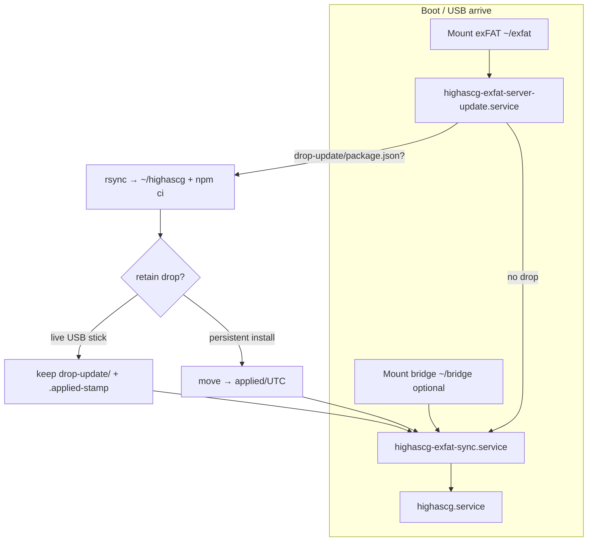

# Work Order 66: Robust boot `drop-update/`, build stamp, GitHub release check, Web UI update

> **⚠️ AGENT COLLABORATION PROTOCOL**
> Every agent that works on this document MUST:
> 1. Add a dated entry to the **Work Log** section at the bottom documenting what was done.
> 2. Update task checkboxes to reflect current status.
> 3. Leave clear **Instructions for Next Agent** at the end of their log entry.
> 4. Do **NOT** delete previous agents' log entries.

**Status:** Phases 1–4 shipped (boot retain/consume, API, Web UI updates tab); Phase 5–6 QA on hardware outstanding  
**Parent / context:** [00_PROJECT_GOAL.md](./00_PROJECT_GOAL.md)  
**Extends / depends on:**
- [47_WO_EXFAT_DATA_MOUNT_AND_MTIME_BOOT_SYNC.md](./47_WO_EXFAT_DATA_MOUNT_AND_MTIME_BOOT_SYNC.md) — exFAT mount, boot sync pipeline
- [52_WO_BRIDGE_DISK_PARTITION_AND_USB_SYNC.md](./52_WO_BRIDGE_DISK_PARTITION_AND_USB_SYNC.md) — USB vs bridge volumes, `drop-config/` pairs
- [39_WO_SETTINGS_SYSTEM_HARDWARE.md](./39_WO_SETTINGS_SYSTEM_HARDWARE.md) — Settings modal, privileged server actions pattern
- [51_WO_DECOUPLED_FRONTEND_BACKEND_ARCHITECTURE.md](./51_WO_DECOUPLED_FRONTEND_BACKEND_ARCHITECTURE.md) — `dist-web/` on playout `:4200`
- [11_WO_BOOT_ORCHESTRATOR_AND_OS_SETUP.md](./11_WO_BOOT_ORCHESTRATOR_AND_OS_SETUP.md) — systemd boot ordering

**Operator docs (update when shipped):**
- [`docs/EXFAT_SERVER_UPDATE.md`](../../docs/EXFAT_SERVER_UPDATE.md)
- [`docs/DEV_RELEASE_GITHUB.md`](../../docs/DEV_RELEASE_GITHUB.md)
- [`client/tools/live-usb/USB_STICK_AFTER_FLASH.md`](../../client/tools/live-usb/USB_STICK_AFTER_FLASH.md)

**Builds on (existing code — do not rewrite from scratch):**
- `scripts/exfat/highascg-exfat-server-update.sh` — boot apply `drop-update/` → `~/highascg/`
- `scripts/exfat/highascg-exfat-arrive.sh` — late USB udev pipeline
- `scripts/exfat/install-exfat-systemd-units.sh` — unit ordering
- `config/server-update-rsync-excludes.txt` — rsync policy (must align with WO-52)
- `tools/release/make-github-release-server.sh` + `tools/release/release-lib.sh` — stamped tarballs
- `src/system/exfat-sync.js` + `config/exfat-sync.json` — `drop-config/` push/pull
- `src/api/routes-system-setup.js` — reboot/restart patterns

---

## 1. Problem statement

Operators need to **refresh the playout stack without reflashing the live USB ISO**. WO-47/WO-52 introduced `exfat/drop-update/` and `highascg-exfat-server-update.service`, but field use exposed gaps:

| Symptom | Likely cause |
|---------|----------------|
| Stick has a new drop but playout still runs old code | USB enumerates **after** boot units ran; `highascg-exfat-arrive` starts update with **`--no-block`** and does not gate `highascg.service` |
| UI on playout not updated after stick drop | Repo `config/server-update-rsync-excludes.txt` still lists **`dist-web/`** (WO-52 patch under `client/tools/to-server/` differs — ISO may ship wrong excludes) |
| No way to know what is running | `package.json` `version` is manual; no canonical **build stamp** surfaced in API or Web UI |
| Updates require physical stick prep | No **in-band** path: check GitHub → download → apply while on air break |
| After Web UI update, stick/bridge not “primed” for next cold boot | Apply updates `~/highascg/` only; does not **re-stage** `drop-update/` or push current config to **`drop-config/`** on mounted volumes |
| **Second boot reverts to flashed ISO version** | Current script **`mv`** drop → **`applied/`** after apply; on **live USB** boot **`~/highascg/` is not durable** (squashfs / non-persistent overlay) — next boot has **empty `drop-update/`** and only the **ISO-baked** tree remains |

**Goal:** Treat **`drop-update/` on the USB stick** as the **canonical, persistent** server tree for stick-boot systems **and** make boot apply **reliable**, while adding **stamp-based version readout**, **GitHub release awareness**, and **operator-triggered update from Settings** that also refreshes removable/bridge staging.

---

## 2. Goal (normative)

### 2.1 Boot-time `drop-update/` (essential on stick)

On every boot (and on late USB arrive), **before** `highascg.service` starts:

1. If **`/home/casparcg/exfat`** is mounted and **`drop-update/package.json`** exists (or legacy `update/server/package.json` once):
   - **Validate** drop (see §4).
   - **Stop** `highascg.service`.
   - **Apply** drop → `/home/casparcg/highascg/` via rsync (includes **`dist-web/`**).
   - **Optional** `npm ci --omit=dev` when lockfile present/changed.
   - **Retention policy** (see §3.6 — critical for stick boot):
     - **Retain (live USB / non-persistent workspace):** leave drop **in place** under `drop-update/`; optionally write `drop-update/.applied-stamp`; **do not move** to `applied/`.
     - **Consume (persistent install):** move tree to `drop-update/applied/<UTC>/` after success (today’s behaviour — safe when `~/highascg/` survives reboot on internal disk).
   - **Record** applied stamp in `~/highascg/.highascg-build-stamp` (or equivalent).
   - **Start** `highascg.service`.
2. If no pending drop: exit **0** quickly (no block).
3. **Late USB:** when `highascg-exfat-arrive` runs, the same apply must **complete** before the app serves traffic (either block arrive on update unit, or have update unit re-run with `Before=highascg.service` and arrive triggers a **synchronous** `systemctl start highascg-exfat-server-update.service`).

**Non-negotiable:** Operator can copy `highascg-server_*.tar.gz` contents into `E:\drop-update\` on a laptop, reboot playout, and get the new server **without re-imaging the stick**. **Every subsequent cold boot** from that stick must **re-apply the same drop** (or a newer one still sitting in `drop-update/`) — not fall back to the ISO squashfs snapshot.

### 2.2 Build stamp (no semver)

- **Canonical identity:** UTC **date-hour stamp** matching release tarballs, e.g. `2026-06-28T143022Z` (same as `release_lib_stamp()` / `highascg-server_<stamp>.tar.gz`).
- **Not** semantic versioning; operators compare stamps lexicographically or via dedicated compare helper.
- **Written at release build** into:
  - `BUILD_STAMP` file at repo root (in tarball)
  - optional mirror in `package.json` field `version` for backwards compatibility
- **Exposed:**
  - `GET /api/system/version` — running stamp, ISO/squashfs hint if detectable, paths to mounted volumes
  - Web UI: Settings → **System** or new **Updates** sub-panel + optional header/footer badge

### 2.3 GitHub release check

- Poll **`GET https://api.github.com/repos/<owner>/<repo>/releases/latest`** (configurable repo; default this repo).
- Parse latest **`highascg-server_*.tar.gz`** asset name → stamp.
- Compare to running stamp → `{ current, latest, updateAvailable, releaseUrl, publishedAt }`.
- **Offline / no network:** degrade gracefully (`updateAvailable: null`, reason in JSON).
- **Rate limits:** cache latest check ≥ 15 min server-side; UI manual “Check now” bypasses cache.

### 2.4 Web UI “Update now”

Operator flow from Settings:

1. **Check for updates** — shows current stamp vs latest GitHub release.
2. **Download and apply** (privileged):
   - Download asset to `/var/cache/highascg/updates/` (or `/tmp` with size guard).
   - Verify size / optional SHA256 if we attach checksums to release notes later.
   - Run the **same apply path** as boot (`highascg-exfat-server-update.sh` core or shared `highascg-apply-server-drop.sh`).
   - Restart `highascg.service`; API returns progress/log tail.
3. **Post-apply staging** (when volumes present):
   - **USB (`HIGHASCGEXF`):** rsync applied tree **into** **`/home/casparcg/exfat/drop-update/`** and **leave it there** (stick-boot systems depend on this for the **next** cold boot). On retain-mode sticks this replaces in place; never archive away the only copy.
   - **Bridge (`HIGHASCGDAT`):** same under **`/home/casparcg/bridge/drop-update/`** if mount exists — bridge is persistent, so **consume** (move to `applied/`) is OK after staging if desired; default **retain** for symmetry with USB.
   - **Config push:** run exfat-sync **to_exfat** for `drop-config/` (+ modular `configs/` per policy) on USB and bridge so field laptops see current show settings.

**Security:** Download URL allow-list (GitHub releases host only); apply via **fixed root helper** + `sudo -n` (same model as WO-39). No arbitrary shell from UI.

### 2.5 Non-goals (v1)

- Auto-update without operator confirm
- Updating CasparCG binary or NVIDIA driver from this flow (separate WOs / ISO)
- Delta/binary patches (full tarball only)
- Updating **Electron launcher** on Mac/Windows from playout Web UI

---

## 3. Architecture

### 3.1 Boot pipeline (target)



**Ordering rules:**
- `highascg-exfat-server-update.service` — **`Before=highascg.service`**, **`After=home-casparcg-exfat.mount`**
- `highascg-exfat-arrive` — **`systemctl start highascg-exfat-server-update.service`** (blocking, not `--no-block`) then sync, then ensure app running
- Boot must not start `highascg` until update unit finishes (success or skip)

### 3.2 Volume layouts

| Volume | Mount | `drop-update/` | `drop-config/` |
|--------|-------|----------------|----------------|
| USB stick `HIGHASCGEXF` | `/home/casparcg/exfat` | **Primary** server hotfix (existing) | Optional monolithic config (existing) |
| Bridge `HIGHASCGDAT` | `/home/casparcg/bridge` | **New (v1):** mirror staging after Web UI apply | Existing (`bridge-drop-config` pair) |

Seed `bridge/drop-update/` and `bridge/drop-update/applied/` in bridge layout scripts alongside USB seeding.

### 3.3 Two boot profiles (why `applied/` breaks stick boot)

| Profile | `~/highascg/` after reboot | `drop-update/` after apply | Re-apply on every boot? |
|---------|----------------------------|----------------------------|-------------------------|
| **Live USB stick** (WO-47 shell or embedded-server ISO) | **Reset** — squashfs base ± non-persistent overlay; Node tree often **omitted** from squashfs entirely | **Must stay populated** — exFAT tail is the durable store | **Yes** — idempotent rsync from `drop-update/` |
| **Persistent playout** (internal NVMe install, or union overlay with `casper-rw` that keeps `~/highascg`) | **Survives** reboot | May **move** to `applied/<UTC>/` (one-shot hotfix) | **No** — skip when `drop-update/package.json` absent |

**WO-47 reminder:** squashfs intentionally **excludes** `index.js`, `src/`, `dist-web/`, etc. Stick boot **without** a retained `drop-update/` cannot start the Node app at all (shell ISO) or runs the **stale embedded** snapshot (standalone ISO).

### 3.4 Drop retention policy (normative)

**Default detection (retain when any true):**

- `/run/live` exists (Debian/Ubuntu live session), **or**
- root mount is **overlay/aufs** on casper (`findmnt -no FSTYPE /` ∈ `overlay,aufs`), **or**
- `/etc/highascg/server-update-retain-drop` exists (installed by live-USB image build)

**Overrides:**

| Knob | Effect |
|------|--------|
| `HIGHASCG_SERVER_UPDATE_RETAIN_DROP=1` | Force **retain** (never move drop) |
| `HIGHASCG_SERVER_UPDATE_RETAIN_DROP=0` | Force **consume** (move to `applied/` after success) |
| `/etc/highascg/server-update-consume-drop` | Force **consume** on image |

**Retain mode behaviour:**

1. Rsync `drop-update/` → `~/highascg/` every boot (or skip rsync when `drop-update/BUILD_STAMP` equals `~/highascg/BUILD_STAMP` **and** quick sanity checks pass — optional optimisation).
2. Write **`drop-update/.applied-stamp`** (last successfully applied stamp + UTC time).
3. Optional **audit copy** to `drop-update/applied/<UTC>/` via **`cp -a`** (history only — **never** empty `drop-update/`).
4. Update **`drop-update/README.txt`** to state: *on live USB, leave the drop here; do not move to `applied/` manually*.

**Consume mode behaviour:** current script — **`mv`** entire drop to `applied/<UTC>/`, recreate empty `drop-update/` + README.

### 3.5 Shared apply module

Extract rsync + npm ci + retention + stamp write from `highascg-exfat-server-update.sh` into:

```
/usr/local/lib/highascg/highascg-apply-server-drop.sh
  --source <dir> --dest ~/highascg
  [--retain-drop | --consume-drop]
  [--archive-copy-to <applied-parent>]   # optional audit copy in retain mode
  [--dry-run]
```

Boot service and Web UI helper both call this. **Single source of truth** for excludes: `/etc/highascg/server-update-rsync-excludes.txt` (**must not exclude `dist-web/`**).

Web UI apply on a stick: **`--retain-drop`** + rsync result **back** into `exfat/drop-update/` so cold boot and in-session state match.

### 3.6 Version / update API

| Method | Path | Purpose |
|--------|------|---------|
| GET | `/api/system/version` | Running stamp, git commit if present, volume mounts |
| GET | `/api/system/update/check` | GitHub latest vs current (cached) |
| POST | `/api/system/update/apply` | Download + apply; body `{ releaseTag?: string }` optional pin |
| GET | `/api/system/update/status` | In-progress job id, phase, log tail (for long downloads) |

Implementation: `src/api/routes-system-update.js` + `src/system/server-update.js` (download, compare stamps, invoke helper).

### 3.7 Web UI

- Settings tab **“Updates”** (`data-tab="system-updates"`):
  - Current build stamp (large, copyable)
  - Last check time / **Check for updates**
  - Latest release stamp + link to GitHub
  - **Install update** button (disabled when not newer; confirm dialog warns brief playout stop)
  - Progress + log panel during apply
  - Post-success: “Staged to USB / bridge” indicators
- Reuse WO-39 patterns: `settings-modal-templates.js`, `settings-modal.js`, nuclear password optional for apply (bikeshed — default **require** same as reboot if easy)

---

## 4. Drop validation (robustness)

Before rsync, fail closed with clear journal log (do **not** archive corrupt drops):

| Check | Required |
|-------|----------|
| `package.json` exists at drop root | Yes |
| `index.js` exists | Yes |
| `src/` directory exists | Yes |
| `dist-web/index.html` exists | Yes (WO-52 unified playout UI) |
| `tools/runtime/` exists | Yes |
| Drop stamp | Read `BUILD_STAMP` or parse from `package.json` `version`; if missing, log warning and use directory mtime |

On validation failure: leave drop in place, log errors, exit **1** from apply (boot: still start `highascg` with **previous** tree — do not partial-apply).

**Partial apply guard:** rsync to `~/highascg/.update-staging/<stamp>/` then atomic `rsync --delete` into place, or use staging dir + rename (pick one; document in script header).

---

## 5. Success criteria

### A. Boot / stick `drop-update/`

- [x] **A1.** `dist-web/` is deployed from stick drops (fix `/etc/highascg/server-update-rsync-excludes.txt` source in repo + ISO install hook).
- [x] **A2.** Late USB arrive **waits** for server-update completion before app accepts traffic.
- [ ] **A3.** Valid drop on stick → after reboot, `GET /api/system/version` stamp matches drop `BUILD_STAMP`.
- [x] **A4.** **Live USB retain:** after apply, `drop-update/package.json` **still present**; `.applied-stamp` updated; **second cold boot** runs same stamp (not ISO squashfs).
- [x] **A4b.** **Persistent consume:** after apply on internal install, drop moved to `applied/<UTC>/`; `~/highascg/` stamp survives reboot without re-drop.
- [x] **A5.** Invalid drop (missing `dist-web/`) → previous install still runs; error in `journalctl -u highascg-exfat-server-update`.
- [ ] **A6.** Legacy `update/server/` still works once with migration log.
- [ ] **A7.** Web UI apply on stick leaves refreshed tree in `exfat/drop-update/` (retain, not archive-away).

### B. Build stamp

- [x] **B1.** `npm run release:github-server` writes `BUILD_STAMP` into tarball root.
- [x] **B2.** `GET /api/system/version` returns `{ buildStamp, packageVersion, volumes: { usb, bridge } }`.
- [x] **B3.** Web UI displays running stamp.

### C. GitHub check

- [x] **C1.** `GET /api/system/update/check` returns latest server asset stamp when online.
- [x] **C2.** Offline returns structured error without throwing 500.
- [x] **C3.** Server caches GitHub response (configurable TTL).

### D. Web UI apply + staging

- [x] **D1.** Operator can apply newer release from Settings; service restarts; UI shows new stamp.
- [x] **D2.** When USB mounted, post-apply copies tree to `exfat/drop-update/` (validated layout).
- [x] **D3.** When bridge mounted, post-apply copies tree to `bridge/drop-update/`.
- [x] **D4.** Post-apply pushes `drop-config/` (+ configured config pairs) to USB and bridge via exfat-sync.
- [x] **D5.** Privileged actions use allow-listed helper + sudoers fragment documented in `docs/HIGHASCG_PASSWORDLESS_SUDO.md`.

### E. Docs / ops

- [ ] **E1.** `docs/EXFAT_SERVER_UPDATE.md` — validation, arrive ordering, bridge `drop-update/`.
- [ ] **E2.** `USB_STICK_AFTER_FLASH.md` — “update without reflash” workflow.
- [x] **E3.** Smoke test: fake drop in tmp exfat → apply script → stamp file (`tools/smoke/smoke-server-update-retain.test.js`).

---

## 6. Tasks

### Phase 1 — Correctness fixes (boot path)

- [x] **T1.1** Align `config/server-update-rsync-excludes.txt` with WO-52 (remove `dist-web/` exclude); verify `install-exfat-systemd-units.sh` installs it.
- [x] **T1.2** Refactor `highascg-apply-server-drop.sh` shared helper; thin wrapper in `highascg-exfat-server-update.sh`.
- [x] **T1.3** Add drop validation + staging dir atomic apply.
- [x] **T1.4** **Retention policy:** detect live USB; **retain** drop by default on stick; **consume** only on persistent profile; fix current **`mv`** bug in `highascg-exfat-server-update.sh`.
- [x] **T1.5** Fix `highascg-exfat-arrive.sh`: synchronous `systemctl start highascg-exfat-server-update.service`; document interaction with already-running `highascg.service`.
- [x] **T1.6** Write `BUILD_STAMP` / `.highascg-build-stamp` on successful apply; write `drop-update/.applied-stamp` in retain mode.
- [x] **T1.7** ISO install hook: `/etc/highascg/server-update-retain-drop` on live-USB images; update `drop-update/README.txt` operator wording.

### Phase 2 — Stamp in release artifact

- [x] **T2.1** `release-lib.sh` / `make-github-release-server.sh`: emit `BUILD_STAMP` file into tarball.
- [x] **T2.2** Set `package.json` `version` to stamp at release time (`--no-bump-package` to skip).

### Phase 3 — API

- [x] **T3.1** `routes-system-update.js` + wire in `router.js`.
- [x] **T3.2** `server-update.js`: stamp read, GitHub fetch + parse, cache.
- [x] **T3.3** `POST apply`: download, verify, call apply helper, restart service, stage to volumes.
- [x] **T3.4** `GET status` for long-running apply job (single-flight lock).

### Phase 4 — Web UI

- [x] **T4.1** Settings tab templates + handlers.
- [x] **T4.2** Poll apply status; show errors; link to GitHub release.

### Phase 5 — Bridge `drop-update/` + seed scripts

- [ ] **T5.1** `seed-exfat-operator-layout.sh` / bridge seed: `drop-update/`, `drop-update/applied/`.
- [ ] **T5.2** `stage-drop-to-volumes.sh` called from apply helper (USB + bridge).

### Phase 6 — QA

- [ ] **T6.1** Boot test: stick with drop → apply → **retain** → **second cold boot** same stamp.
- [ ] **T6.1b** Boot test: persistent install → apply → **consume** → reboot without drop still correct stamp.
- [ ] **T6.2** Late-insert USB test.
- [ ] **T6.3** Web UI apply test with network; staging verified on stick.
- [x] **T6.4** `tools/smoke/smoke-server-update-retain.test.js` (validation + retain/consume).

---

## 7. Open decisions

| # | Question | Proposal |
|---|----------|----------|
| O1 | Bridge `drop-update/` in v1? | **Yes** — same semantics as USB; optional mount |
| O2 | Password gate for apply? | Reuse nuclear / setup password (`routes-system-setup.js`) |
| O3 | GitHub repo default | `mko1989/highascg` from existing release scripts — confirm in `config/general.json` |
| O4 | Keep `package.json` version field? | Yes, mirror stamp for tools that read it |
| O5 | Auto-check on boot? | **No** — manual + Settings only in v1 (avoid air-gap surprise) |
| O6 | Archive on stick? | **Copy-only** to `applied/` for audit optional; **never move** on retain profile |
| O7 | Skip rsync when stamp unchanged? | **Optional** optimisation in retain mode; full rsync OK for v1 |

---

## 8. Related files

| Area | Path |
|------|------|
| Boot apply | `scripts/exfat/highascg-exfat-server-update.sh` |
| USB arrive | `scripts/exfat/highascg-exfat-arrive.sh` |
| Systemd | `scripts/exfat/install-exfat-systemd-units.sh` |
| Rsync excludes | `config/server-update-rsync-excludes.txt` |
| exFAT sync | `config/exfat-sync.json`, `src/system/exfat-sync.js` |
| Release | `tools/release/make-github-release-server.sh`, `tools/release/release-lib.sh` |
| API (new) | `src/api/routes-system-update.js`, `src/system/server-update.js` |
| Web UI | `client/components/settings-modal-templates.js`, `settings-modal.js` |
| Sudoers | `docs/HIGHASCG_PASSWORDLESS_SUDO.md` |

---

## 9. Work Log

### 2026-06-28 — T2.2 package.json bump at release (agent)

- `release_lib_bump_package_json` / `release_lib_restore_package_json` in `release-lib.sh`.
- `make-github-release-server.sh` sets `package.json` `version` = stamp for tarball only; restores on exit. `--no-bump-package` to skip.
- Fixed EXIT trap so BUILD_STAMP + package.json restore always run.
- Smoke: `smoke-release-package-bump.test.js`.

### 2026-06-28 — Phases 2–4 implemented (agent)

- Release tarballs include `BUILD_STAMP` (`make-github-release-server.sh`).
- API: `GET /api/system/version`, `GET /api/system/update/check`, `POST /api/system/update/apply`, `GET /api/system/update/status`.
- `src/system/server-update.js` + `src/system/build-stamp.js`; privileged `highascg-webui-server-update.sh` (apply + stage USB/bridge + exfat-sync push).
- Settings → **updates** tab (`settings-modal-system-updates.js`).
- Sudoers doc entry for web UI update helper.

**Instructions for Next Agent:** Field QA T6.1–T6.3 on live USB; add sudoers fragment to installer if not hand-installed; optional T2.2 package.json version bump at release.

### 2026-06-28 — Phase 1 implemented (agent)

- Added `scripts/exfat/highascg-apply-server-drop.sh`: validation, staging rsync, **retain** (live USB) vs **consume** (persistent), `BUILD_STAMP` / `.applied-stamp`.
- Refactored `highascg-exfat-server-update.sh` to call apply helper with `--auto-retain`.
- Fixed `config/server-update-rsync-excludes.txt` — **`dist-web/`** no longer excluded.
- `highascg-exfat-arrive.sh` + `highascg-exfat-boot.sh`: **blocking** server-update start.
- `prepare-eggs-clone-with-exfat.sh`: installs `/etc/highascg/server-update-retain-drop`.
- Docs + seed README updated; smoke tests pass.

**Instructions for Next Agent:** Phase 2 — `BUILD_STAMP` in release tarballs; Phase 3 — `/api/system/version` + GitHub check + Web UI apply.

### 2026-06-28 — Retain-vs-consume policy (user + agent)

- **User correction:** on **live USB stick** boot, moving the drop to **`applied/`** breaks the **next** cold boot — `~/highascg/` is not durable; only **`drop-update/`** on exFAT persists. Archiving empties the canonical store and playout falls back to **ISO squashfs** (stale or missing Node tree per WO-47).
- Added §3.3–§3.4: **retain** (stick) vs **consume** (persistent install) profiles; detection via `/run/live`, overlay root, `/etc/highascg/server-update-retain-drop`; **`mv` → retain** as default on stick.
- Updated success criteria **A4/A4b/A7**, tasks **T1.4/T1.6/T1.7**, QA **T6.1/T6.1b**, open decisions **O6/O7**.

**Instructions for Next Agent:**

1. **T1.4 is blocking** — change `highascg-exfat-server-update.sh` so stick boot **never moves** `drop-update/`; only persistent installs consume.
2. Then **T1.1** rsync excludes + **T1.2** shared helper with `--retain-drop` / `--consume-drop`.
3. Update **`docs/EXFAT_SERVER_UPDATE.md`** and **`drop-update/README.txt`** when behaviour ships.

### 2026-06-28 — Work order created (agent)

- Captured user requirement: robust **`drop-update/`** on USB stick at boot; **date-hour build stamp**; **GitHub release check**; **Web UI apply** that updates running system and **re-stages `drop-update/` + `drop-config/`** on stick/bridge when mounted.
- Audited existing WO-47/52 pipeline, `highascg-exfat-server-update.sh`, arrive race (`--no-block`), and `dist-web/` exclude mismatch in repo vs WO-52 handoff.
- Split implementation into boot fixes, release stamp, API, UI, bridge staging, QA.

**Instructions for Next Agent:** superseded by retain-vs-consume entry above.
