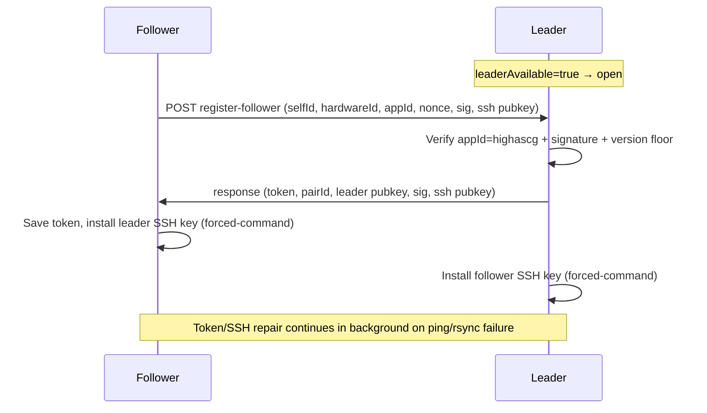

# Work Order 78: Replication trust, rsync-only SSH, and hardware hostname

> **⚠️ AGENT COLLABORATION PROTOCOL**
> Every agent that works on this document MUST:
> 1. Add a dated entry to the **Work Log** section at the bottom documenting what was done.
> 2. Update task checkboxes to reflect current status.
> 3. Leave clear **Instructions for Next Agent** at the end of their log entry.
> 4. Do **NOT** delete previous agents' log entries.

**Status:** In progress — Phase A–D shipped 2026-07-01; Phase E single-box QA automated  
**Priority:** High (LAN pairing today grants full `casparcg` shell; poor machine labels)  
**Parent / context:** [00_PROJECT_GOAL.md](./00_PROJECT_GOAL.md)

**Builds on (required reading):**
- [54_WO_HOT_BACKUP_LEADER_FOLLOWER_REPLICATION.md](./54_WO_HOT_BACKUP_LEADER_FOLLOWER_REPLICATION.md) — pairing, register-follower
- [61_WO_RSYNC_PEER_SYNC_AND_NETWORK_SETTINGS.md](./61_WO_RSYNC_PEER_SYNC_AND_NETWORK_SETTINGS.md) — project media rsync
- [68_WO_HOT_BACKUP_CONNECTION_STATUS_AND_CHANNEL_PARITY.md](./68_WO_HOT_BACKUP_CONNECTION_STATUS_AND_CHANNEL_PARITY.md) — inspector / ping payload
- [79_WO_LEADER_AUTOSAVE_LIVE_REPLICATION.md](./79_WO_LEADER_AUTOSAVE_LIVE_REPLICATION.md) — live show sync (separate WO)

**Operator doc (update when shipped):** `docs/reference/hot-backup-replication.md`

**Related code today:**
- Pairing: `src/replication/connect-pair.js`, `src/api/routes-replication.js`
- SSH/rsync: `src/replication/replication-ssh-setup.js`, `src/replication/sync-project-media-rsync.js`
- Identity: `src/config/machine-identity.js`, `src/replication/replication-local-identity.js`
- ISO hostname: `tools/eggs/live-usb/build-highascg-egg.sh` (`BASENAME=highascg-nvidia-${BR}`)

---

## 1. Problem statement

| Issue | Today | Target |
|-------|-------|--------|
| SSH `authorized_keys` | Full shell as `casparcg` | Rsync-scoped replication key only |
| Peer attestation | None | Both boxes identify as HighAsCG in **background** handshake |
| Pairing UX | Open register (no approval) | **Keep open** — `leaderAvailable` means ready to connect |
| Token / SSH exchange | Visible in connect flow | **Fully background** during connect (operator sees status only) |
| Hostname | `highascg-nvidia-595` (long, clone-identical) | `highascg####` from hardware (MAC-based) |
| Machine recognition | Random `selfId` suffix | Stable **4-digit id** for users + replication metadata |
| Project metadata | Pair only in `config/replication.json` | Also record leader/follower relationship in **project** (show slice) |

**Goal:** Short recognizable hostnames, background mutual HighAsCG handshake + token/SSH exchange on connect, rsync-only SSH, and pair labels stored where operators and projects can see them.

**Explicitly out of scope (operator 2026-06-29):**
- Leader approval queue / pairing PIN / “Accept follower” UI
- Blocking connect while operator confirms

---

## 2. Operator decisions (2026-06-29)

| Decision | Choice |
|----------|--------|
| Leader approval | **No** — broadcasting leader = ready for connection |
| Token / SSH exchange | **Background** during connect (no extra steps) |
| Hardware ID | **MAC-based** (part of address → 4-digit label) |
| ID purpose | Human recognition + machine metadata (not primary security boundary) |
| Hostname format | `highascg####` (4 decimal digits from MAC) |
| Pair in project | **Yes** — save leader/follower relationship in project JSON (show tier) |

---

## 3. Hardware ID from MAC (chosen approach)

Primary NIC: first non-internal IPv4 interface’s MAC (`en*` / `eth*`), same as `localPrimaryIp()` selection.

| Variant | Formula | Example MAC `52:54:00:12:34:56` | Hostname |
|--------|---------|-------------------------------|----------|
| **A — Last 2 octets → decimal % 10000** (recommended) | `(byte4<<8 \| byte5) % 10000` → pad 4 | `0x3456` = 13398 → **3398** | `highascg3398` |
| **B — Last 4 hex digits literal** | `mac.replace(/:/g,'').slice(-4)` | `3456` | `highascg3456` (hex chars in name) |
| **C — CRC32(full MAC) % 10000** | hash entire MAC string | varies | `highascg####` |
| **D — Fallback chain** | A, else C, else `/etc/machine-id` slice | VM without eth | still get id |

**Stability:** Stable until **primary NIC** changes (USB ethernet dongle as primary = id change — document in Device View). Wi‑Fi not used if wired present.

**Clone stick:** Same physical laptop = same MAC = same id (desired). Cloned **image** on **different** hardware gets different MAC → different id on first boot.

**Persist:** `config/hardware-identity.json` `{ hardwareId, mac, hostname, derivedAt }` — local only (exFAT exclude, like `replication-local-identity.json`).

**Tasks:** `src/system/hardware-identity.js`, first-boot hostname via `hostnamectl`, migrate `highascg-nvidia-*` once.

---

## 4. Background mutual HighAsCG handshake (no approval)

Extend existing `register-follower` flow — **no new operator steps**.



| Check | Detail |
|-------|--------|
| `appId` | Must be `'highascg'` |
| `appVersion` | Semver ≥ minimum (configurable) |
| `hardwareId` | 4-digit label from §3 |
| Device identity key | ed25519 in `config/device-identity.json` (never exFAT-synced); sign `{nonce, pairId, hardwareId, role}` |
| Token exchange | Existing random 48-hex token; all **automatic** in `connectToLeader` / `registerFollowerOnLeader` |
| Reject unknown | Non-HighAsCG register attempts log + 403 (does not install SSH key) |

**No** `handshake/pending`, **no** PIN, **no** leader Accept button.

**Ping payload:** `appId`, `hardwareId`, `hostname`, `selfId` (hostname when aligned).

---

## 5. SSH forced-command — rsync-only

| Option | Mechanism | Status |
|--------|-----------|--------|
| **B — Custom wrapper** (recommended) | `command="/usr/local/bin/highascg-replication-ssh"` — only `rsync --server`, paths under `media/` + `template/` | Ship |
| **E — `from="IP"`** (optional) | Refresh peer IP on each register | Ship if DHCP stable enough on show LAN |

Deprecate shell probe `echo highascg-replication-ssh-ok` → rsync dry-run probe.

Files: `replication-ssh-setup.js`, `scripts/replication/setup-replication-ssh.sh`.

---

## 6. Hot backup pair metadata in project (show tier)

Store **who this show is paired with** for operator clarity and cross-machine recognition. Lives in **show slice** (replicated leader → follower).

**Draft schema** (`project.hotBackup`):

```json
{
  "hotBackup": {
    "pairId": "uuid",
    "role": "leader",
    "self": { "hardwareId": "3398", "hostname": "highascg3398", "host": "192.168.0.20" },
    "peer": { "hardwareId": "4821", "hostname": "highascg4821", "host": "192.168.0.28" },
    "pairedAt": "2026-06-29T12:00:00.000Z"
  }
}
```

| Rule | Detail |
|------|--------|
| Leader project | Updated on connect + when follower re-registers (IP change) |
| Follower project | `mergeSharedProjectIntoLocal` applies leader’s `hotBackup` show slice; local `self`/`peer` roles swapped in UI if needed |
| Strip on export | `hotBackup` is **show** data (not machine profile) — travels with looks |
| `replication.json` | Still authoritative for token/SSH — project copy is **display + catalog** only |
| Disconnect | Clear or mark `hotBackup: null` on standalone |

**UI:** Device View hot backup panel + project header badge: “Paired with highascg4821”.

---

## 7. Phased tasks

### Phase A — Hardware ID + hostname

- [x] **T78.1** `src/system/hardware-identity.js` — MAC → 4-digit decimal (variant A)
- [x] **T78.2** First-boot / bridge start: `hostnamectl set-hostname highascg####`
- [x] **T78.3** Align `replication.selfId` + `machine-identity.js` with hostname
- [x] **T78.4** Device View: show hardware id + hostname
- [x] **T78.5** Ping + replication status: `hardwareId`, `appId`
- [x] **T78.6** Migrate `highascg-nvidia-*` hosts

### Phase B — rsync-only SSH

- [x] **T78.7** `highascg-replication-ssh` wrapper + installer
- [x] **T78.8** Forced-command in `installPeerAuthorizedKey()`
- [x] **T78.9** Rsync-only SSH probe; smoke test

### Phase C — Background handshake (no approval)

- [x] **T78.10** `device-identity.js` — signing key
- [x] **T78.11** Sign/verify in `register-follower` (background); reject non-HighAsCG
- [x] **T78.12** Token repair endpoints require valid token or fresh handshake
- [x] **T78.13** Fix `project-media-manifest` auth inversion

### Phase D — Project pair metadata

- [x] **T78.14** `project.hotBackup` read/write on connect/disconnect
- [x] **T78.15** Include in `stripDeviceLocalFromProject` export (show tier)
- [x] **T78.16** Inspector + docs

### Phase E — Docs + QA

- [x] **T78.17** Update `hot-backup-replication.md`
- [x] **T78.18** Two-box QA: instant connect, no approval, rsync works, shell blocked *(single-box automated; peer checks via `REPL_QA_PEER` after pair)*

---

## 8. Acceptance

- [ ] **A78.1** Hostname `highascg####` from primary MAC; stable across reboot. *(hardware id + target hostname verified; `hostnamectl` needs root on this box)*
- [ ] **A78.2** Connect with `leaderAvailable` — no approval UI; token + SSH complete in background. *(manual two-box)*
- [x] **A78.3** Non-HighAsCG register does not install SSH keys. *(smoke + `replication-pair-qa.sh --register-reject-test`)*
- [ ] **A78.4** Rsync works; replication key cannot open shell. *(wrapper smoke PASS; peer rsync probe needs paired second box)*
- [ ] **A78.5** Project shows paired peer `highascg####` on both boxes after connect.
- [ ] **A78.6** Inspector lists peer by hardware id + hostname.

---

## 9. Decision log

| Decision | Choice | Date | Notes |
|----------|--------|------|-------|
| SSH restriction | Custom wrapper (B) | 2026-06-29 | |
| Attestation | Background signed handshake (§4) | 2026-06-29 | No approval |
| Leader approval | **No** | 2026-06-29 | leaderAvailable = open |
| Hostname format | `highascg` + 4 decimal digits | 2026-06-29 | |
| Hardware ID source | MAC last 2 octets % 10000 | 2026-06-29 | Variant A |
| Pair in project | Yes (`project.hotBackup`) | 2026-06-29 | Show tier |

---

## 10. Work log

### 2026-06-29 — Options draft (planning)

- Documented security gaps in current `register-follower` + full-shell SSH.
- Captured options for rsync-only SSH, mutual attestation, hostname, hardware ID.

### 2026-06-29 — Operator decisions

- **No leader approval** — broadcasting leader means ready to connect.
- Token/SSH exchange stays **fully in background** on connect.
- **MAC-based** 4-digit id for recognition; hostname `highascg####`.
- Store leader/follower relationship in **project** metadata.
- Split autosave live sync to [79_WO_LEADER_AUTOSAVE_LIVE_REPLICATION.md](./79_WO_LEADER_AUTOSAVE_LIVE_REPLICATION.md).

**Instructions for next agent:** Phase A (MAC hostname) unblocks §6 pair labels. Phase C must not add approval UI. See WO-79 for autosave push gap.

### 2026-07-01 — Phase A shipped (hardware ID + hostname)

- Added `src/system/hardware-identity.js` — MAC variant A → `highascg####`, persisted in `config/hardware-identity.json`.
- Bridge start calls `ensureHardwareHostname()` from `index.js` (migrates `highascg-nvidia-*` via `hostnamectl` / `sudo -n`).
- `replication-local-identity.js` + `machine-identity.js` align `selfId` with hardware hostname.
- Ping (`/api/replication/ping`), replication status, system inventory, and Device View show `hardwareId` + `appId`.
- exFAT config sync excludes `hardware-identity.json` (with replication local files).
- Smoke: `tools/smoke/smoke-hardware-identity.test.js`.

**Instructions for next agent:** Phase B (rsync-only SSH wrapper) is next security slice. Hostname apply needs root or passwordless `hostnamectl` on deployed boxes — document in installer if missing.

### 2026-07-01 — Phase B shipped (rsync-only SSH)

- Added `tools/runtime/highascg-replication-ssh.sh` — forced-command wrapper (`rsync --server` only, `media/` + `template/` paths).
- `installPeerAuthorizedKey()` writes `from="peer-ip",command="…highascg-replication-ssh"` with port/X11/agent/pty disabled; upgrades legacy plain keys on re-pair.
- `testReplicationSshToPeer()` uses rsync dry-run probe (shell `echo` probe removed).
- Installer: `scripts/replication/install-replication-ssh-wrapper.sh` → `/usr/local/bin/highascg-replication-ssh`.
- Pairing passes peer IP for `from=` refresh (`connect-pair.js`).
- Extended `tools/smoke/smoke-replication-ssh-setup.test.js`.

**Instructions for next agent:** Phase C (signed background handshake + `device-identity.js`) — no approval UI. Install wrapper on ISO: `sudo bash scripts/replication/install-replication-ssh-wrapper.sh`.

### 2026-07-01 — Phase C shipped (signed background handshake)

- Added `src/system/device-identity.js` — per-box ed25519 key in `config/device-identity.json` (exFAT excluded).
- Added `src/replication/replication-handshake.js` — sign/verify `{nonce,pairId,hardwareId,role}` for register + repair.
- `register-follower` requires `appId=highascg`, semver floor, signed follower handshake; leader response signed; stores `peerDevicePublicKey`.
- `connectToLeader` sends/verifies handshake in background (no operator steps).
- Token repair (`realign-pair-token`, `apply-pair-token`, `exchange-ssh`) accepts valid token **or** signed repair handshake (peer IP fallback for transition).
- Fixed `project-media-manifest` auth inversion — require token when replication pair is configured.
- Smoke: `tools/smoke/smoke-replication-handshake.test.js`.

**Instructions for next agent:** Phase D — `project.hotBackup` in show slice on connect/disconnect. Re-pair existing boxes to populate `peerDevicePublicKey` and upgrade SSH forced-command keys.

### 2026-07-01 — Phase D shipped (project.hotBackup)

- Added `src/replication/project-hot-backup.js` — build/apply/clear `project.hotBackup` on leader register and disconnect.
- Leader writes metadata before post-register project push so follower receives show-tier pair info.
- `GET /api/replication/status` includes `projectHotBackup` with `peerLabel` for UI.
- Header L/F badge shows **Paired with highascg####**; Device View hot backup panel lists peer hostname + hardware id.
- Client helpers: `client/lib/hot-backup-project.js`.
- Docs: `docs/reference/hot-backup-replication.md` — `project.hotBackup` schema + replication path.
- Smoke: `tools/smoke/smoke-project-hot-backup.test.js`.

**Instructions for next agent:** Phase E — two-box QA (T78.18): instant connect, rsync works, shell blocked, paired labels on both boxes. Re-pair existing deployments for `peerDevicePublicKey`, forced-command SSH, and `hotBackup`. Install wrapper: `sudo bash scripts/replication/install-replication-ssh-wrapper.sh`.

### 2026-07-01 — Phase E single-box QA (automated)

- Added `tools/runtime/replication-pair-qa.sh` — local smoke, optional `--register-reject-test`, peer checks via `REPL_QA_PEER`.
- Added stick-boot module `test-11-replication-trust.sh` (WO-78 identity + smoke).
- Docs: QA commands in `docs/reference/hot-backup-replication.md`.
- **This box (`highascg-nvidia-595`):** hardware id `7579` / target `highascg7579`, wrapper installed, ping + smoke PASS; hostname WARN (needs `sudo hostnamectl set-hostname highascg7579`).

**Instructions for next agent:** Run two-box verification after re-pair: `REPL_QA_PEER=<other-ip> bash tools/runtime/replication-pair-qa.sh`. Restart `highascg.service` on deployed boxes so live bridge matches WO-78 register/handshake code. Apply hostname on each box with passwordless `hostnamectl` or manual sudo.
