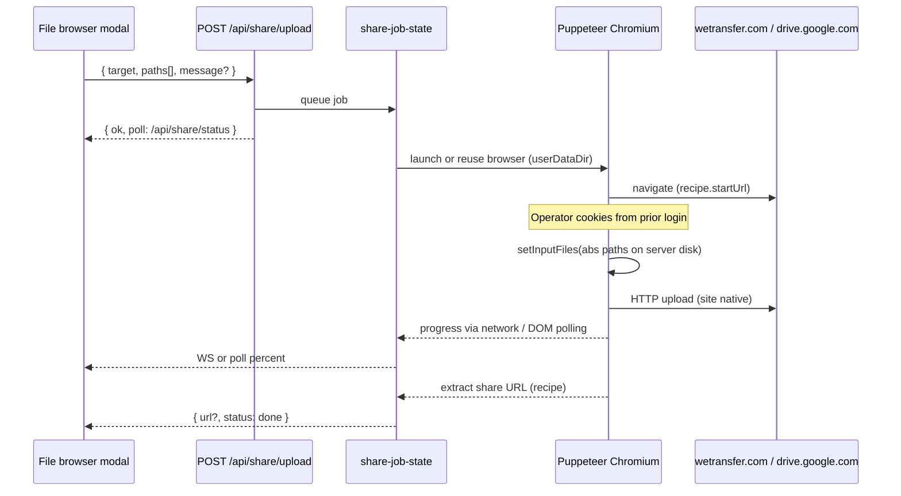

# Work Order 79: Dual-pane file browser modal + cloud upload (server browser automation)

> **⚠️ AGENT COLLABORATION PROTOCOL**
> Every agent that works on this document MUST:
> 1. Add a dated entry to the **Work Log** section at the bottom documenting what was done.
> 2. Update task checkboxes to reflect current status.
> 3. Leave clear **Instructions for Next Agent** at the end of their log entry.
> 4. Do **NOT** delete previous agents' log entries.

**Status:** In progress — Phase A + Phase B foundation shipped 2026-06-29; live cloud upload QA pending  
**Priority:** Medium–High (operators need filesystem control without SSH; post-show recording handoff is a common field ask)  
**Parent / context:** [00_PROJECT_GOAL.md](./00_PROJECT_GOAL.md)

**Related:**
- [08_WO_CASPARCG_CLIENT_FEATURES.md](./08_WO_CASPARCG_CLIENT_FEATURES.md) — media browser lineage (CasparCG Client Library widget)
- [15_WO_CLIENT_SERVER_SYNC.md](./15_WO_CLIENT_SERVER_SYNC.md) — ingest `+` menu (upload / paste link)
- [29_WO_USB_MEDIA_INGEST.md](./29_WO_USB_MEDIA_INGEST.md) — single-pane USB browse modal (pattern to reuse)
- [62_WO_PROJECT_SCOPED_MEDIA_ROOT.md](./62_WO_PROJECT_SCOPED_MEDIA_ROOT.md) — project write root; browser still reads full tree
- [27_WO_STREAMING_CHANNEL.md](./27_WO_STREAMING_CHANNEL.md) — local PGM/PRV recording → Caspar media folder `.mp4`
- [67_WO_LOGS_MODAL_CATEGORIES_AND_SUPPORT_BUNDLE.md](./67_WO_LOGS_MODAL_CATEGORIES_AND_SUPPORT_BUNDLE.md) — modal shell / toolbar patterns

**Client API spec (existing):** `from_client/media-browser-api.md`  
**Operator doc (create when shipped):** `docs/wiki/operations/file-browser-and-share.md`

**Design decision (2026-06-29):** Use **Option A — server-side browser automation** (Puppeteer + `setInputFiles` with server disk paths). **Not** WeTransfer Public API (2 GB dev cap), **not** unofficial `wetransfert.upload()` (broken), **not** streamed remote browser / remote desktop in v1. Operator uses normal cloud **web** upload flows (WeTransfer, Google Drive, OneDrive, …) with **their account limits** (including files > 2 GB).

---

## 1. Feasibility summary

| Capability | Possible? | Notes |
|------------|-----------|-------|
| **Midnight Commander–style dual-pane file browser** | **Yes** | Server already exposes copy/move/delete/mkdir; client has folder picker + Sources selection bar. Missing: dual-pane modal, per-directory browse API, keyboard shortcuts. |
| **Move / copy between panes** | **Yes** | Reuse `POST /api/media/move` and `POST /api/media/copy` via `client/lib/media-file-ops.js`. |
| **Browse recordings after PGM record** | **Yes** | Recordings land in Caspar media dir (`routes-streaming-channel.js`). Modal opens with file pre-selected. |
| **Upload server files to WeTransfer / Drive / OneDrive** | **Yes (Option A)** | Server Chromium reads paths directly; Puppeteer `setInputFiles(absolutePaths)` feeds the site’s file input. Same limits as operator’s logged-in web account — **not** the 2 GB Public API cap. |
| **Literal drag-drop from file list into google.com iframe in laptop browser** | **No** | Cross-origin browser security; files on server are not `File` objects in the operator’s browser. Option A uses **Share → …** buttons instead. |
| **Fallback LAN share** | **Yes** | Optional time-limited signed HTTP download from HighAsCG when cloud upload not configured. |

**Bottom line:** Build the MC-style browser first. Cloud handoff = **select files → Share → target** → server automates the website’s upload widget. Files stream **server disk → cloud** only (never via operator laptop).

---

## 2. Problem statement

| Symptom | Today | Pain |
|---------|-------|------|
| File ops buried in Sources → Media | Copy/move/delete via flat list + small folder picker | No side-by-side folder mental model |
| No global file manager | Operators SSH or use OS file manager | Breaks headless web UI goal |
| Recording handoff | `.mp4` on disk; operator copies to laptop then uploads | Double hop; slow for large ProRes/recordings |
| WeTransfer ingest is download-only | `POST /api/ingest/download` pulls **from** links | No push of finished recordings to producers |

**Goal:** A **full-screen modal** with **left / right directory panes** (F5 copy, F6 move, F8 delete, mkdir, refresh) over the **server media filesystem**, plus **Share → {WeTransfer, Google Drive, OneDrive, …}** that uploads selected file(s) via **server Chromium** and surfaces progress + share link when the target page exposes it.

---

## 3. Current state (code inventory)

### Server — already shipped

| Piece | Location |
|-------|----------|
| Media list | `GET /api/media` — flat list with `isDir` rows (`src/api/media-catalog.js`) |
| Copy / move / delete / mkdir | `src/api/routes-media.js` |
| Path sandbox | `src/media/local-media.js` → `resolveSafe` |
| Project write root | `src/media/project-media-root.js` (WO-62) |
| WeTransfer **download** ingest | `src/api/routes-ingest.js` — `wetransfert.download()` |
| USB browse (reference UX) | `GET /api/usb/browse` + `client/components/usb-import-modal.js` |
| Recording path | `src/api/routes-streaming-channel.js` — `ctx.streamingChannelRecord.path` |
| **Puppeteer** (dev dep) | `package.json` — reuse for server upload automation |

### Client — already shipped

| Piece | Location |
|-------|----------|
| Batch file ops | `client/lib/media-file-ops.js` |
| Folder picker | `client/components/media-folder-picker-modal.js` |
| Sources toolbar | `client/components/sources-panel.js` |
| Modal CSS | `client/styles/08c-modals-misc.css` |

### Gaps

- No `GET /api/media/browse?path=`
- No dual-pane UI
- No cloud upload job / Puppeteer share module
- No persisted Chromium profile for cloud logins on server

---

## 4. Product behaviour (normative)

### 4.1 Entry points

| Trigger | Behaviour |
|---------|-----------|
| **Header toolbar** | Icon **Files** → `showFileBrowserModal()` |
| **Sources → Media** footer | **Open file manager…** |
| **After recording stops** | Toast → **Browse recording** (file pre-selected) |
| **Keyboard** | Optional: `Ctrl+Shift+F` / `⌘+Shift+F` |

### 4.2 Dual-pane layout (MC-inspired)

Both panes are **server filesystem** browsers (not embedded cloud iframes).

```text
┌─ File manager ────────────────────────────────────────────────────────────────┐
│  [Refresh] [Mkdir]  │  Copy F5  Move F6  Delete F8  │  Share ▾                   │
├─ Left pane ────────────────┬─ Right pane ─────────────────────────────────────┤
│  📁 projects/evening_news  │  📁 stock/                                        │
│  ├─ record_pgm_….mp4  ◀sel │  ├─ bumper.mov                                    │
│  └─ gfx/                   │  └─ …                                             │
├─ Path · size summary       │  Path · size summary                              │
├─ Share progress (when active) ────────────────────────────────────────────────┤
│  Uploading to WeTransfer…  ████████░░  62%  record_pgm_….mp4  ·  Cancel        │
└─────────────────────────────────────────────────────────────────────────────────┘
```

| Requirement | Detail |
|-------------|--------|
| **Active pane** | Click to focus; accent border |
| **Navigation** | Double-click folder; `..` goes up |
| **Selection** | Multi-select; show count + total bytes |
| **Copy (F5) / Move (F6)** | Active pane selection → other pane cwd |
| **Delete (F8) / Mkdir / Refresh** | Existing media APIs |
| **Hidden dirs** | Hide `.highascg-thumbnails`, `.replication-active` by default |

### 4.3 Share → cloud upload (Option A)

| Requirement | Detail |
|-------------|--------|
| **Precondition** | At least one **file** selected (not folder) |
| **Targets (v1)** | **WeTransfer**, **Google Drive**, **OneDrive**; **Custom URL** for integrator-defined recipes |
| **Flow** | Operator: select file(s) → **Share ▾** → pick target → optional message/recipient fields if recipe supports → **Upload** |
| **Server** | Queue job → launch/reuse headless Chromium with **persistent profile** → navigate to target upload URL → `setInputFiles(serverAbsPaths)` → run recipe steps → poll until complete |
| **Progress** | Bottom bar in modal: phase (`opening`, `uploading`, `finalizing`), percent when detectable, current filename, **Cancel** |
| **Success** | Show **copyable link** when recipe extracts it from DOM (e.g. `we.tl/…`); else “Upload complete — open {service} to copy link” + link to service home if logged in |
| **Recording shortcut** | From record-stop toast: file pre-selected; **Share** one click away |
| **Failure UX** | Not logged in → “Complete one-time login” (§5.3); site DOM changed → recipe version error; file locked → retry hint |

**Not in v1:** streamed browser pane, drag-drop onto cloud iframe, WeTransfer Public API.

### 4.4 Settings (Settings → Media / Cloud share)

| Key | Default | Purpose |
|-----|---------|---------|
| `cloud_share_enabled` | `true` | Master switch |
| `cloud_share_browser_profile` | `~/.highascg/cloud-browser-profile` | Chromium userDataDir — cookies / login persistence |
| `cloud_share_headless` | `true` | `false` only for one-time login debugging on server with display |
| `cloud_share_max_concurrent` | `1` | One upload job at a time (large files) |
| `cloud_share_fallback_http_enabled` | `true` | LAN signed download link when cloud disabled |
| `cloud_share_recipes` | built-in map | Per-target URL + selectors (override in advanced JSON) |

Persist via settings routes. Profile path **never** synced via exFAT bridge (machine-local secrets/cookies).

---

## 5. Cloud upload — Option A (server browser automation)

### 5.1 Why this approach

| Approach | Verdict |
|----------|---------|
| Operator drags server file list → `iframe` Google Drive | **Impossible** — cross-origin; server files not in client `File` API |
| WeTransfer Public API | **Rejected** — ~2 GB transfer cap; normal web UI allows larger files per account |
| Unofficial `wetransfert.upload()` | **Rejected** — deprecated / captcha-blocked |
| Streamed remote browser (CDP screencast) | **Deferred** — heavier; Option A achieves same upload without visual browser |
| **Puppeteer on server + `setInputFiles(paths)`** | **Selected** — direct disk access; uses real web UIs and account limits |

### 5.2 Upload pipeline



**Path resolution:** media id `projects/foo/bar.mp4` → `resolveSafe(mediaRoot, id)` → absolute path passed to Puppeteer.

### 5.3 One-time cloud login (prerequisite)

Headless automation requires an **authenticated** Chromium profile on the playout server.

| Method | When |
|--------|------|
| **A — Setup script (recommended)** | `npm run share:browser-login` or `tools/runtime/cloud-share-browser-login.sh` — launches **headed** Chromium (needs `DISPLAY` or `xvfb-run` + optional VNC); operator logs into each service once; profile saved under `cloud_share_browser_profile` |
| **B — SSH on site** | Integrator runs setup script over SSH before show |
| **C — Status API** | `GET /api/share/accounts` returns `{ wetransfer: 'logged_in' \| 'needs_login', … }` via cookie probe |

Document in wiki: login is **per machine**, not synced with project USB.

### 5.4 Upload recipes (per target)

Recipes live in `src/share/cloud-upload-recipes.js` — data-driven, versioned.

```javascript
// Illustrative — selectors validated in spike
{
  wetransfer: {
    id: 'wetransfer',
    label: 'WeTransfer',
    startUrl: 'https://wetransfer.com/',
    fileInput: 'input[type="file"]',       // or multi-step selectors
    steps: ['acceptCookies?', 'clickTransfer', 'fillMessage?', 'waitUploadComplete'],
    shareLinkSelector: 'a[href*="we.tl"]',
    maxFiles: 20,
  },
  google_drive: { … },
  onedrive: { … },
}
```

| Concern | Mitigation |
|---------|------------|
| Site DOM changes | Recipe `version`; smoke uses fixture HTML; manual QA per release |
| Google / Microsoft 2FA | One-time login in profile; session refresh |
| Captcha on upload | Rare when logged in; surface error + retry headed login |
| Huge files | No HighAsCG size cap — bounded by service + disk read speed; show honest progress |

### 5.5 Fallback: internal signed download link

`POST /api/share/link` → time-limited `GET /api/share/download/:token` for LAN handoff when cloud upload unavailable.

---

## 6. Architecture

### 6.1 New server modules

```text
src/media/media-browse.js              # listDirectory(relPath)
src/api/routes-media-browse.js         # GET /api/media/browse
src/share/share-job-state.js           # job progress (mirror ingest download-status)
src/share/cloud-browser-pool.js      # single Chromium instance + userDataDir lock
src/share/cloud-upload-recipes.js      # per-target selectors + steps
src/share/cloud-upload-runner.js       # Puppeteer: open, setInputFiles, wait, extract link
src/api/routes-share.js                # upload, status, accounts, link fallback
tools/runtime/cloud-share-browser-login.sh
```

### 6.2 REST API

| Method | Path | Purpose |
|--------|------|---------|
| GET | `/api/media/browse?path=` | Directory listing (`""` = media root) |
| POST | `/api/share/upload` | `{ target: 'wetransfer' \| 'google_drive' \| 'onedrive' \| string, paths: string[], message? }` |
| GET | `/api/share/status` | `{ phase, percent, currentFile?, url?, error? }` |
| POST | `/api/share/cancel` | Abort active Puppeteer job |
| GET | `/api/share/accounts` | Login status per target (cookie probe) |
| POST | `/api/share/link` | Fallback LAN signed URL |
| GET | `/api/share/download/:token` | Serve fallback file |

Register in `src/api/router.js`. Optional WS: `share:progress`.

### 6.3 Client modules

```text
client/components/file-browser-modal.js
client/lib/file-browser-state.js
client/styles/08d-modals-file-browser.css
client/components/header-bar.js          # Files toolbar button
```

Reuse `media-file-ops.js` for pane copy/move/delete.

### 6.4 Recording integration

On record stop, WS `record:stopped` `{ mediaId, absPath }` → header toast **Browse / Share**.

### 6.5 Production dependencies

| Package | Role |
|---------|------|
| `puppeteer` | Promote from devDependency to **dependency** for production upload (or `puppeteer-core` + system Chromium if image size matters) |
| System | `chromium` / bundled Puppeteer browser; `xvfb` optional for headed login on headless rigs |

---

## 7. Tasks

### Phase A — Browse API + dual-pane modal (P0)

- [x] **T79.A.1** `src/media/media-browse.js` + unit tests (path traversal, hidden dirs).
- [x] **T79.A.2** `GET /api/media/browse` + smoke in `tools/smoke/smoke-media-browser-router.test.js`.
- [x] **T79.A.3** `file-browser-modal.js` — two panes, breadcrumbs, selection, active pane.
- [x] **T79.A.4** Wire F5/F6/F8, Mkdir, Refresh to existing media APIs.
- [x] **T79.A.5** CSS `08d-modals-file-browser.css`.
- [x] **T79.A.6** Header **Files** button + Sources footer link.
- [x] **T79.A.7** Default cwd to project folder when WO-62 active.

### Phase B — Cloud upload via Puppeteer (P1)

- [ ] **T79.B.1** Spike: Puppeteer `setInputFiles` with 100 MB+ file → wetransfer.com (logged-in profile); document selectors + limits in work log.
- [x] **T79.B.2** `cloud-browser-pool.js` — profile dir, singleton lock, graceful shutdown.
- [x] **T79.B.3** `cloud-upload-recipes.js` — WeTransfer recipe (v1 ship target).
- [x] **T79.B.4** `cloud-upload-runner.js` — job phases, cancel, link extraction.
- [x] **T79.B.5** `routes-share.js` + `share-job-state.js` + router registration.
- [x] **T79.B.6** Share UI — target menu, progress bar, copy link, login-needed state.
- [x] **T79.B.7** `cloud-share-browser-login.sh` + `GET /api/share/accounts`.
- [x] **T79.B.8** Promote `puppeteer` to production dependency; document ISO install size.
- [ ] **T79.B.9** Smoke: recipe step runner against fixture HTML (no live cloud in CI).

### Phase C — More targets + recording polish (P2)

- [ ] **T79.C.1** Google Drive + OneDrive recipes (after WeTransfer stable).
- [x] **T79.C.2** `record:stopped` WS + header toast.
- [ ] **T79.C.3** Fallback `POST /api/share/link`.
- [ ] **T79.C.4** Focus trap, Esc, aria (match `usb-import-modal.js`).
- [ ] **T79.C.5** Wiki `docs/wiki/operations/file-browser-and-share.md`.
- [ ] **T79.C.6** Manual QA: 10+ GB recording → WeTransfer via Share button.

---

## 8. Acceptance criteria

1. Operator opens **Files** modal, **copies** and **moves** clips between panes without SSH.
2. **Delete** / **Mkdir** work; paths cannot escape media root.
3. Browse stays responsive with **5 000+** files in library (per-directory listing only).
4. After one-time login on server, selecting a **> 2 GB** recording and **Share → WeTransfer** uploads from **server disk** with visible progress (no laptop copy step).
5. Success shows **copyable share link** when WeTransfer recipe extracts it.
6. `GET /api/share/accounts` reports `needs_login` before operator runs setup script — no silent hang.
7. Chromium profile / cookies never exposed to client API or support bundle.

---

## 9. Prerequisites

| Prerequisite | Owner | Notes |
|--------------|-------|-------|
| Outbound HTTPS from playout box | Network | Upload uses each service’s normal web endpoints |
| One-time cloud login per machine | Operator / integrator | `share:browser-login` script before first Share |
| Disk read on media paths | Already have | Same as copy/ingest |
| Puppeteer + Chromium on playout image | Build / WO-73 eggs | May add ~150–300 MB; consider `puppeteer-core` + apt chromium |
| Recipe maintenance | Dev | DOM changes on third-party sites — expect occasional updates |

---

## 10. Manual QA checklist

- [ ] Dual-pane copy/move between `projects/<slug>/` and `stock/`.
- [ ] Recording stop → file pre-selected in file manager.
- [ ] Share → WeTransfer, **> 2 GB** file, link works in incognito.
- [ ] Share without prior login → clear “complete setup login” message.
- [ ] Cancel mid-upload aborts Puppeteer job; disk file unchanged.
- [ ] Google Drive recipe (Phase C) with workspace account.

---

## Work Log

### 2026-06-29 — Agent (Phase A + B foundation)

**Work done:**
- **Server:** `media-browse.js`, `GET /api/media/browse`, share routes (`/api/share/upload|status|cancel|accounts`), Puppeteer runner + recipes + browser pool, `puppeteer` moved to dependencies.
- **Client:** `file-browser-modal.js` (dual-pane, F5/F6/F8, Share menu), header **Files** + Sources **Files…**, CSS `08d-modals-file-browser.css`.
- **Ops:** `tools/runtime/cloud-share-browser-login.sh` for one-time cloud login.
- **Recording:** WS `record_stopped` on record stop → prompt to open file manager.
- **Tests:** `test/media-browse.test.js`, extended `smoke-media-browser-router.test.js`, `npm run smoke:media-browser` (14 pass).
- **Build:** `npm run build:client` OK.

**Remaining:** T79.B.1 live WeTransfer spike (selectors may need tuning), T79.B.9 fixture smoke, Phase C polish (Drive/OneDrive recipes, LAN fallback link, wiki).

**Instructions for Next Agent:** On playout box run `bash tools/runtime/cloud-share-browser-login.sh`, log into WeTransfer, then test Share with a real recording. Tune `cloud-upload-recipes.js` selectors from T79.B.1 findings.

### 2026-06-29 — Agent (Option A adoption)

**Work done:**
- Replaced WeTransfer Public API / streamed-browser design with **Option A**: server Puppeteer + `setInputFiles` on real cloud web UIs.
- Rationale: operator web accounts allow **> 2 GB**; no API key; files never route through laptop; no remote desktop.
- Updated UX (both panes = filesystem; Share toolbar + progress bar), architecture, recipes model, tasks, acceptance criteria.

**Status:** Work order revised. Implementation not started.

**Instructions for Next Agent:** Phase A unchanged. Phase B starts with **T79.B.1 spike** on a real Ubuntu box with logged-in WeTransfer profile — validate selectors before building runner. Promote puppeteer only after spike confirms headless upload works post-login.

### 2026-06-29 — Agent (initial scope)

**Work done:**
- Initial WO with dual-pane browser + WeTransfer API push (superseded by Option A above).

**Status:** Superseded.

---

*Work Order created: 2026-06-29 | Revised: 2026-06-29 (Option A) | Series: HighAsCG operator media ops | Parent: 00_PROJECT_GOAL.md*
