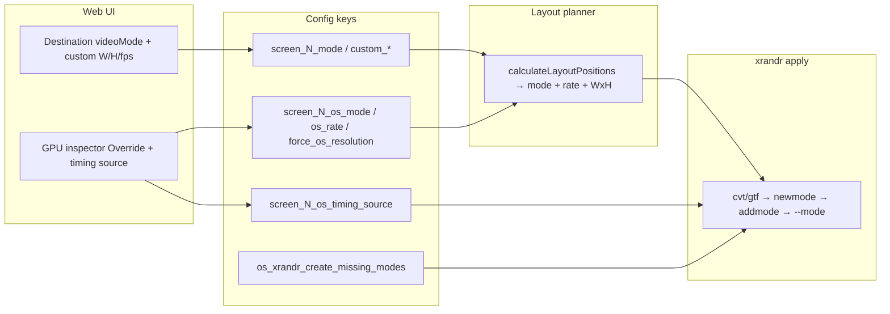

# Work Order 80: xrandr custom mode — force OS output to Web UI WxH×fps

> **⚠️ AGENT COLLABORATION PROTOCOL**
> Every agent that works on this document MUST:
> 1. Add a dated entry to the **Work Log** section at the bottom documenting what was done.
> 2. Update task checkboxes to reflect current status.
> 3. Leave clear **Instructions for Next Agent** at the end of their log entry.
> 4. Do **NOT** delete previous agents' log entries.

**Status:** In progress — Phase A shipped 2026-06-29  
**Priority:** High (operators cannot reliably force non-EDID resolutions at cold boot)  
**Parent / context:** [00_PROJECT_GOAL.md](./00_PROJECT_GOAL.md)

**Builds on (required reading):**
- [40_WO_DEVICE_VIEW_GPU_XRANDR_SCREEN_DEST_SYNC.md](./40_WO_DEVICE_VIEW_GPU_XRANDR_SCREEN_DEST_SYNC.md) — destination → GPU, Override, Apply GPU consent model
- [40a_WO_PIXEL_MAP_GPU_XRANDR_CASPAR_ALIGNMENT.md](./40a_WO_PIXEL_MAP_GPU_XRANDR_CASPAR_ALIGNMENT.md) — inherited canvas modes, `os_xrandr_create_missing_modes` (slice 4 shipped)
- [39_WO_SETTINGS_SYSTEM_HARDWARE.md](./39_WO_SETTINGS_SYSTEM_HARDWARE.md) — `SYSTEM_DISPLAY_KEYS`, apply-os
- Design refs: `docs/reference/xrandr-gpu-screen-mapping.md`, `docs/reference/GPU_SCREEN_CONSUMER_AND_XRANDR.md`, `docs/reference/screen-consumer-vsync-nvidia.md`

**Related code today:**
- Layout planner: `src/utils/os-layout-calculator-place.js`, `src/utils/os-layout-calculator-helpers.js`
- xrandr apply: `src/utils/os-config.js` (`applyX11Layout`, `persistLayoutScript`)
- Custom mode creation: `src/utils/xrandr-custom-mode.js`, `src/utils/modeline-timings.js`
- Web UI: `client/components/device-view-inspector-gpu-video-modeline.js`, `client/components/device-view-destinations-inspector.js`
- Boot: `scripts/setup/09-openbox-autostart.sh`, `~/.agent/transcripts` → `tools/runtime/highascg-nvidia-x-apply.sh`
- Tests: `npm run test:xrandr-custom-mode`, `npm run test:modeline-timings`, `npm run test:os-layout-w40`

---

## 1. Problem statement

Operators set a **custom** or **non-EDID** resolution in Device View (destination **Video mode** or GPU inspector **Override** + custom WxH×fps). **Apply GPU** / `POST /api/settings/apply-os` should drive the physical monitor at exactly that format.

| Gap | Today | Target |
|-----|-------|--------|
| Custom mode at apply time | Works when `os_xrandr_create_missing_modes` is **on** and Apply GPU runs live | Same, but predictable default when operator forces custom WxH |
| Cold boot / login | `apply-layout.sh` persists **only** the final `xrandr --output … --mode …` line — **no** `--newmode` / `--addmode` | Startup script recreates every required mode **before** `--mode` |
| Terminology | “MetaMode” used loosely for both RandR and NVIDIA | Document and code comments distinguish **RandR mode** vs **NVIDIA CurrentMetaMode** |
| Operator visibility | Modeline preview exists (`GET /api/hardware/modeline-preview`) but apply path is opaque | Apply logs + persisted script show full mode-creation sequence |
| Rate enforcement | `--rate` appended when layout has `rate`; custom CVT name embeds Hz | Document when `--rate` is needed vs redundant |

**Goal:** Reliable, reviewable xrandr setup so the OS outputs the **exact** WxH×fps chosen in the Web UI — including after reboot — with the **correct command order** and shared timing math between UI preview and apply.

**Explicitly out of scope (inherit WO-40 §4):**
- Implicit xrandr on every settings edit (still **Apply GPU** only)
- Caspar **FILL** / rescaling to hide OS mismatch
- Chasing full `nvidia-settings` parity for mode creation (stay **xrandr-first** for resolution; NVIDIA script remains composition-pipeline only)

---

## 2. Terminology — do not confuse “MetaMode” with RandR modes

| Term | Layer | What it is | HighAsCG use |
|------|-------|------------|--------------|
| **RandR mode** (often called “custom mode” in product docs) | X11 / `xrandr` | A named timing line on the X server: dot clock + H/V porch/sync totals + optional flags. Created with `--newmode`, attached to an output with `--addmode`, selected with `--output NAME --mode MODE`. | **This WO** — force WxH×fps on the wire |
| **Modeline** | Xorg / `cvt` / `gtf` text format | Human-readable source for `--newmode`: `Modeline "1920x1080_60.00" 173.00 1920 2048 … -hsync +vsync` | Parsed by `modeline-timings.js`; fed to `xrandr --newmode` |
| **NVIDIA CurrentMetaMode** | `nvidia-settings` | Driver string describing **all** active heads + per-head options (e.g. `ForceCompositionPipeline=On`). **Not** where WxH is defined for HighAsCG. | `highascg-nvidia-x-apply.sh` runs **after** xrandr layout; patches composition pipeline only |
| **EDID mode** | Monitor firmware | Pre-enumerated modes in `xrandr --query` under each connected output | Used when present; custom path only when missing or operator forces Override |

When operators say “custom meta mode,” they mean a **RandR mode** (Modeline-backed), **not** NVIDIA MetaMode.

---

## 3. What xrandr requires for a custom resolution

### 3.1 Mode identity

xrandr does **not** accept raw WxH alone unless that string already exists in the server’s mode list for that output. For arbitrary WxH×fps you need:

1. **Timing numbers** — dot clock (MHz), horizontal active/total/sync, vertical active/total/sync, sync flags.
2. **Mode name** — string token used in `--mode`. HighAsCG uses the **`cvt` / `gtf` generator name**, e.g. `5120x1024_50.00` (WxH + refresh with two decimal places).

### 3.2 Modeline contents (what can be used)

Standard **CVT** / **GTF** generators produce a line parseable as:

```
Modeline "<modeName>"  <dotClockMhz>  <hDisplay> <hSyncStart> <hSyncEnd> <hTotal>  <vDisplay> <vSyncStart> <vSyncEnd> <vTotal>  [flags…]
```

| Field | Role |
|-------|------|
| `dotClockMhz` | Pixel clock in MHz (bandwidth limit — UI classifies SL/DL/4K in modeline preview) |
| `hDisplay` × `vDisplay` | Active pixels (= target width × height) |
| `hSyncStart/End`, `hTotal` | Horizontal blanking + sync |
| `vSyncStart/End`, `vTotal` | Vertical blanking + sync |
| Flags (e.g. `-hsync +vsync`) | Polarities; must match what the output accepts |

**Allowed timing sources in HighAsCG** (`screen_N_os_timing_source` / inspector timing dropdown):

| Key | Generator | When to use |
|-----|-----------|-------------|
| `cvt` | `cvt W H Hz` | Default; standard CVT |
| `cvt_r` | `cvt -r W H Hz` | Reduced blanking (lower pixel clock, many modern panels) |
| `gtf` | `gtf W H Hz` | Legacy/alternate; operator choice |

**Not in scope for v1:** hand-edited porch values in the Web UI, interlaced custom timings, or EDID binary injection.

### 3.3 Mandatory command order (per output needing a custom mode)

RandR is stateful. Order matters:

```
# 0. Environment (always)
export DISPLAY=:0
export XAUTHORITY=/home/casparcg/.Xauthority

# 1. Discover current modes (in-memory in applyX11Layout; optional in script)
xrandr --query

# 2. If planned WxH not listed for this output — create mode ONCE per unique modeName:
cvt 5120 1024 50                    # or gtf / cvt -r — timing source from settings
xrandr --newmode 5120x1024_50.00  <dotClock> <hDisp> <hSS> <hSE> <hTot> <vDisp> <vSS> <vSE> <vTot> <flags…>

# 3. Attach mode to the PHYSICAL output (per output; same modeName can be addmode’d to multiple outputs)
xrandr --addmode DP-0 5120x1024_50.00

# 4. Apply layout (all heads in one command is OK after all addmodes)
xrandr --output DP-0 --pos 0x0 --mode 5120x1024_50.00 --rate 50

# 5. AFTER layout — NVIDIA policy only (separate script; do not interleave)
highascg-nvidia-x-apply.sh
```

**Rules:**

| Step | Rule |
|------|------|
| `--newmode` | Global to the X server; safe to run once per unique `modeName` even for multi-head |
| `--addmode` | **Per output**; must run before `--output THAT --mode modeName` on that output |
| `--newmode` before `--addmode` | **Required** — addmode fails if the name does not exist |
| Replace existing timing | If `modeName` already exists with different numbers: switch output away → `--delmode` → `--rmmode` → `--newmode` (implemented in `stripExistingXrandrModeByName`) |
| `--rate` | Optional when mode name already encodes Hz (`5120x1024_50.00`); keep when EDID bare `5120x1024` is reused with multiple refresh variants |
| Multi-head | Collect **all** `newmode`/`addmode` pairs first, then one combined `xrandr --output …` (current `applyX11Layout` pattern) |

**Failure modes to log clearly:**

- `xrandr: cannot find mode` → addmode missing or wrong order
- `BadMatch` → often transient on NVIDIA; retry (already in `os-config.js`)
- `mode already exists` → replace path or pick existing token via `pickBestExistingModeForPlan`

---

## 4. How HighAsCG calculates the desired mode from Web UI (WxH × fps)

End-to-end data flow from operator fields to xrandr:



### 4.1 Web UI inputs

| UI surface | Fields | Config keys |
|------------|--------|-------------|
| **Destination inspector** | Standard mode (`1080p5000`, …) or **custom** width, height, fps | Destination node + `casparServer.screen_N_*` / generator merge |
| **GPU inspector — Video mode** | Caspar mode; with **Override** on, drives OS | `screen_N_force_os_resolution`, `casparServer.screen_N_mode`, `screen_N_custom_width/height/fps` |
| **GPU inspector — EDID row** | Pick existing `xrandr --query` mode (hint) | `screen_N_os_mode`, `screen_N_os_rate` |
| **GPU inspector — Timing** | CVT / CVT-R / GTF | `screen_N_os_timing_source` |
| **Global (advanced)** | Create missing modes | `os_xrandr_create_missing_modes` (root or `casparServer`) |

Helpers:
- `casparVideoModeToOsModeAndRate` — maps Caspar mode id → `{ osMode: "1920x1080", osRate: 50 }` (`device-view-destinations-inspector.js`, `CASPAR_VIDEO_MODE_SPECS`)
- `GET /api/hardware/modeline-preview?w=&h=&hz=&kind=` — same generator as apply (`modeline-timings.js`)

### 4.2 Layout planner output (`computePlacedLayoutResults`)

For each GPU head (screen or multiview):

| Output field | Derivation |
|--------------|------------|
| `mode` | **`modeForXrandr`** string, usually `"{width}x{height}"` (bare WxH for planner; apply may resolve to suffixed CVT name) |
| `rate` | **`effectiveRate`** in Hz |
| `width`, `height` | Layout strip / bbox math |

**`modeForXrandr` priority** (see `os-layout-calculator-place.js`):

1. **Override on** (`screen_N_force_os_resolution`):
   - Explicit `screen_N_os_mode` if it matches `/^\d+x\d+$/` → use as-is
   - Else Caspar **`custom`** → `screen_N_custom_width` × `screen_N_custom_height`
   - Else standard Caspar mode → `mapCasparModeToXrandrRes` (`STANDARD_VIDEO_MODES`)
2. **Override off** (default): bound **destination** `videoMode` + custom WxH from topology wins over stale `screen_N_os_mode`
3. **Mapping → GPU** (WO-40a): per-output slice rect or full canvas union when `osXrandrHeadMode === 'canvas'`

**`effectiveRate` priority:**

1. Override + custom: `screen_N_custom_fps`
2. Else: `inferRefreshHzFromCasparMode(casparMode)` (e.g. `1080p5000` → 50)
3. Else: `screen_N_os_rate` from inspector / EDID pick

### 4.3 Apply-time mode resolution (`applyX11Layout` → `processHead`)

Given planned `mode` = `"5120x1024"` and `rate` = `50`:

| Step | Function | Result |
|------|----------|--------|
| 1 | `xrandr --query` → parse modes per output | `availableModesByOutput` |
| 2 | `pickBestExistingModeForPlan("5120x1024", avail, 50)` | e.g. `5120x1024_50.00` if already registered |
| 3 | If missing and `os_xrandr_create_missing_modes` | `tryAddXrandrModeFromCvt({ width, height, refreshHz, timingKind: readOsTimingSourceForOutput })` |
| 4 | Inside tryAdd: `runTimingGenerator` → parse Modeline → `xrandr --newmode` → `--addmode` | Returns CVT **modeName** |
| 5 | Build `--output SYSID --pos XxY --mode MODE [--rate R]` | Single combined xrandr command |

**Important:** Planner emits **bare** `WxH`; apply emits **concrete** mode token (bare, suffixed, or EDID label). Both refer to the same active pixels when create-missing succeeds.

### 4.4 Example trace

Operator sets destination **custom 5120×1024 @ 50 fps**, cables to `DP-0`, enables **Create missing modes**, clicks **Apply GPU**:

| Stage | Value |
|-------|-------|
| UI → config | `videoMode: custom`, `width: 5120`, `height: 1024`, `fps: 50` |
| Planner | `mode: "5120x1024"`, `rate: 50` |
| `cvt 5120 1024 50` | `Modeline "5120x1024_50.00" …` |
| xrandr | `--newmode 5120x1024_50.00 …` → `--addmode DP-0 5120x1024_50.00` → `--output DP-0 --pos 0x0 --mode 5120x1024_50.00 --rate 50` |
| NVIDIA (after) | `highascg-nvidia-x-apply.sh` patches **CurrentMetaMode** composition flags only |

---

## 5. Known gaps (this WO closes)

| ID | Gap | Notes |
|----|-----|-------|
| G80.1 | **Cold boot** | `persistLayoutScript` writes only step 5 — modes vanish on X restart → `--mode 5120x1024_50.00` fails |
| G80.2 | **Opt-in create flag** | ~~`os_xrandr_create_missing_modes` defaults false~~ → **auto-create when WxH not in EDID**; explicit `false` opt-out only |
| G80.3 | **Script dedupe** | Multi-head same WxH should emit one `--newmode`, multiple `--addmode` |
| G80.4 | **Preview ↔ apply parity** | Already shared via `modeline-timings.js`; verify inspector preview updates when destination custom fields change |
| G80.5 | **Support bundle** | Include last planned mode-creation lines + whether create-missing ran |

---

## 6. Target behaviour (acceptance-oriented)

### Phase A — Persisted mode creation (G80.1, G80.3)

- [x] **T80.A.1** Extend `applyX11Layout` to collect `{ modeName, timings[], outputs[] }` for every CVT-created or explicitly planned custom mode during live apply
- [x] **T80.A.2** `persistLayoutScript` emits shell lines in order: header → **all unique `--newmode`** → **per-output `--addmode`** → combined layout `xrandr` → `buildOperatorDisplaySessionShellLines` (primary, mouse, NVIDIA)
- [x] **T80.A.3** Idempotent boot script: if `xrandr --query` already lists mode on output, skip redundant newmode/addmode (or use replace path)
- [x] **T80.A.4** Unit test: fixture layout with two heads same custom WxH → one newmode, two addmode, one layout line

### Phase B — Force custom resolution UX (G80.2)

- [x] **T80.B.1** ~~Inspector warn when mode missing from EDID~~ — **Rejected:** EDID dropdown vs Custom are distinct paths; no warning needed
- [x] **T80.B.2** Auto-create RandR mode when planned WxH not in EDID (`shouldCreateXrandrModeForPlan`; default on; `os_xrandr_create_missing_modes: false` opt-out only)
- [ ] **T80.B.3** Apply-os response includes `modeCreation: [{ output, modeName, created: bool, source: 'cvt'|'edid' }]` for Device View toast / logs modal

### Phase C — Documentation + diagnostics (G80.4, G80.5)

- [x] **T80.C.1** Update `docs/reference/xrandr-gpu-screen-mapping.md` §7 — custom mode order + cold boot
- [x] **T80.C.2** Support bundle (`gpu-display-snapshot.js`) includes `plannedCustomModes` from last apply
- [ ] **T80.C.3** Stick boot QA (`77_WO_STICK_BOOT_QA_TEST_SUITE.md`) optional check: after reboot, `xrandr --query` lists planned WxH on cabled head

### Phase D — Tests

- [x] **T80.D.1** `smoke-xrandr-persist-script.js` — pure function test for script line ordering from mock apply result
- [ ] **T80.D.2** Extend `smoke-xrandr-custom-mode` for replace path + multi-output addmode plan
- [x] **T80.D.3** Regression: `npm run test:os-layout-w40`, `test:mapping-gpu-os-layout`

---

## 7. Implementation notes

- **Single timing module:** Keep using `modeline-timings.js` for preview, apply, and persisted script generation — do not duplicate CVT parsing in shell.
- **Do not** put NVIDIA MetaMode strings into `apply-layout.sh` for WxH — resolution stays in xrandr; `highascg-nvidia-x-apply.sh` stays last.
- **WO-40 §4 still applies:** no auto-apply on edit; operator clicks **Apply GPU**.
- **Caspar alignment:** Forcing OS resolution does not change Caspar consumer WxH unless operator also changes channel video mode (Override copy in inspector explains this).
- **Rate limits:** Reject or warn when `classifyPixelClockBandwidth` exceeds plausible DP/HDMI tier for the cabled connector (future; log-only in v1).

---

## 8. Acceptance criteria

- [ ] **A80.1** Operator sets custom **5120×1024 @ 50** on a head with no EDID mode → Apply GPU → live output matches; `xrandr --query` shows `5120x1024_50.00` active.
- [ ] **A80.2** Reboot → openbox autostart → **same** mode without manual Apply GPU (persisted script includes newmode/addmode).
- [ ] **A80.3** Modeline preview in Web UI matches timings used in apply logs for same W/H/Hz/kind.
- [ ] **A80.4** Multi-head: two outputs same custom mode → one `--newmode`, two `--addmode`, correct positions.
- [ ] **A80.5** NVIDIA composition pipeline still applied after layout (`ForceCompositionPipeline=On` in CurrentMetaMode).

---

## 9. Operator checklist (draft)

1. Set **Video mode** (destination or GPU Override) to desired WxH×fps.  
2. Open GPU inspector → confirm **Timing** (CVT / CVT-R / GTF) and preview modeline.  
3. Enable **Create missing modes** if the EDID list lacks your WxH.  
4. **Apply GPU** — check logs for `registered custom mode … via cvt`.  
5. Reboot once to verify cold-boot script; if wrong, inspect `~/.config/highascg/apply-layout.sh` for newmode/addmode lines before `--output`.

---

## 10. Work log

### 2026-06-29 — Specification draft

- Captured RandR vs NVIDIA MetaMode terminology.
- Documented Modeline fields, timing sources, and mandatory xrandr command order.
- Traced Web UI → config → layout planner → `tryAddXrandrModeFromCvt` data flow.
- Identified cold-boot persistence gap (WO-40a follow-up) as primary implementation target.

**Instructions for next agent:** Start **Phase A** (`persistLayoutScript` + collected mode-creation artifacts). Run existing smoke tests after any `os-config.js` change. Do not implement WO-40 §4 rejections. Link shipped work back to WO-40a T40a.4 caveat closure.

### 2026-06-29 — Phase A implementation

- **`src/utils/xrandr-persist-script.js`** — `CustomXrandrModeRegistry`, idempotent `newmode`/`addmode` shell lines, `buildApplyLayoutScriptContent`.
- **`src/utils/xrandr-custom-mode.js`** — `computeModelineForWxH` (shared CVT/GTF parse, no xrandr exec).
- **`src/utils/os-config.js`** — collect custom mode plans during layout; persist into `apply-layout.sh`; write `data/runtime/xrandr-custom-modes-last-apply.json`.
- **`src/support/gpu-display-snapshot.js`** — `plannedCustomModes` in support bundle.
- **`docs/reference/xrandr-gpu-screen-mapping.md`** — §7 cold boot.
- Tests: `npm run test:xrandr-persist-script` (4 tests); regressions pass.

**Instructions for next agent:** Phase B (inspector warn when mode missing from EDID; optional auto-enable create-missing). Live QA: Apply GPU with custom 5120×1024@50 + reboot → verify `~/.config/highascg/apply-layout.sh` has newmode before `--output`. Close WO-40a T40a.4 caveat in work log when QA passes.

### 2026-06-29 — Operator source model (EDID dropdown vs Custom)

- **`screen_N_os_mode_source`**: `edid` | `custom` — operator choice, not server WxH matching.
- **EDID pick** → exact xrandr token (`1920x1080_60.00`), never `newmode`.
- **Custom pick** → always CVT/`newmode`/`addmode` at WxH×Hz (e.g. 1080p50 when EDID only has 60).
- GPU inspector: OS output dropdown = EDID modes + **Custom** row with WxH×Hz fields.
- `src/utils/os-mode-source.js`; tests `npm run test:os-mode-source`.

**Instructions for next agent:** T80.B.3 apply-os `modeCreation` payload optional. Destination inspector could set `os_mode_source=custom` on save when videoMode custom (optional polish).

---

*End of WO-80*
