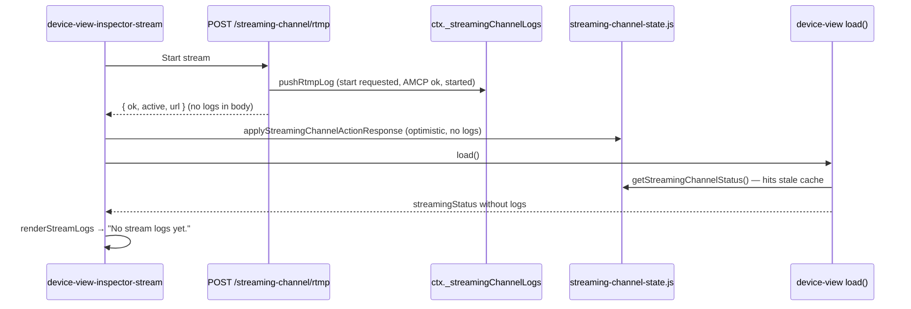

# Work Order 81: Stream/record — no false Apply dirty, live status logs in inspector

> **⚠️ AGENT COLLABORATION PROTOCOL**
> Every agent that works on this document MUST:
> 1. Add a dated entry to the **Work Log** section at the bottom documenting what was done.
> 2. Update task checkboxes to reflect current status.
> 3. Leave clear **Instructions for Next Agent** at the end of their log entry.
> 4. Do **NOT** delete previous agents' log entries.

**Status:** In progress — Phase A–C shipped 2026-06-29  
**Priority:** High (operators see empty stream log after go-live; spurious Apply & restart blocks show prep)  
**Parent / context:** [00_PROJECT_GOAL.md](./00_PROJECT_GOAL.md)

**Builds on (required reading):**
- [27_WO_STREAMING_CHANNEL.md](./27_WO_STREAMING_CHANNEL.md) — dedicated streaming channel, RTMP/record AMCP
- [67_WO_LOGS_MODAL_CATEGORIES_AND_SUPPORT_BUNDLE.md](./67_WO_LOGS_MODAL_CATEGORIES_AND_SUPPORT_BUNDLE.md) — `streaming` log category (`buffered-logger.js`)
- [33c_WO_DEVICE_VIEW_CASPAR_BACKPLANE_UI.md](./33c_WO_DEVICE_VIEW_CASPAR_BACKPLANE_UI.md) — Device View Apply Caspar config button

**Related code today:**
- RTMP/record API + in-memory log ring: `src/api/routes-streaming-channel.js` (`pushRtmpLog`, `ctx._streamingChannelLogs`)
- Client status cache: `client/lib/streaming-channel-state.js`
- Device View inspector log box: `client/components/device-view-inspector-stream.js`
- False dirty triggers: `device-view-inspector-stream.js`, `device-view-inspector-record.js`, `device-view.js` (`removeStreamOutputConnector` / `removeRecordOutputConnector`)
- Suggested connectors (UI only, not Caspar XML): `src/config/device-graph-suggest.js`
- Dynamic consumers (no config regen): AMCP `ADD … STREAM` / `ADD … FILE` in `routes-streaming-channel.js`

---

## 1. Problem statement

| Symptom | Root cause (traced) |
|---------|---------------------|
| **Apply Caspar config (restart)** turns orange after saving stream/record settings, adding/removing stream or record outputs | `setCasparRestartDirty(true)` called from stream/record inspector save and remove paths — but `streamOutputs` / `recordOutputs` are **show-tier definitions** used for UI connectors + runtime AMCP ffmpeg args; they are **not** Caspar `<channel>` / `<consumer>` XML entries |
| After **Start stream**, Device View **Stream log** pane shows *"No stream logs yet."* | **Three stacked bugs:** (1) server writes logs to `ctx._streamingChannelLogs.rtmp` on start; (2) client `applyStreamingChannelActionResponse` applies an **optimistic** status slice **without** `logs`; (3) `device-view.js` `load()` prefers `getStreamingChannelStatus()` cache over `GET /api/streaming-channel`, so fresh server logs are never fetched |
| Stream log viewer has little operational value | Only RTMP start/stop AMCP lines are logged; no record log ring; no periodic health (consumer present, last error, URL redacted); no WebSocket push (`streaming_channel` WS handler exists on client but **server never broadcasts** log updates) |
| Inspector copy says *"Save settings → Apply Caspar config"* for stream/record | Misleading — runtime encode is AMCP-driven; only **first-time** `streamingChannel.enabled` (dedicated Caspar channel slot) belongs in generated `casparcg.config` |

**Goal:** Stream and record output CRUD + encoder settings must **not** mark Caspar restart dirty. The per-output **Stream log** box must show live status immediately after start/stop and stay updated while on air. Logging should be rich enough that an operator can diagnose URL, AMCP, and consumer state without opening the full Logs modal.

---

## 2. Architecture trace (current)

| Layer | Behaviour |
|-------|-----------|
| **Caspar config generator** | `streamOutputs` / `recordOutputs` → suggested `stream_out` / `record_out` connectors only (`device-graph-suggest.js`). FFmpeg consumers attached at runtime via AMCP, not in generated XML. |
| **`streamingChannel.enabled`** | Adds dedicated `streamingCh` in `config-generator-channels.js` — **does** require Apply & restart when toggled from off→on. |
| **Server log store** | In-process ring buffer per process; `GET /api/streaming-channel` returns `rtmp.logs`; record has **no** log store today. |
| **Client cache** | `setStreamingChannelStatus` replaces whole `rtmp` slice; optimistic updates drop `logs`. `normalizeOutputSlice` only keeps `logs` when present on incoming object. |
| **WebSocket** | `app-ws-handlers.js` listens for `streaming_channel` — **no server publisher** for log/status deltas. |

---

## 3. Product behaviour (normative)

### 3.1 Apply & restart — what must / must not mark dirty

| Action | Mark `casparRestartDirty`? | Notes |
|--------|---------------------------|-------|
| Add / remove **stream output** (`streamOutputs[]`) | **No** | UI connector list only |
| Add / remove **record output** (`recordOutputs[]`) | **No** | UI connector list only |
| Save stream/record **encoder settings** (URL, key, CRF, codecs, quality) | **No** | Used on next `ADD STREAM` / `ADD FILE` |
| **Start / stop** RTMP or file record | **No** | Pure AMCP |
| Cable destination → `stream_out` / `record_out` (updates `streamingChannel.videoSource` / `recordOutputs[].source`) | **No** | Apply plan should issue route PLAY / graph sync only — not Caspar regen |
| Toggle **`streamingChannel.enabled`** (dedicated channel slot) | **Yes** | Changes generated channel list |
| Change `streamingChannel.videoMode`, decklink on streaming bus, screen consumer on streaming ch | **Yes** | Caspar XML |
| GPU / PGM / DeckLink destination cabling | **Yes** (unchanged) | Existing behaviour |

Remove misleading inspector note *"Save settings → Apply Caspar config"* for stream/record; replace with *"Saved settings apply on next Start stream / Start record."*

### 3.2 Stream log viewer (Device View inspector)

| Requirement | Detail |
|-------------|--------|
| **Immediate feedback** | After Start/Stop, log box shows server lines within one UI tick — no manual refresh |
| **While on air** | New status lines append (WS preferred; fallback: refresh GET after actions) |
| **Record outputs** | Same log component pattern for `record` slice (or unified `outputId` keyed logs) |
| **Line format** | `[ISO ts] [LEVEL] message {optional json}` — match existing `pushRtmpLog` shape |
| **Content (minimum)** | start requested, AMCP command accepted/fallback, started/stopped, errors, consumer index, redacted URL (host visible, stream key masked) |
| **Content (stretch)** | periodic `INFO` consumer probe on streaming ch, ffmpeg stderr highlights if Caspar exposes them |
| **Cap** | Ring buffer ~80 lines server-side; viewer shows last 20 |

### 3.3 Server logging & push

| Requirement | Detail |
|-------------|--------|
| **`broadcastStreamingChannelStatus(ctx)`** | After any log push or active flag change, `ctx._wsBroadcast('streaming_channel', handleGet(ctx).body parsed)` |
| **Record logs** | `pushRecordLog` mirroring `pushRtmpLog`; include in GET + WS payload |
| **Buffered logger** | Also `streamLog.info(…)` for main Logs modal `streaming` category (already wired in other streaming modules) |
| **Status fields in payload** | `rtmp.active`, `rtmp.url` (redacted), `rtmp.lastError`, `rtmp.outputId`, `record.active`, `record.path`, `logs[]` |

### 3.4 Client status cache fixes

| Requirement | Detail |
|-------------|--------|
| **Merge logs on update** | `setStreamingChannelStatus`: when merging `rtmp`/`record`, preserve existing `logs` if incoming slice omits them |
| **After local actions** | `refreshStreamingChannelStatus()` (always GET) — not cache-only |
| **`device-view.js` load()** | Do **not** skip GET when cache exists if inspector needs logs; or pass `forceRefresh` after stream actions |
| **Inspector subscription** | `subscribeStreamingChannelStatus` in stream inspector to re-render log box without full `load()` |

---

## 4. Phased tasks

### Phase A — Stop false Apply dirty (client)

- [x] **T81.1** Remove `setCasparRestartDirty(true)` from `device-view-inspector-stream.js` save path
- [x] **T81.2** Remove `setCasparRestartDirty(true)` from `device-view-inspector-record.js` save path
- [x] **T81.3** Remove dirty from `removeStreamOutputConnector` / `removeRecordOutputConnector` in `device-view.js`
- [x] **T81.4** Audit `tryAddCable` — when edge only updates `streamOutputs` / `recordOutputs` / `streamingChannel.videoSource`, skip dirty (keep dirty for GPU/DeckLink/PGM paths)
- [x] **T81.5** Update inspector helper text (stream + record)

### Phase B — Fix empty log viewer (client)

- [x] **T81.6** `streaming-channel-state.js` — merge `logs` on partial updates; include logs in optimistic start only via post-action GET
- [x] **T81.7** After start/stop in inspector, call `refreshStreamingChannelStatus()` before `renderStreamLogs`
- [x] **T81.8** `device-view.js` `load()` — always fetch `/api/streaming-channel` (or `forceRefresh` flag from stream actions)
- [x] **T81.9** Stream inspector: subscribe to `subscribeStreamingChannelStatus` for live log box updates

### Phase C — Richer server logging + WS

- [x] **T81.10** `broadcastStreamingChannelStatus(ctx)` helper; call from every `pushRtmpLog` and active-state mutation
- [x] **T81.11** `pushRecordLog` + `record.logs` in GET payload
- [x] **T81.12** Redact stream keys in log `extra.url` / status URL fields
- [x] **T81.13** Optional: interval consumer health log while `rtmp.active` (behind env flag `HIGHASCG_STREAM_STATUS_POLL_MS`)

### Phase D — Verification

- [ ] **T81.14** Smoke: add `str_2`, save RTMP URL — Apply button stays idle
- [ ] **T81.15** Smoke: Start stream — inspector log shows ≥3 lines within 2 s
- [ ] **T81.16** Smoke: second browser tab receives log lines via WS without refresh
- [ ] **T81.17** Smoke: toggle `streamingChannel.enabled` in Settings → Screens still marks dirty / config mismatch as today

---

## 5. Acceptance

- [ ] **A81.1** Adding, removing, or saving stream/record output settings does **not** orange the Apply Caspar config button.
- [ ] **A81.2** Start stream → Stream log shows start requested + AMCP result + started (not empty state).
- [ ] **A81.3** Stop stream → log shows stop line; `active` false in header badges.
- [ ] **A81.4** Record start/stop produces visible log lines in record inspector (when record log UI added or shared component).
- [ ] **A81.5** Enabling dedicated streaming channel in settings still requires Caspar Apply & restart (unchanged).
- [ ] **A81.6** Logs also appear under Logs modal **streaming** category for support bundle / filtering.

---

## 6. Code map (quick reference)

| File | Change |
|------|--------|
| `client/components/device-view-inspector-stream.js` | dirty removal, refresh/subscribe, copy |
| `client/components/device-view-inspector-record.js` | dirty removal, record log UI |
| `client/components/device-view.js` | load() fetch policy, remove dirty on output delete, cable dirty guard |
| `client/lib/streaming-channel-state.js` | log merge, refresh after actions |
| `src/api/routes-streaming-channel.js` | broadcast, record logs, redaction |
| `index.js` or WS wiring | ensure `_wsBroadcast` available to routes |

---

## 7. Decision log

| Decision | Choice | Date | Notes |
|----------|--------|------|-------|
| Stream/record definitions vs Caspar XML | Definitions are runtime-only | 2026-06-29 | No restart for CRUD/settings |
| Log transport | WS `streaming_channel` + GET fallback | 2026-06-29 | Client handler already exists |
| Key redaction | Mask stream key in logs/status | 2026-06-29 | Security / show floor |

---

## 8. Work log

### 2026-06-29 — Trace + draft WO

- Traced RTMP start path: server `pushRtmpLog` works; client cache + `load()` skip GET → empty inspector log.
- Identified false `setCasparRestartDirty` on stream/record save and remove (outputs are not in generated Caspar XML).
- Noted `streaming_channel` WS client handler with no server publisher.
- Drafted phased fix (dirty guard, cache merge, broadcast, record logs).

**Instructions for next agent:** Ship **Phase A + B** first (operator-visible). Phase C WS broadcast can follow immediately after — without it, GET-after-action from B is enough for v1 acceptance **A81.2**. Do not weaken dirty signalling for `streamingChannel.enabled` or GPU cabling. Add smoke under `tools/smoke/` if AMCP mock exists; else document manual QA steps in work log.

### 2026-06-29 — Phase A + B implemented

- **Phase A:** Removed false `setCasparRestartDirty` from stream/record save, remove-output, and destination→stream/record cabling (`cableAffectsCasparConfig`). Kept dirty when first-time `streamingChannel.enabled` on RTMP start (Caspar channel slot). Updated inspector copy.
- **Phase B:** `mergeOutputSlice` preserves logs across optimistic updates; `load()` always calls `refreshStreamingChannelStatus()`; stream inspector refreshes after start/stop and subscribes to status for live log box.

**Instructions for next agent:** Phase C (WS `streaming_channel` broadcast, `pushRecordLog`, key redaction). Manual QA: start RTMP → inspector log shows lines; save stream URL → Apply stays idle; enable streaming ch first time → Apply oranges.

### 2026-06-29 — Phase C implemented

- Added `src/streaming/streaming-channel-status.js` — payload builder, URL/command redaction.
- `routes-streaming-channel.js` — `broadcastStreamingChannelStatus` on every log push; `pushRecordLog`; buffered `streaming` category logs; optional `HIGHASCG_STREAM_STATUS_POLL_MS` health probe while RTMP active.
- Record inspector log box + WS-driven updates; `record.logs` in GET/WS payload.
- Tests: `tools/smoke/smoke-streaming-channel-status.test.js`.

**Instructions for next agent:** Phase D manual QA on hardware. Set `HIGHASCG_STREAM_STATUS_POLL_MS=15000` to verify periodic health lines in stream log. Second browser tab should receive log lines via `streaming_channel` WS without refresh.

### 2026-07-13 — Regression note (found + fixed by WO-172)

**T81.3 regressed.** `removeStreamOutputConnector` / `removeRecordOutputConnector` were unconditionally calling `setCasparRestartDirty(true)` again — reintroduced (or never actually landed) through the `device-view.js` → `client/components/device-view-cable.js` file-split refactor; confirmed present at `device-view-cable.js:352,:367` before this fix. Root cause of the false-dirty regression was compounded by a separate bug (WO-172 finding A): the server-side no-restart auto-sync (`syncDeviceViewToCaspar`) was silently broken (missing export → swallowed `TypeError`), so `streamingChannel.videoSource` / `recordOutputs[].source` never actually live-synced from cabling — meaning the *only* way those changes ever took effect was the full "Apply Caspar config" restart, which likely motivated someone to (re)add the blanket dirty flag as a workaround. Fixed together in WO-172 (`work/work-orders/172_WO_STREAMING_RECORD_SOURCE_SYNC_FLAGS_AUDIO.md`) T172.1/T172.3: the export/sync bug is fixed so the config write actually lands live, and the dirty flag is now mode-aware (only dirty for `stream_out` cabling when `streamingChannel.dedicatedOutputChannel === true`; `record_out` never dirty — see the decision matrix in `client/lib/caspar-restart-dirty-policy.js` header and WO-172 §4 A172.2). No action needed here beyond this note — WO-172 owns the fix and its own smokes (`tools/smoke/smoke-wo172-restart-dirty-policy.test.js`).
