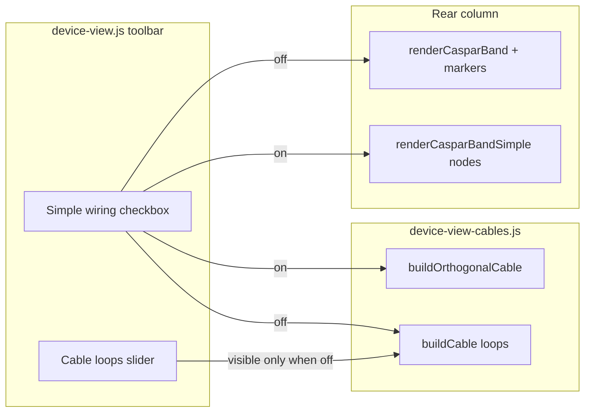

# Work Order 82: Device View — simple wiring mode (rear panel)

> **⚠️ AGENT COLLABORATION PROTOCOL**
> Every agent that works on this document MUST:
> 1. Add a dated entry to the **Work Log** section at the bottom documenting what was done.
> 2. Update task checkboxes to reflect current status.
> 3. Leave clear **Instructions for Next Agent** at the end of their log entry.
> 4. Do **NOT** delete previous agents' log entries.

**Status:** In progress — Phase A–C shipped 2026-06-29  
**Priority:** Medium (UX clarity for dense rigs; default behaviour unchanged)  
**Parent / context:** [00_PROJECT_GOAL.md](./00_PROJECT_GOAL.md)

**Builds on (required reading):**
- [33_WO_DEVICE_VIEW_INDEX.md](./33_WO_DEVICE_VIEW_INDEX.md) — Device View umbrella
- [33c_WO_DEVICE_VIEW_CASPAR_BACKPLANE_UI.md](./33c_WO_DEVICE_VIEW_CASPAR_BACKPLANE_UI.md) — rear-panel SVG + connector hit targets
- [33d_WO_DEVICE_VIEW_PIXELHUE_CABLING.md](./33d_WO_DEVICE_VIEW_PIXELHUE_CABLING.md) — cable tool (selection model unchanged)

**Related code today:**
- Shell + toolbar: `client/components/device-view.js` (`cable-messiness` slider, cable overlay host)
- Rear panel render: `client/components/device-view-caspar-render.js`, `device-view-caspar-render-markers.js`
- Cable overlay (physics + loops): `client/components/device-view-cables.js` (`buildCable`, `renderCableOverlay`)
- Destination node cards (visual reference): `client/components/device-view-destinations-ui.js`
- Styles: `client/styles/09b2-device-view-backpanel-hardware.css`, `09a2-device-view-destinations-visual.css`, `09b1-device-view-connectors-overlay.css`
- Connector dots / cable affordance: `client/components/device-view-cable-affordance.js`, `device-view-bands-render.js` (`addPortNodeDot`)

---

## 1. Problem statement

| Today | Pain | Target |
|-------|------|--------|
| Rear panel uses a **hardware backplane** metaphor — metal gradient, large centred SVG jack icons, label gutters | Visually busy; hard to read signal flow on laptops / narrow viewports | Optional **simple mode**: compact **node cards** (like screen destinations) |
| Cables use **physics sag + optional loop coils** (`buildCable` in `device-view-cables.js`) | Loops look realistic but add clutter when many edges cross the rear column | In simple mode: **orthogonal straight segments** (right-angle routing) between connector anchor points |
| `Cable loops` slider (0–2) in toolbar | Good for default “messy” aesthetic; irrelevant in simple mode | Slider **hidden** when simple mode is on; default wiring stays as today when simple mode is **off** |
| **Full reload on every tab visit** | Switching to Devices re-fetches `/api/device-view` + `/api/settings` + streaming; inspector focus lost; visible flash | **No server fetch** on tab re-entry; state kept in memory |
| **Full reload after every edit** | Each cable/destination/inspector save calls `load()` (triple GET + full DOM rebuild) | **Partial update**: merge POST response → `renderFromState()`; optional `live` GET for hardware-dependent saves |

**Goal:** Add an **opt-in checkbox** (“Simple wiring”) that switches the **rear panel column** to a lighter node-based layout and orthogonal cable lines. **Default remains the current rear panel + loop-capable cables** (messiness slider at operator’s last value).

**Explicitly in scope:**
- Rear panel column only (`device-view__rear-column` / Caspar band: GPU, DeckLink, Stream, Record, Audio connectors)
- Cable overlay routing style when simple mode is enabled
- Persist toggle in `localStorage` (same pattern as GPU layout prefs)

**Explicitly out of scope (v1):**
- Replacing the **destinations** column layout (already node-based)
- Replacing the **mappings** column
- Server / graph API changes
- PixelHue second-device card (33d)
- Removing or changing default backplane when simple mode is off

---

## 2. Operator UX (normative)

### 2.1 Toggle placement

| Control | Location | Default | Persist |
|---------|----------|---------|---------|
| **Simple wiring** | Device View toolbar (`device-view__toolbar`), near existing cable controls | **unchecked** (current rear panel) | `localStorage` key `highascg_device_view_simple_wiring` = `'1'` when on |

Label: **“Simple wiring”** (checkbox).  
Tooltip: *“Compact node layout and straight cable lines on the rear panel.”*

When **unchecked** (default):
- Current `renderCasparBand` backplane + markers
- `Cable loops` slider visible and functional
- `buildCable` physics path unchanged

When **checked**:
- Rear panel renders **simple node stack** (see §2.2)
- `Cable loops` slider **hidden** (not disabled in storage — restore when unchecked)
- Cables use **orthogonal router** (see §2.3)

### 2.2 Simple rear panel — node cards

Replace the metal backplane grid with a **vertical stack of grouped nodes**, visually aligned with screen destination cards (`device-view__destination` family).

**Per connector node (minimum):**

| Element | Spec |
|---------|------|
| Container | Reuse / extend `.device-view__destination` or new `.device-view__simple-node` — rounded card, ~200px max width, subtle border (match `09a2-device-view-destinations-visual.css`) |
| Group heading | Section labels: **GPU**, **DeckLink**, **Stream**, **Record**, **Audio** (same taxonomy as today’s slots) |
| Icon | **Same SVG assets** as current rear markers (`casparRearKindToIcon`, per-item `icon` from live/suggested connectors) — **smaller** (~16–20px wide, not centred hero art) |
| Icon position | **Left-aligned** in card header row (icon + label), not centred in a tall jack well |
| Label | Short connector label (existing `it.label` / `friendlyConnectorLabel`) |
| Subtitle | Optional one line: connection state (`ok` / `off` / resolution) — reuse `resolveStatusClass` semantics |
| Cable anchor | Connector dot on **outer edge** of card: outputs → **right**; inputs/sinks → **left** (same rule as `addPortNodeDot`) |
| Interaction | **Unchanged**: click → inspector; dot click → cable arm/complete; GPU edit / DeckLink drag-reorder **disabled in simple mode v1** (or hidden behind “Rear panel layout” inspector if already present) |

**Layout:**
- Single column flex stack inside `device-view__band--caspar-simple` (or modifier class on existing band)
- No metal gradient, no `device-view__backpanel-overlay` absolute positioning
- Disconnected GPU ports: still listed but visually de-emphasised (opacity), consistent with destination host-channel styling

### 2.3 Simple cables — orthogonal lines

When simple mode is on, `renderCableOverlay` must **not** call `buildCable` (physics/loops).

**Routing algorithm (v1):**

```
source (x1,y1) ──horizontal──┐
                               ├── vertical ── destination (x2,y2)
```

1. Anchor at source connector dot centre (`connectorCenter` — unchanged).
2. Exit horizontally from source (direction: toward panel centre / toward destination).
3. One vertical segment at `midX` (e.g. average of endpoints, or deterministic per edge id for stability).
4. Enter horizontally into destination.

**DeckLink key/fill virtual side links:** keep existing orthogonal rail logic (`buildDecklinkKeyFillSideLink`) — already straight segments.

**Rubber-band cable** (armed, pointer following): same orthogonal style (no loops).

**Visual:**
- Stroke width same as today; colour from `getCableColor`
- No plug-boot drop segments unless needed for anchor clearance (≤8px stub max)
- Selected / hovered edge styling unchanged

### 2.5 Refresh policy (normative)

| Trigger | Behaviour |
|---------|-----------|
| **First open** (session) | `load({ refresh: 'full' })` — device-view + settings + streaming status |
| **Tab re-entry** | `onDeviceViewTabActivated()` — `updateUI()` only (cables, selection); **no GET** |
| **Refresh button** | `load({ refresh: 'full' })` |
| **Project loaded** (`project-loaded`) | `load({ refresh: 'full' })` |
| **Device snapshot loaded** | `load({ refresh: 'full' })` |
| **Mapping-state reload** (`highascg-device-view-reload`) | `load({ refresh: 'full' })` |
| **Settings saved elsewhere** (`highascg-settings-applied`) | Merge `settingsState` cache → `renderFromState()` (no GET) |
| **Graph / destination mutation** (cable, edge, patch) | Merge API response fields → `renderFromState()` |
| **Inspector save** (GPU, DeckLink, stream, etc.) | `load({ refresh: 'live' })` — device-view GET only (live hardware + suggested connectors) |
| **Simple wiring toggle** | `renderFromState()` only |

**Autosave:** Device View edits already persist via targeted POST (`addEdge`, `patchDestination`, `saveSettingsPatch`, etc.). UI must **not** re-fetch the full stack after each save when the response carries enough state to repaint.

### 2.6 Accessibility

- Checkbox: associated `<label>`, keyboard toggle
- Simple nodes: `button` or `role="button"` per connector; `aria-label` includes kind + label + cable state
- Focus ring visible on nodes and connector dots

---

## 3. Architecture



**Suggested module split (keep diffs small):**

| File | Responsibility |
|------|----------------|
| `client/lib/device-view-simple-wiring-prefs.js` | read/write `highascg_device_view_simple_wiring` |
| `client/components/device-view-caspar-render-simple.js` | `renderCasparBandSimple(ctx)` — node stack |
| `client/components/device-view-cables.js` | `buildOrthogonalCable(x1,y1,x2,y2)` + branch in `renderCableOverlay` on `simpleWiring` flag |
| `client/components/device-view-bands-render.js` | `renderBands`: if simple → simple renderer else classic |
| `client/components/device-view.js` | Wire checkbox, pass `simpleWiring` into `getCOCtx()`, toggle messiness row visibility |
| `client/styles/09b2-device-view-backpanel-hardware.css` | `.device-view__simple-node*` modifiers |

No server changes.

---

## 4. Phased tasks

### Phase A — Preference + toolbar

- [x] **T82.1** `device-view-simple-wiring-prefs.js` — `readSimpleWiring()`, `writeSimpleWiring(on)`
- [x] **T82.2** Toolbar checkbox in `device-view.js`; on change persist + `updateUI()`
- [x] **T82.3** Hide `Cable loops` label/slider/value when simple mode on; show when off

### Phase B — Simple rear panel renderer

- [x] **T82.4** `renderCasparBandSimple(ctx)` — group connectors by slot title (reuse slot building from `renderCasparBand` or shared helper)
- [x] **T82.5** Node card DOM matching destination visual language (icon left, label, status, connector dot)
- [x] **T82.6** Wire selection / cable-armed / valid-target classes (same class names as backplane markers)
- [x] **T82.7** `renderBands` branch: simple vs classic
- [x] **T82.8** CSS for compact nodes (smaller icons, left-aligned, reduced padding)

### Phase C — Orthogonal cables

- [x] **T82.9** `buildOrthogonalCable` with stable `midX` from edge id seed
- [x] **T82.10** `renderCableOverlay` — use ortho path when `ctx.simpleWiring`
- [x] **T82.11** Rubber-band ghost cable uses ortho while simple mode on
- [x] **T82.12** Verify `connectorCenter` resolves to simple-node dots (data-connector-id on dots)

### Phase D — Tab refresh & partial save

- [x] **T82.17** Split `load()` into refresh modes: `full` | `live` | `settings` | `none` (`device-view-refresh.js`)
- [x] **T82.18** `renderFromState()` — repaint from `lastPayload` without GET
- [x] **T82.19** `mergeDeviceViewMutation()` — apply POST graph/destination fields locally
- [x] **T82.20** Tab re-entry: `onDeviceViewTabActivated()` in `app.js` (no fetch)
- [x] **T82.21** Replace `highascg-settings-applied` → full load with settings-cache merge + render
- [x] **T82.22** `project-loaded` → full load; Refresh button → full load
- [x] **T82.23** Cable/edge/destination edits → merge + `renderFromState()` (not full load)

### Phase E — QA & docs

- [ ] **T82.13** Manual QA: toggle persists across reload; default off on fresh browser
- [ ] **T82.14** Manual QA: cable create/select/hover/delete works in both modes
- [ ] **T82.15** Manual QA: 6+ simultaneous edges readable in simple mode (no loop overlap)
- [ ] **T82.16** Note in `33g` or Device View operator doc: when to use simple wiring
- [ ] **T82.24** Manual QA: switch Scenes ↔ Devices — no network flash; selection/cables preserved
- [ ] **T82.25** Manual QA: add cable → no triple GET; graph updates in place

---

## 5. Acceptance criteria

- [ ] **A82.1** Fresh session: rear panel shows **current** backplane; **Simple wiring** unchecked.
- [ ] **A82.2** Checking **Simple wiring** immediately swaps rear column to **node cards** with **smaller left-aligned** SVG icons.
- [ ] **A82.3** Cables in simple mode are **straight segments with right-angle bends** only (no sag, no coils).
- [ ] **A82.4** Unchecking restores backplane + messiness slider + physics/loop cables.
- [ ] **A82.5** Preference survives page reload.
- [ ] **A82.6** All existing cable interactions (arm, complete, cancel, edge select, DeckLink key/fill side link) work in simple mode.
- [ ] **A82.7** Destinations column and inspector behaviour **unchanged**.
- [ ] **A82.8** Switching away from Devices and back does **not** trigger `/api/device-view` (verify in Network tab).
- [ ] **A82.9** Refresh button and project load still perform a **full** reload.
- [ ] **A82.10** Adding/removing a cable updates the canvas without re-fetching settings + streaming status.

---

## 6. Visual reference (implementation hints)

**Destination card (reuse patterns):**

```46:51:client/styles/09a2-device-view-destinations-visual.css
.device-view__destinations-vertical-stack .device-view__destination {
	display: flex;
	width: 200px;
	max-width: 200px;
	box-sizing: border-box;
}
```

**Current messiness default (unchanged when simple off):**

```66:69:client/components/device-view.js
	const messinessLabel = Object.assign(document.createElement('label'), { textContent: 'Cable loops: ', style: 'margin-left: 14px; font-size: 11px; opacity: 0.8' })
	const messinessSlider = Object.assign(document.createElement('input'), { type: 'range', min: '0', max: '2', value: '0', id: 'cable-messiness', style: 'width: 40px; height: 8px; cursor: pointer;' })
	const messinessVal = Object.assign(document.createElement('span'), { textContent: '0', style: 'margin-left: 6px; font-size: 11px; font-weight: 600;' })
	messinessSlider.oninput = () => { messinessVal.textContent = messinessSlider.value; updateUI() }
```

**Icon sources (keep):** `device-view-caspar-render-helpers.js` → `casparRearKindToIcon`, per-slot `icon` paths in `device-view-caspar-render.js`.

---

## 7. Decision log

| Decision | Choice | Date | Notes |
|----------|--------|------|-------|
| Default mode | Current backplane + loop cables | 2026-06-29 | Operator: “wiring stays as default with current loops messiness” |
| Opt-in control | Checkbox “Simple wiring” | 2026-06-29 | Opt **into** simple, not opt-out of default |
| Scope | Rear panel column only | 2026-06-29 | Destinations already node-based |
| Persistence | `localStorage` | 2026-06-29 | Matches GPU/DeckLink layout prefs |
| GPU/DeckLink edit in simple mode | Disabled v1 | 2026-06-29 | Avoid two layout systems; classic mode keeps edit |
| Tab re-entry fetch | None | 2026-06-29 | Keep in-memory state; repaint cables only |
| Post-edit reload | Merge + render; live GET for hardware saves | 2026-06-29 | Avoid triple GET after every cable |

---

## 8. Work log

### 2026-06-29 — Draft WO from operator request

- Captured requirement: lighter rear-panel wiring view; default unchanged; checkbox for simple node layout; smaller off-centre SVG icons; orthogonal cable lines.
- Traced existing implementation: `device-view-caspar-render*.js`, `device-view-cables.js`, destinations UI as visual reference, messiness slider in toolbar.
- Defined phased delivery (prefs → simple renderer → ortho cables → QA).

**Instructions for next agent:** Start **Phase A** (checkbox + prefs + hide messiness). Then **Phase B** with a minimal `renderCasparBandSimple` that lists the same connectors as classic mode (no new data). **Phase C** can land in the same PR if small. Do not remove or alter default backplane rendering path. GPU drag-edit can stay classic-only until a follow-up if operators ask.

### 2026-06-29 — Phase A–C implemented

- Added `client/lib/device-view-simple-wiring-prefs.js` and toolbar **Simple wiring** checkbox (persisted in `localStorage`).
- Extracted `buildCasparRearPanelData` (`device-view-caspar-rear-data.js`) shared by classic and simple rear renderers.
- Added `renderCasparBandSimple` — compact node cards with left-aligned 18px SVG icons and edge connector dots.
- `renderCableOverlay` uses `buildOrthogonalCable` when simple mode is on; messiness slider hidden.
- CSS in `09b2-device-view-backpanel-hardware.css` for simple nodes and toolbar toggle.

**Instructions for next agent:** Phase D manual QA on hardware (toggle persist, cable arm/complete in both modes, 6+ edges). Optional: note in `33g` docs. GPU/DeckLink rear drag-edit remains classic-only by design.

### 2026-06-29 — Phase D: tab refresh + partial save

- Added `client/lib/device-view-refresh.js` — refresh modes, mutation merge, settings-cache sync.
- Split `load({ refresh })` vs `renderFromState()` in `device-view.js`.
- Tab re-entry (`onDeviceViewTabActivated` + `app.js`) repaints cables/selection only — no GET.
- Removed blanket `highascg-settings-applied` → full load; now merges `settingsState` and re-renders.
- Graph/cable/destination edits merge POST response and call `renderFromState()`; inspector saves use `live` refresh only.
- Full reload reserved for: Refresh button, `project-loaded`, snapshot load, `highascg-device-view-reload`, first mount.

**Instructions for next agent:** Phase E manual QA — especially **A82.8** (no fetch on tab switch) and **A82.10** (cable add without settings GET). Watch Network tab in browser devtools.
